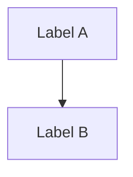

# Content Quality Rules — Learn Guides

Load this file before drafting, revising, or reviewing any guide content. These rules apply to every guide in every capability (create, update, review).

## Narrative arc

Every guide must tell a story:

- Open with a concrete pain the reader recognizes — not a definition or a summary of what will be covered
- Introduce each concept as the answer to the problem raised by the previous one
- Add one natural transition sentence before every code block
- Close with a decision rule, a caveat, or a threshold — not a summary of what was covered
- Both EN and FR must have the same narrative richness — FR is not a reduced version

## Persona alignment

Always write for the target persona:

| Difficulty     | Persona     | Rules                                                                                                                                                                   |
| -------------- | ----------- | ----------------------------------------------------------------------------------------------------------------------------------------------------------------------- |
| `beginner`     | Découvreur  | Analogies, plain language, define every term on first use, explicit limitations, path to next guides. ✅ End with a "what next" pointer. ❌ No unexplained code blocks. |
| `intermediate` | Développeur | Working code with commented parameters, practical patterns, mention costs/rate limits/security. ❌ No purely theoretical content.                                       |
| `advanced`     | Architecte  | Tradeoffs, observability, production patterns, SLAs. ❌ Don't explain basics (tokens, temperature, etc.).                                                               |

## Project-agnosticism

- No references to any specific codebase, internal repo, or organizational setup
- Code examples use generic names (`@my/shared`, `my-app`, `my-package`)
- Any personal anecdote is framed around a universal experience, not internal specifics
- Any reader on any project must be able to follow the guide

## Official documentation links

- Back every significant technical claim with an inline link to its primary source (provider docs, tool websites, specs, seminal papers)
- Each URL must appear **at most once** per guide — link it the first time; use the name only on subsequent references
- Sources must be official — not blog posts or secondary sources
- External link count (body + `## Resources` section combined) must be **between 3 and 7**
  - Fewer than 3 → under-linked; key claims unsupported, weak SEO authority signals
  - More than 7 → over-linked; dilutes link equity and risks being flagged
  - Hard cap: **10** — when you'd exceed the cap, consolidate into a `## Resources` section instead of adding more inline links
- A `## Resources` section exists at the end **only** when it lists sources not already linked inline (foundational papers, additional reading, or a consolidated reference list)
- The `## Resources` section must contain **actual markdown links** (`[Name](url)`) — prose descriptions of sources with no clickable links are not acceptable

## Inline link anchor text

Anchor text must be **concise** — it names the resource, feature, or key term (ideally ≤5 words). The cited claim stays as readable prose; the link sits only on the resource name.

- ✅ `[OpenAI's evals guide](url) recommends tracking behavior as prompts change`
- ✅ `temperature is documented in [Google's parameter guide](url) as a randomness control`
- ✅ `[chain-of-thought paper](url)`
- ❌ `[OpenAI recommends evals to track behavior as prompts and models change](url)`
- ❌ `[Google documents temperature as a randomness control and lists 1.0 as the default](url)`

## Visual elements — Tables and Diagrams

Use tables and Mermaid diagrams to make abstract relationships immediately scannable. Both are fully supported by the render pipeline.

### Tables (GFM Markdown)

Use a table when comparing two or more options across the same set of dimensions.

- ✅ Feature comparison, before/after, concept matrix (e.g. traditional software vs AI system)
- ❌ Long prose lists that would read better as paragraphs
- ❌ A table with a single column — use a bullet list instead

Syntax: GFM pipe tables. Omit the header cell of the first column when using it as a row-label column:

```md
|       | Option A | Option B |
| ----- | -------- | -------- |
| Speed | Fast     | Slow     |
| Cost  | Low      | High     |
```

Always translate every cell in FR. Mirror the column order and row count exactly — a table that differs in structure between EN and FR is a consistency error. Use `✓` / `✗` for boolean cells.

### Mermaid diagrams

Use a Mermaid diagram when the relationship between concepts cannot be expressed as a table (hierarchy, flow, dependency).

Syntax: a fenced code block with the `mermaid` language tag:

````md

````

Guidelines:

- Prefer `graph TD` (top-down) for hierarchies, `flowchart LR` (left-right) for pipelines
- Translate only the **quoted label text** between EN and FR — the graph structure (node IDs, arrows) must be identical in both files
- Keep diagrams simple: **4–8 nodes maximum**; a diagram that needs a legend to be understood should be split or replaced with prose
- Always add an introductory sentence before the diagram to frame what it shows
- Emoji in node labels are optional — they aid scannability; use consistently if used at all
- The diagram is centered and scales to full width automatically

## Verify before writing

Check API shapes, configuration option names, and defaults against official docs. Mention the version when behavior is version-specific.
