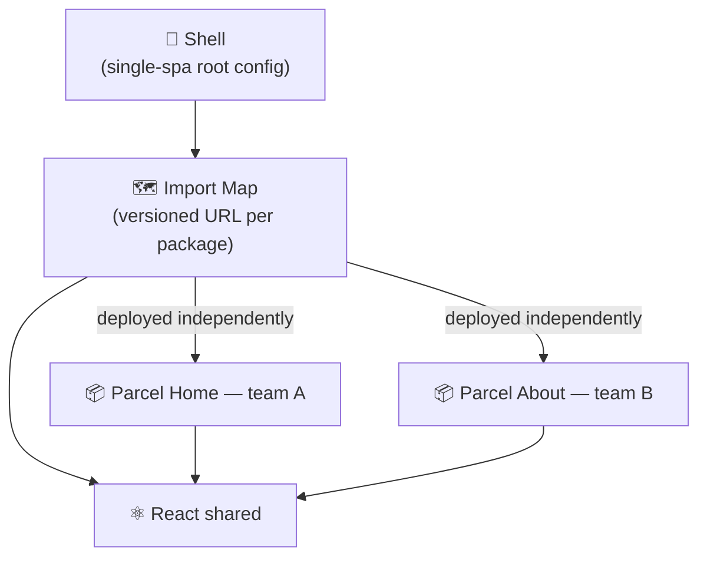

You're in a release meeting because three teams touched the same frontend, one found a bug late, and now nobody knows whether to ship or freeze. Everybody waits. Again.

That is the failure mode micro-frontends are supposed to solve: turning one fragile frontend into deployable boundaries.



## The actual bet

Micro-frontends are a deployment strategy, not a component pattern. With [single-spa](https://single-spa.js.org/docs/configuration/), the shell registers named applications and activates them from the URL. That buys independent deploys. It also buys you harder debugging, stricter version discipline, and a platform layer somebody has to own.

I would not do this for one team. I start considering it when several autonomous teams ship on the same surface and release coordination is already the bottleneck.

## The shell stays dumb

A shell should decide what to mount, not contain product logic. [single-spa lifecycles](https://single-spa.js.org/docs/building-applications/) are intentionally small: `bootstrap` runs once, `mount` and `unmount` run as routes change, and those lifecycle functions must return promises or be `async`.

The root config should stay boring on purpose:

```typescript
import { registerApplication, start } from 'single-spa';

registerApplication({
  name: '@my/parcel-home',
  app: () => import('@my/parcel-home'),
  activeWhen: ['/'],
});

registerApplication({
  name: '@my/parcel-about',
  app: () => import('@my/parcel-about'),
  activeWhen: ['/about'],
});

start();
```

From the shell's perspective, each micro-frontend is just a name, a loader, and an activation rule.

## Module resolution is the deployment layer

Browser [import maps](https://developer.mozilla.org/en-US/docs/Web/HTML/Reference/Elements/script/type/importmap) exist because `import('@my/parcel-home')` is a bare specifier and the browser needs a URL. That mapping is where independent deployment becomes real: update one URL, roll out one frontend, leave the others alone.

The mapping itself should look as dull as possible:

```json
{
  "imports": {
    "@my/parcel-home": "https://cdn.example.com/parcel-home/1.2.0/parcel.js",
    "@my/parcel-about": "https://cdn.example.com/parcel-about/0.9.1/parcel.js"
  }
}
```

If your deployment process cannot update that map safely, you do not have independent deploys. You have distributed hope.

## React mounting is where people create debt

With React 18+, [createRoot](https://react.dev/reference/react-dom/client/createRoot) should be created once per container and reused through `render` calls. Recreating a root on the same DOM node is how teams manufacture warnings and flaky unmount behavior.

The React entry point is where most teams get sloppy:

```typescript
import { createRoot } from 'react-dom/client';
import App from './App';

let root: ReturnType<typeof createRoot> | null = null;

export async function bootstrap() {}

export async function mount() {
  const container = document.getElementById('app-container');
  if (!container) throw new Error('Container not found');

  root ??= createRoot(container);
  root.render(<App />);
}

export async function unmount() {
  root?.unmount();
  root = null;
}
```

If you want less hand-rolled ceremony, use a helper such as `single-spa-react`. The constraint does not change: root ownership must stay explicit.

## Shared dependencies are not optional

For large shared libraries, I would externalize them and let the browser load one copy. [Rollup external](https://rollupjs.org/configuration-options/#external) is the relevant build-time contract, and the import map is the runtime contract.

Keep the shared dependency contract explicit in both places:

```json
{
  "imports": {
    "react": "https://cdn.example.com/shared/react.js",
    "react-dom": "https://cdn.example.com/shared/react-dom.js"
  }
}
```

```typescript
export default defineConfig({
  build: {
    rollupOptions: {
      external: ['react', 'react-dom'],
    },
  },
});
```

React's own [invalid hook call](https://react.dev/warnings/invalid-hook-call-warning) warning is more precise than the usual cargo-cult version of this advice: multiple React copies on one page are not automatically fatal, but hooks break when your components and `react-dom` resolve different React modules. In practice, I still treat shared React as mandatory because letting each micro-frontend pick its own copy turns one version policy into permanent debugging debt.

If you do not have at least three independently deployed frontend teams and someone willing to own the shell, the import map, and dependency policy, stay with a modular monolith.
