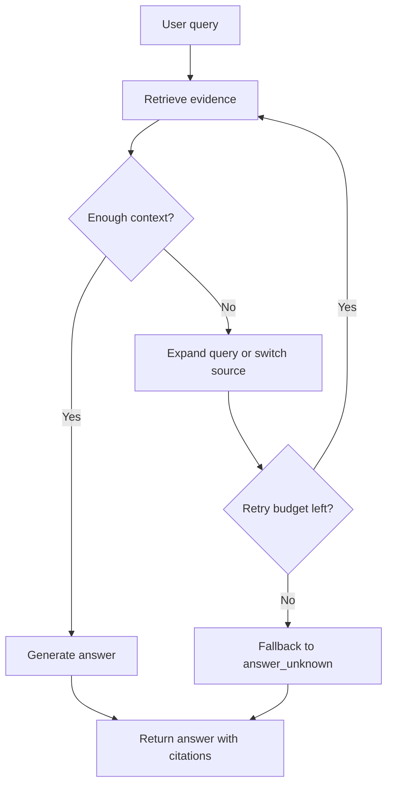

Your retriever looks fine until a user asks for a comparison spread across three manuals, one changelog, and a support note hiding in another system. Then the answer collapses. The problem is not embeddings. The problem is that a single retrieve-then-generate pass is the wrong shape for multi-step evidence gathering.

I switch to agentic RAG only when the system must break the question apart, choose different tools, and keep track of what each step proved. That is exactly what [LlamaIndex agents](https://docs.llamaindex.ai/en/stable/use_cases/agents/) are for. I do not want a fake “smart” layer. I want a planner that can recover after a weak first retrieval.

I would not ship that machinery for a documentation FAQ, a support bot, or anything living under a hard latency budget. Start with better chunking, metadata filters, [hybrid search](https://docs.pinecone.io/guides/search/hybrid-search), and [rerank](https://docs.cohere.com/docs/reranking-with-cohere). Agentic RAG only earns its cost when single-hop retrieval keeps missing cross-source questions.

Most guides neglect observability and reliability. Every extra step increases latency, spend, and failure surface. If you cannot inspect the plan, tool arguments, and retrieved document IDs for each request, you cannot debug misses against an SLA. I want [traces](https://docs.langchain.com/langsmith/observability-quickstart) before I want a clever planner.

Then I force the pipeline to fail in CI before users do. [DeepEval](https://deepeval.com/docs/getting-started) is useful because it lets you run agent and RAG evals like tests instead of treating regressions as something you discover from support tickets.

This is the minimum loop I want to see on paper before I trust the runtime:



That pressure should show up in a hard contract, not a slide deck:

```yaml
planner:
  max_steps: 4
  stop_if_confidence_below: 0.55
retrieval_tools:
  - semantic_search
  - keyword_search
  - sql_lookup
guards:
  max_total_retrieved_chunks: 18
  require_citations: true
  fallback: 'answer_unknown'
observability:
  trace_query_plan: true
  trace_tool_arguments: true
  trace_document_ids: true
```

| Setting                                  | What I use it for                                                                                      |
| ---------------------------------------- | ------------------------------------------------------------------------------------------------------ |
| `planner.max_steps: 4`                   | Caps the number of retrieval-planning turns before the agent starts burning latency for marginal gain. |
| `planner.stop_if_confidence_below: 0.55` | Forces the loop to admit weak evidence instead of bluffing its way into generation.                    |
| `guards.max_total_retrieved_chunks: 18`  | Prevents the planner from flooding the context window with low-value chunks.                           |
| `guards.fallback: 'answer_unknown'`      | Makes failure explicit when the retry budget is gone or the evidence still looks thin.                 |
| `guards.require_citations: true`         | Ensures the final answer stays tied to retrieved documents instead of unsupported synthesis.           |

My rule is blunt: if a single-pass retriever plus reranker answers at least 85% of real production questions inside your SLA, stay there. Below that threshold, agentic RAG is justified. Above it, you are paying for self-inflicted latency.
