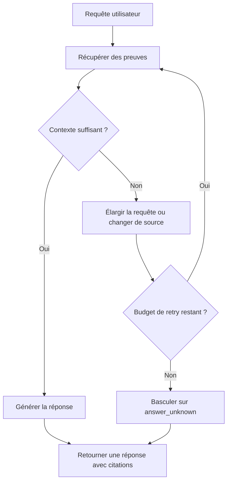

Ton retriever a l’air correct jusqu’au moment où un utilisateur demande une comparaison répartie sur trois manuels, un changelog et une note de support cachée dans un autre système. Là, la réponse s’effondre. Le problème ne vient pas des embeddings. Le problème, c’est qu’un seul passage retrieve-then-generate a la mauvaise forme pour une collecte de preuves en plusieurs étapes.

Je passe au RAG agentique seulement quand le système doit découper la question, choisir plusieurs outils et garder la trace de ce que chaque étape a réellement prouvé. C’est exactement le rôle des [agents](https://docs.llamaindex.ai/en/stable/use_cases/agents/). Je ne veux pas d’une couche “intelligente” pour faire joli. Je veux un planner capable de se rattraper après une première récupération médiocre.

Je ne sortirais pas cette mécanique pour une FAQ documentaire, un bot de support, ou quoi que ce soit soumis à une contrainte de latence dure. Commence par un meilleur chunking, des filtres de métadonnées, la recherche [hybride](https://docs.pinecone.io/guides/search/hybrid-search) et le [rerank](https://docs.cohere.com/docs/reranking-with-cohere). Le RAG agentique ne mérite son coût que quand la récupération mono-saut rate trop souvent les questions qui traversent plusieurs sources.

La plupart des guides négligent l'observabilité et la fiabilité. Chaque étape supplémentaire augmente la latence, la facture et la surface de panne. Si tu ne peux pas inspecter le plan, les arguments d'outil et les identifiants de documents récupérés pour chaque requête, tu ne peux pas déboguer les ratés face à une SLA. Je veux des [traces](https://docs.langchain.com/langsmith/observability-quickstart) avant un planner malin.

Ensuite, je force le pipeline à casser en CI avant que les utilisateurs s’en chargent. [DeepEval](https://deepeval.com/docs/getting-started) est utile parce qu’il permet d’exécuter les evals agent et RAG comme des tests, au lieu de découvrir les régressions via des tickets de support.

C’est la boucle minimale que je veux voir sur papier avant de faire confiance au runtime :



Cette pression doit se voir dans un contrat dur, pas dans un slide deck :

```yaml
planner:
  max_steps: 4
  stop_if_confidence_below: 0.55
retrieval_tools:
  - semantic_search
  - keyword_search
  - sql_lookup
guards:
  max_total_retrieved_chunks: 18
  require_citations: true
  fallback: 'answer_unknown'
observability:
  trace_query_plan: true
  trace_tool_arguments: true
  trace_document_ids: true
```

| Réglage                                  | Pourquoi je m’en sers                                                                                                     |
| ---------------------------------------- | ------------------------------------------------------------------------------------------------------------------------- |
| `planner.max_steps: 4`                   | Limite le nombre de tours planification + récupération avant que l’agent ne gaspille de la latence pour un gain marginal. |
| `planner.stop_if_confidence_below: 0.55` | Force la boucle à reconnaître que les preuves sont faibles au lieu de bluffer jusqu’à la génération.                      |
| `guards.max_total_retrieved_chunks: 18`  | Empêche le planner de noyer la fenêtre de contexte sous des chunks peu utiles.                                            |
| `guards.fallback: 'answer_unknown'`      | Rend l’échec explicite quand le budget de retry est épuisé ou que les preuves restent trop maigres.                       |
| `guards.require_citations: true`         | Garantit que la réponse finale reste attachée aux documents récupérés au lieu d’une synthèse sans appui.                  |

Ma règle est simple et sèche : si un retriever en un seul passage avec reranking répond à au moins 85 % des vraies questions de production dans la SLA, reste là. En dessous, le RAG agentique se justifie. Au-dessus, tu paies une latence que tu t’infliges toi-même.
