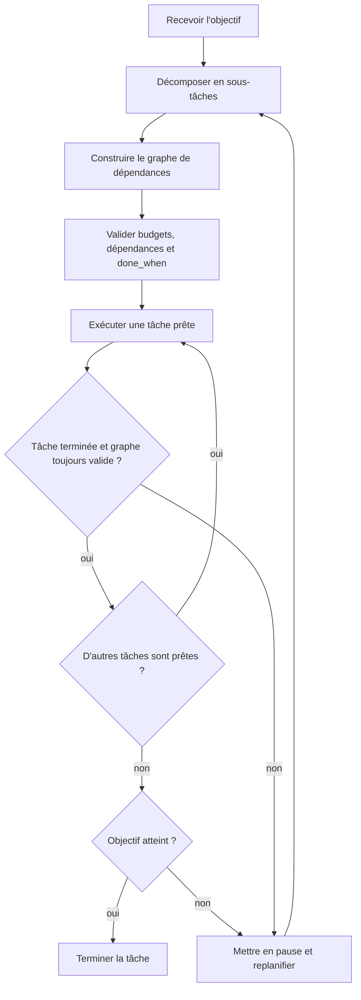

Votre agent a terminé la tâche. Enfin, plus ou moins. Quarante-sept appels d'outils, deux boucles, et un résultat crédible jusqu'au moment où quelqu'un vérifie. On accuse souvent le modèle. La plupart du temps, le vrai problème est ailleurs : il n'y a pas de plan.

Le mécanisme de casse est simple. Quand un agent commence à agir sans décomposition, chaque étape suivante hérite du désordre de la précédente. Le papier [ReAct](https://arxiv.org/abs/2210.03629) fonctionne parce qu'il garde le raisonnement et l'action ancrés dans un objectif explicite et limité. Si vous jetez un gros objectif à un agent en le laissant improviser, vous obtenez de la dérive, du travail dupliqué et une facture de tokens sans stratégie de reprise propre.

Je ne laisse pas un agent toucher aux outils tant qu'il n'a pas émis un plan que je peux valider. Ce plan doit être un graphe, pas un paragraphe : sous-tâches, dépendances, critères de fin, limites de retry et budget de tokens par nœud. Le [guide OpenAI Agents](https://platform.openai.com/docs/guides/agents) vous donne des primitives d'exécution, mais la partie que presque tous les tutos évitent est la propriété du budget. Ce n'est pas à l'agent de décider combien une tâche a le droit de coûter.

C'est ce niveau de structure que je veux verrouiller avant le premier appel d'outil :

```python
from pydantic import BaseModel
from typing import List, Optional

class Subtask(BaseModel):
    id: str
    goal: str
    depends_on: List[str]
    done_when: str
    tool_hint: Optional[str] = None
    max_tokens: int
    max_retries: int = 2

class ExecutionPlan(BaseModel):
    objective: str
    subtasks: List[Subtask]
    total_token_budget: int
```

Si `sum(subtask.max_tokens)` dépasse `total_token_budget`, rejet du plan. Si une sous-tâche n'a pas de `done_when`, rejet du plan. Si deux sous-tâches se dépendent mutuellement, rejet du plan. La planification n'est pas un contrôle d'ambiance. C'est du contrôle d'admission.

Je veux aussi rendre la boucle d'exécution visible, parce qu'au moment où le plan disparaît dans de la prose, l'agent recommence à improviser.



Ensuite, exécutez le graphe avec un état, pas avec une transcription géante qui grossit sans fin. [LangGraph](https://langchain-ai.github.io/langgraph/) est utile ici parce qu'il force à penser en nœuds, arêtes et checkpoints plutôt qu'en boucle infinie. Persistez le résultat de chaque nœud, compressez le signal utile, et ne passez à la suite que ce qui compte. La sortie brute d'un outil ne doit pas traîner derrière l'agent comme une valise.

Le replanning est parfois nécessaire, mais pas toutes les trois étapes. Si un nœud découvre une dépendance manquante ou dépasse l'estimation de scope de 30 %, on pause et on replanifie. Si vous replannifiez sans arrêt, votre objectif initial est mal spécifié et aucun prompt malin ne corrigera ça.

Et comme je ne fais pas confiance aux règles de planification vagues, je garde les limites dures dans une checklist au lieu de les redécouvrir en plein run.

| Contrainte          | Règle que j'applique                                                                                   | Pourquoi j'y tiens                                                          | Ce que je fais quand ça casse                                                                          |
| ------------------- | ------------------------------------------------------------------------------------------------------ | --------------------------------------------------------------------------- | ------------------------------------------------------------------------------------------------------ |
| Accès aux outils    | Aucun appel d'outil tant que je n'ai pas validé le graphe                                              | Ça empêche l'agent d'improviser jusqu'au scope creep                        | Je rejette le brouillon de plan et je le réécris                                                       |
| Budgets par nœud    | `sum(subtask.max_tokens)` doit rester dans `total_token_budget`                                        | Ça évite les fuites silencieuses de tokens sur tout le run                  | Je rejette le plan avant exécution                                                                     |
| Critères de fin     | Chaque nœud doit avoir un `done_when`                                                                  | Je veux une condition d'arrêt objective, pas une ambiance                   | Je rejette le nœud et j'oblige l'auteur à le définir                                                   |
| Dépendances         | Pas de dépendance cyclique ; une dépendance manquante découverte à l'exécution déclenche un replanning | Les cycles bloquent l'exécution et les prérequis cachés brûlent les retries | Je rejette les cycles d'entrée ; je mets en pause et je replanifie si une nouvelle dépendance apparaît |
| Retries             | Je borne les retries par nœud avec `max_retries` (2 par défaut)                                        | Une boucle ne doit pas se déguiser en persévérance                          | Je fais échouer le nœud, puis je replanifie ou j'escalade                                              |
| Seuil de replanning | Je replanifie seulement si une dépendance manque ou si le scope grossit de plus de 30 %                | Le replanning doit rester une exception                                     | Je mets l'exécution en pause et je reconstruis le graphe                                               |
| Taille du graphe    | Si les plans dépassent régulièrement 12 nœuds, la tâche est trop grosse                                | Les gros graphes cachent presque toujours un objectif flou                  | Je découpe l'objectif en tâches plus petites                                                           |
| Signal de staging   | Plus de 20 % de replans en staging signifie que la définition de tâche est mauvaise                    | Le churn de replanning est un problème de spec, pas d'intelligence          | Je resserre le scope avant la mise en prod                                                             |

Ma règle est sèche : si votre graphe dépasse régulièrement 12 nœuds, ou si la phase de staging montre plus de 20 % de replans, arrêtez d'essayer de rendre l'agent plus malin et rendez la tâche plus petite.
