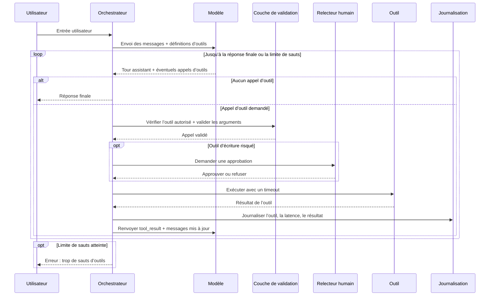

Tu branches ton premier appel LLM, la démo marche, puis le modèle décide de lancer deux recherches, de retenter un write et de réclamer encore un outil juste au cas où. Bravo, ta feature de chat a maintenant des modes de panne.

Je sépare function calling et tool calling parce que cette nuance évite de vraies erreurs d’architecture. Le function calling, c’est le schéma. Le tool calling, c’est la boucle que tu possèdes. Chez les trois fournisseurs, le contrat est presque le même : tu déclares des outils, le modèle renvoie une requête structurée quand il en a besoin, ton code exécute, puis tu réinjectes le résultat. OpenAI le décrit comme un flux en plusieurs étapes, Anthropic comme un échange `tool_use` puis `tool_result`, et Gemini suit la même logique avec des déclarations de fonction et un `id` d’appel que tu renvoies avec le résultat ([OpenAI](https://developers.openai.com/api/docs/guides/function-calling), [Anthropic](https://platform.claude.com/docs/en/agents-and-tools/tool-use/how-tool-use-works), [Gemini](https://ai.google.dev/gemini-api/docs/function-calling)).

Le point sous-estimé, ce n’est pas le JSON. C’est le contrôle. Si le modèle gère les retries, les budgets ou les écritures, tu n’as pas construit un agent. Tu as juste délégué ton futur rapport d’incident.

Le raccourci que j’aurais aimé piquer plus tôt : traite chaque outil comme une dépendance distante capricieuse, même si aujourd’hui c’est juste un helper local. Cet état d’esprit te pousse vers les timeouts, la validation de schéma, l’idempotence et les logs avant que la production ne devienne désagréablement pédagogique.

Voilà la boucle que je mettrais vraiment en prod :

```ts
const MAX_TOOL_HOPS = 4;

for (let hop = 0; hop < MAX_TOOL_HOPS; hop += 1) {
  const assistantTurn = await callModel({ messages, tools });
  const toolCalls = readToolCalls(assistantTurn);

  if (toolCalls.length === 0) {
    return assistantTurn;
  }

  const toolResults = await Promise.all(
    toolCalls.map(async (toolCall) => {
      assertAllowedTool(toolCall.name);
      const args = validateArgs(toolCall.name, toolCall.args);

      const output = await runWithTimeout(() => executeTool(toolCall.name, args), 4_000);

      return {
        callId: toolCall.id,
        output,
      };
    })
  );

  logToolHop({ hop, toolCalls, toolResults });
  messages.push(assistantTurn, formatToolResults(toolResults));
}

throw new Error('Too many tool hops');
```



Quelques habitudes de prod rentabilisent l’effort très vite. Mets une limite dure sur le nombre de sauts, parce qu’un modèle confus peut tourner en rond avec ton budget. Garde les outils d’écriture idempotents, parce qu’un échec partiel adore rejouer la même action. Loggue le nom de l’outil, sa latence et son résultat à chaque saut, parce que “l’agent a été bizarre” n’aide personne. Et si un outil peut bouger de l’argent, contacter des clients ou modifier des données, ajoute une approbation humaine avant exécution.

Ma règle est simple : j’utilise le tool calling quand le modèle a besoin d’un état frais ou doit choisir entre plusieurs actions externes. Si tu sais déjà quel service appeler, saute le cérémonial et appelle-le toi-même. Moins de boucles, moins de surprises.
