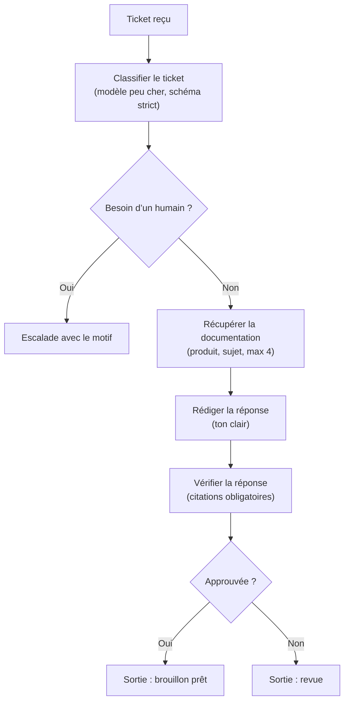

La première version tient dans un seul prompt. Puis tu la déploies, un ticket un peu tordu arrive, et soudain ce prompt fait la classification, la recherche, la rédaction, le formatage, les fallbacks, et le service après-vente.

La plupart des équipes voient ce bazar et sautent directement à “il nous faut un agent”. Moi, la plupart du temps, je ne le ferais pas. Anthropic pose bien la frontière dans [effective agents](https://www.anthropic.com/engineering/building-effective-agents) : les workflows suivent des chemins de code prédéfinis, les agents décident dynamiquement de l’étape suivante. Si tu connais déjà le chemin, prends l’option ennuyeuse et garde-la déterministe. Quand c’est toi qui es d’astreinte, l’ennui devient une qualité.

Un workflow, c’est juste une orchestration explicite : des étapes nommées, des branchements bornés, et des entrées-sorties claires. Tu peux toujours verrouiller les résultats intermédiaires avec [structured outputs](https://developers.openai.com/api/docs/guides/structured-outputs), et appeler de vrais systèmes avec [function calling](https://developers.openai.com/api/docs/guides/function-calling). L’astuce, c’est que le chemin reste visible, donc les pannes deviennent agaçantes de clarté, ce qui est franchement mieux que l’alternative.

Ce choix compte parce qu’un workflow coûte moins cher à déboguer. Quand l’étape trois casse, tu sais où regarder. Quand une boucle d’agent casse, tu récupères souvent une transcription floue et un après-midi perdu. Pour la majorité des features produit, déterministe bat malin.

L’autre sujet que beaucoup ratent, c’est le coût. Le [guide de sélection](https://developers.openai.com/cookbook/examples/partners/model_selection_guide/model_selection_guide) d’OpenAI est assez clair sur le fait qu’il faut adapter la taille du modèle au boulot, et je ferais sans hésiter le routage avec un modèle bon marché au début. Laisse le petit modèle classer, extraire, ou rejeter le bruit. Garde le modèle cher pour la minorité de requêtes qui demandent vraiment plus de raisonnement. Cramer ton meilleur modèle sur chaque requête, c’est une manière très élégante de payer le GPU de quelqu’un d’autre.

Voilà la forme de workflow que j’expédierais pour des réponses support :

```ts
export async function runSupportReplyWorkflow(ticket: Ticket) {
  const routing = await classifyTicket(ticket.body); // modèle peu cher, schéma strict

  if (routing.needsHuman) {
    return { status: 'escalated', reason: routing.reason };
  }

  const docs = await retrieveDocs({
    product: routing.product,
    topic: routing.topic,
    maxResults: 4,
  });

  const draft = await draftReply({
    ticket,
    docs,
    tone: 'clear',
  });

  const verification = await verifyReply({
    draft,
    docs,
    requireCitations: true,
  });

  return verification.approved ? { status: 'ready', draft } : { status: 'review' };
}
```



Quelques patterns gardent un workflow sain. Persiste le résultat de chaque étape pour que les retries repartent du dernier checkpoint valide au lieu de rejouer toute la chaîne. Donne à chaque étape son propre timeout et son propre fallback, parce qu’un problème de recherche documentaire et un problème de modèle ne sont pas le même échec. Ajoute une revue humaine explicite pour les branches à risque, comme les remboursements, le juridique, ou le médical. Et si le workflow tape les limites du fournisseur, expose ça comme un état normal plutôt que comme un “AI error” qui fait peur ; le [guide rate limits](https://developers.openai.com/api/docs/guides/rate-limits) rappelle bien que ces limites font partie du comportement normal de l’API, pas d’une panne mystique.

Ma règle est brutale : si tu peux dessiner le chemin sur un seul tableau blanc, prends un workflow. Sors l’agent uniquement quand l’étape suivante dépend vraiment d’observations que tu ne peux pas prévoir à l’avance.
