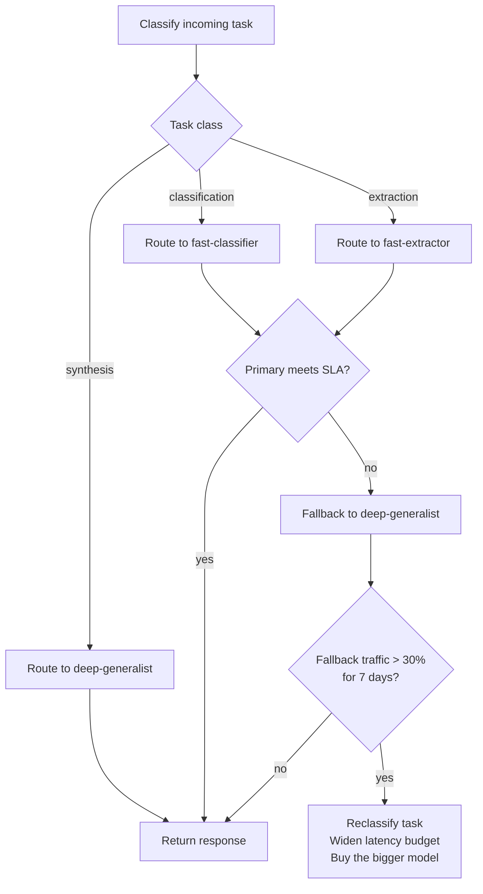

When your cheap path silently punts half the traffic to a bigger model, you do not have routing. You have a billing bug with nice branding. Classification, extraction, moderation, and long-form synthesis do not deserve the same model profile, and pretending otherwise is how teams blow the budget before they even hit scale.

The job is to send each task class to the cheapest model that still clears the SLA. The [OpenAI models guide](https://platform.openai.com/docs/models) is blunt about the tradeoff: bigger models buy capability, smaller ones buy latency and cost. So I would classify tasks first and route second. One default model for everything is lazy architecture.

I want each route to declare five things: primary alias, fallback alias, quality floor, latency budget, and cost ceiling. The route should be chosen before the model call starts. Do not ask the model to decide whether it is the right model. That is fake cleverness.

Write the policy first so the argument happens in code review instead of during an incident.

```python
from dataclasses import dataclass

@dataclass(frozen=True)
class RoutePolicy:
    primary_alias: str
    fallback_alias: str | None
    quality_floor: float
    latency_budget_ms: int
    max_input_cost_per_million: float

ROUTES = {
    "classification": RoutePolicy("fast-classifier", "deep-generalist", 0.88, 500, 0.40),
    "extraction": RoutePolicy("fast-extractor", "deep-generalist", 0.90, 800, 0.60),
    "synthesis": RoutePolicy("deep-generalist", None, 0.94, 4000, 8.00),
}
```

Here is the reference table I would keep next to the router config, because once traffic rises I do not want to reverse-engineer policy from Python literals.

| Task class     | Trigger condition                                                                     | Primary alias     | Fallback alias    | Latency budget | Input cost ceiling / 1M tokens | Quality floor |
| -------------- | ------------------------------------------------------------------------------------- | ----------------- | ----------------- | -------------- | ------------------------------ | ------------- |
| Classification | Short prompts, labeling, gating, or moderation-style decisions at high concurrency    | `fast-classifier` | `deep-generalist` | 500 ms         | $0.40                          | 0.88          |
| Extraction     | Structured field capture from messy text where I still need decent recall             | `fast-extractor`  | `deep-generalist` | 800 ms         | $0.60                          | 0.90          |
| Synthesis      | Long-form generation or reasoning-heavy answers where quality matters more than speed | `deep-generalist` | None              | 4000 ms        | $8.00                          | 0.94          |

If a route keeps missing those numbers, I do not tweak prompts first. I either reclassify the task, widen the latency budget, or admit the cheaper model was never good enough.

Once the policy exists, keep transport on a leash. LiteLLM already documents ordered fallbacks in its [reliability guide](https://docs.litellm.ai/docs/proxy/reliability) and deployment-level routing in its [load balancing guide](https://docs.litellm.ai/docs/proxy/load_balancing). Good. Let the transport layer execute the policy, but do not let it invent the policy.

This is the split I would actually ship.

```python
from litellm import Router

router = Router(
    model_list=[
        {
            "model_name": "fast-classifier",
            "litellm_params": {"model": "provider/small-instruct", "rpm": 600},
        },
        {
            "model_name": "fast-extractor",
            "litellm_params": {"model": "provider/medium-instruct", "rpm": 300},
        },
        {
            "model_name": "deep-generalist",
            "litellm_params": {"model": "provider/large-reasoner", "rpm": 60},
        },
    ],
    fallbacks=[
        {"fast-classifier": ["deep-generalist"]},
        {"fast-extractor": ["deep-generalist"]},
    ],
)


def run_route(task_class: str, messages: list[dict]) -> str:
    spec = ROUTES[task_class]
    response = router.completion(model=spec.primary_alias, messages=messages)
    return response.choices[0].message.content
```



Routing rots faster than people admit. The [OpenAI evals guide](https://developers.openai.com/api/docs/guides/evals) explicitly calls evals essential when upgrading or trying new models, which is exactly why I want route-level evals on a schedule instead of relying on somebody's gut feeling in Slack. If a vendor refresh changes quality or latency, the table should move the same week.

My cutoff is boring on purpose: if a route sends more than 30% of production traffic to fallback for seven straight days, the primary route is dead. Reclassify the task, widen the latency budget, or buy the bigger model. The fallback is insurance, not your real architecture.

## Resources

- [OpenAI graders](https://platform.openai.com/docs/guides/graders)
- [Semantic Kernel](https://learn.microsoft.com/en-us/semantic-kernel/overview/)
