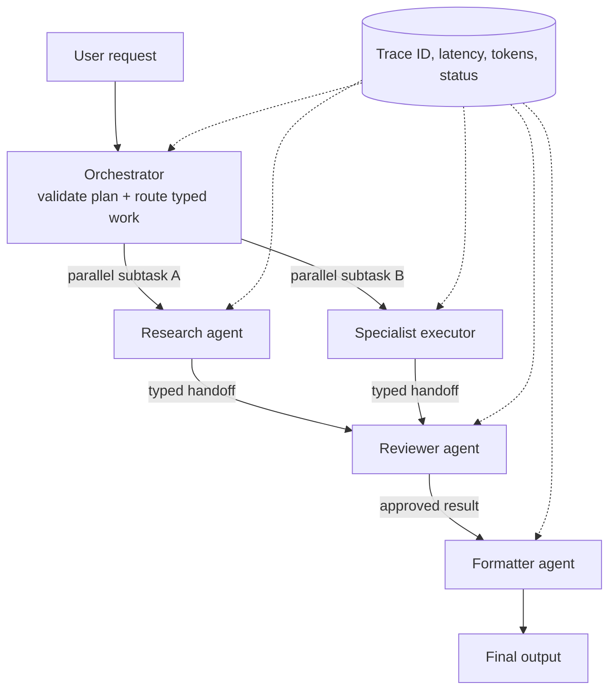

When one user request bounces through a planner, a researcher, a reviewer, and a formatter, your p95 latency blows up and nobody can explain which hop actually failed. Multi-agent architecture is usually that kind of self-inflicted pain.

I only reach for multiple agents when I can justify the tax in one of three ways: real parallel work, a hard isolation boundary, or specialist behavior I do not want mixed in one runtime. [AutoGen](https://microsoft.github.io/autogen/stable/) is built for conversational single and multi-agent apps, and [LangGraph](https://docs.langchain.com/oss/python/langgraph/overview) is explicit about being an orchestration runtime for long-running, stateful agents. Nice tooling, same warning: if you do not need orchestration, you are just paying for more hops.

The orchestrator is where architecture turns into theater. I do not want it doing business reasoning. I want it validating a plan, routing typed work, and rejecting unknown paths. If the orchestrator prompt is full of domain judgment, you hid product logic in the least testable place.

This is the shape I trust: one coordinator, specialist agents doing narrow work, and trace data attached to every hop.



Before the handoff code, lock the contract down so failure is loud instead of polite.

```python
from typing import Callable

AGENTS: dict[str, Callable] = {
    "security": security_agent,
    "pricing": pricing_agent,
    "docs": docs_agent,
}

def dispatch(subtask: Subtask) -> Result:
    handler = AGENTS.get(subtask.role)
    if handler is None:
        raise ValueError(f"No agent for {subtask.role}")
    return handler(subtask)
```

No guessing, no silent reroute, no magical fallback. If the plan says pricing and you only have security and docs, fail the run and fix the plan. A multi-agent system that improvises around missing specialists is just a flaky single agent wearing a fake mustache.

Observability is where the real bill shows up. [OpenTelemetry traces](https://opentelemetry.io/docs/concepts/signals/traces/) exist to correlate work across process boundaries, and [Semantic Kernel observability](https://learn.microsoft.com/en-us/semantic-kernel/concepts/enterprise-readiness/observability/) spells out the boring part people skip: logs, metrics, and tracing are table stakes for enterprise AI. Every cross-agent handoff should carry a trace identifier, sender, receiver, latency, token usage, and terminal status. If you cannot reconstruct one request end to end, you do not have an architecture. You have folklore.

That gets even more concrete for agent systems. [OpenTelemetry GenAI agent spans](https://opentelemetry.io/docs/specs/semconv/gen-ai/gen-ai-agent-spans/) define attributes such as `gen_ai.operation.name`, `gen_ai.agent.name`, `gen_ai.request.model`, and error data for agent and workflow spans. I would use those names before inventing my own schema, because custom telemetry vocabularies age like milk.

The reliability math is still merciless: three hops at 95% success each gives you roughly 86% end-to-end before retries. Add approval gates, queueing, or tool calls and the tail gets uglier, not smarter.

This is the role split I would keep if I had to defend the architecture in a design review.

| Role                   | What I want it doing                                            | What I do not want it doing                                  | Why it exists                                      |
| ---------------------- | --------------------------------------------------------------- | ------------------------------------------------------------ | -------------------------------------------------- |
| Orchestrator           | Validate the plan, route typed subtasks, reject unknown paths   | Hidden product judgment or improvising around missing agents | Keeps control flow explicit and testable           |
| Specialist executor    | Do one narrow job such as research, pricing, or security review | Taking over global coordination                              | Preserves isolation and makes expertise deliberate |
| Reviewer or gatekeeper | Check outputs, enforce policy, approve or fail loudly           | Quietly patching bad upstream work                           | Makes failure visible before it reaches users      |
| Formatter or publisher | Package the final answer into the requested shape               | Re-deciding the substance of the answer                      | Keeps presentation separate from reasoning         |

My cutoff is blunt: if you are not buying parallel throughput, isolation, or a real specialist boundary, keep one agent. If you are not hitting enough scale or risk to feel the tracing pain, ignore the multi-agent hype and spend your time on a better single-agent plan.

## Resources

- [LangGraph persistence](https://docs.langchain.com/oss/python/langgraph/persistence)
- [LangGraph interrupts](https://docs.langchain.com/oss/python/langgraph/interrupts)
