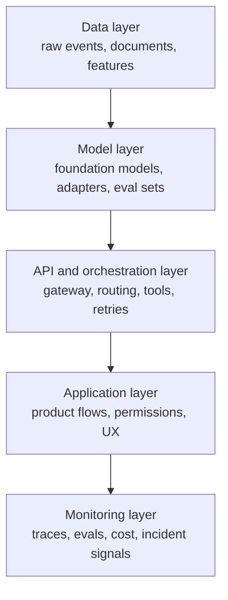

The demo passes on Friday. By Monday, retrieval is stale, latency doubled, and nobody can prove whether the gain came from the prompt, the ranker, or the model swap. That is when AI work stops being a playground and starts needing engineering.

My default move is to split the system into four seams: retrieval, gateway, evals, and business decisions. Retrieval fetches context. The gateway owns provider-specific request and tool semantics. Evals decide whether a change ships. Business code decides what the user may do. Compare OpenAI's [Responses API](https://platform.openai.com/docs/guides/responses-vs-chat-completions) with Anthropic [tool use](https://docs.anthropic.com/en/docs/agents-and-tools/tool-use/overview) once and the gateway stops looking optional.

That separation only matters if you can reject regressions before users find them. I would add evals before I add another provider, because [OpenAI Evals](https://platform.openai.com/docs/guides/evals) captures the production rule that matters: test outputs against criteria you control, then compare changes instead of arguing from vibes.

A gateway still needs a boring implementation. [LiteLLM](https://docs.litellm.ai/) earns its keep when you need routing, retries, and spend controls across providers. I would not self-host just to feel sophisticated. [vLLM](https://docs.vllm.ai/) becomes rational when throughput, latency, or data locality justify the operational bill.

If I need to explain the production stack fast, I draw it like this.



Monitoring sits last in the drawing, but in reality it has to watch every layer above it or the stack will lie to you.

I also want role boundaries to be obvious before the org chart gets political.

| Role              | What I expect it to own                                                                          | What I do not want it to own                            |
| ----------------- | ------------------------------------------------------------------------------------------------ | ------------------------------------------------------- |
| AI Engineer       | Prompt contracts, orchestration, eval wiring, guardrails, and production behavior                | Raw data pipelines or feature prioritization            |
| ML Engineer       | Model selection, fine-tuning or adapters, offline evaluation method, and model quality tradeoffs | App permissions, UX flows, or provider billing controls |
| Data Engineer     | Ingestion pipelines, document freshness, feature stores, and retrieval data quality              | Prompt iteration or per-provider tool semantics         |
| Platform Engineer | Gateway reliability, secrets, quotas, tracing, deploy and rollback paths                         | Use-case wording, acceptance criteria, or policy copy   |
| Product           | User impact, automation level, review bar, and kill-switch expectations                          | SDK details, retry logic, or vector index tuning        |

Before the second model lands, lock the contract down to something feature teams cannot accidentally bypass.

```ts
type AiRequest = { task: 'support' | 'search'; input: string; tenantId: string };
type AiResult = { answer: string; citations: string[]; traceId: string };

export async function runAiTask(req: AiRequest): Promise<AiResult> {
  const docs = await retrieval.fetch(req);
  const completion = await modelGateway.generate({ req, docs });
  await evaluations.record({ req, completion });
  return decisionLayer.format(completion);
}
```

The other thing I refuse to skip is tracing. If an answer cannot be tied to a [trace](https://opentelemetry.io/docs/concepts/signals/traces/), a prompt version, retrieved documents, and an eval result, you cannot debug production behavior fast enough to hit an SLA.

My rule is simple: stay on one hosted model until provider swaps happen more than once a quarter or a hard latency or data-locality constraint forces the change. If you cannot compare variants with traces and evals, adding a second model is just a slower way to lose weekends.
