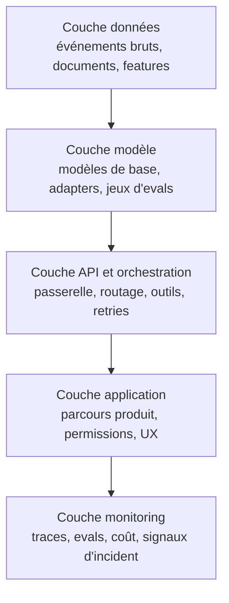

La démo passe le vendredi. Le lundi, la récupération est périmée, la latence a doublé, et personne n'est capable de prouver si le gain vient du prompt, du ranker ou du changement de modèle. C'est à ce moment-là que le jouet devient un problème d'ingénierie.

Mon réflexe est de découper le système en quatre coutures : récupération, passerelle, evals et décisions métier. La récupération va chercher le contexte. La passerelle absorbe les sémantiques de requête et d'outils propres à chaque fournisseur. Les evals décident si un changement mérite la production. Le code métier décide ce que l'utilisateur a réellement le droit de faire. Il suffit de comparer l'[API Responses](https://platform.openai.com/docs/guides/responses-vs-chat-completions) d'OpenAI et le [tool use](https://docs.anthropic.com/en/docs/agents-and-tools/tool-use/overview) d'Anthropic une fois pour comprendre que la passerelle n'a rien d'un luxe.

Cette séparation ne sert à rien si vous êtes incapables de bloquer une régression avant que les utilisateurs la trouvent. J'ajouterais des evals avant d'ajouter un autre fournisseur, parce que [OpenAI Evals](https://platform.openai.com/docs/guides/evals) rappelle la règle de production qui compte : tester les sorties contre des critères que vous contrôlez, puis comparer les changements au lieu de débattre au feeling.

Une passerelle a quand même besoin d'une implémentation ennuyeuse. [LiteLLM](https://docs.litellm.ai/) devient utile quand il faut du routage, des retries et du contrôle de dépense entre fournisseurs. Je n'auto-hébergerais rien pour me donner un air malin. [vLLM](https://docs.vllm.ai/) devient rationnel quand le débit, la latence ou la localisation des données justifient la facture opérationnelle.

Quand je dois expliquer vite la stack de production, je la dessine comme ça.



Le monitoring apparaît à la fin du schéma, mais en vrai il doit surveiller toutes les couches, sinon la stack vous raconte des histoires.

Je veux aussi des frontières de rôle claires avant que l'organigramme ne se mêle de la technique.

| Rôle              | Ce que j'attends qu'il porte                                                                         | Ce que je ne veux pas lui laisser                                         |
| ----------------- | ---------------------------------------------------------------------------------------------------- | ------------------------------------------------------------------------- |
| AI Engineer       | Contrats de prompt, orchestration, branchement des evals, garde-fous et comportement en prod         | Pipelines de données brutes ou priorisation produit                       |
| ML Engineer       | Choix des modèles, fine-tuning ou adapters, méthode d'évaluation hors ligne et arbitrages de qualité | Permissions applicatives, parcours UX ou contrôle des coûts provider      |
| Data Engineer     | Pipelines d'ingestion, fraîcheur documentaire, feature stores et qualité des données de retrieval    | Itération sur les prompts ou sémantique d'outils propre à chaque provider |
| Platform Engineer | Fiabilité de la passerelle, secrets, quotas, traces, déploiement et rollback                         | Formulation du cas d'usage, critères d'acceptation ou texte de policy     |
| Product           | Impact utilisateur, niveau d'automatisation, niveau de revue et attentes sur le kill switch          | Détails SDK, logique de retry ou tuning d'index vectoriel                 |

Avant que le deuxième modèle n'arrive, verrouillez le contrat sur quelque chose que les équipes produit ne peuvent pas contourner par accident.

```ts
type AiRequest = { task: 'support' | 'search'; input: string; tenantId: string };
type AiResult = { answer: string; citations: string[]; traceId: string };

export async function runAiTask(req: AiRequest): Promise<AiResult> {
  const docs = await retrieval.fetch(req);
  const completion = await modelGateway.generate({ req, docs });
  await evaluations.record({ req, completion });
  return decisionLayer.format(completion);
}
```

L'autre chose que je refuse de sacrifier, c'est le traçage. Si une réponse ne peut pas être rattachée à une [trace](https://opentelemetry.io/docs/concepts/signals/traces/), à une version de prompt, aux documents récupérés et à un résultat d'eval, vous ne corrigerez jamais un incident assez vite pour tenir un SLA.

Ma règle est simple : restez sur un seul modèle hébergé tant que les changements de fournisseur n'arrivent pas plus d'une fois par trimestre ou qu'une contrainte dure de latence ou de localisation des données ne vous y force pas. Si vous ne savez pas comparer des variantes avec des traces et des evals, ajouter un deuxième modèle est juste une façon plus lente de perdre vos week-ends.
