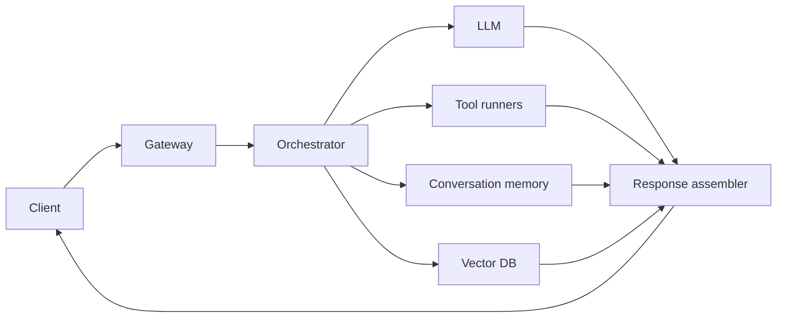

Your first outage will not come from the model. It will come from the moment retrieval slows down, one tool runner stalls, and 10,000 concurrent users pile onto the same path. That is the point where architecture stops being a slide and starts being an SLA.

Treat the model as one dependency, not the application. Microsoft's [agent architecture](https://learn.microsoft.com/en-us/agents/architecture/components-of-agent-architecture) separates client, storage, orchestrator, model, and tools for a reason. I would still keep conversation state outside the orchestrator. Stateless workers autoscale better, fail cleaner, and are far less annoying to debug at 3 a.m.

There are four boxes I want to see drawn separately. First, an ingress layer that authenticates, rate-limits, and tags requests. Second, an orchestration layer that builds context and decides which capabilities may run. Third, isolated tool runners with deadlines and idempotency. Anthropic's [tool use](https://docs.anthropic.com/en/docs/agents-and-tools/tool-use/overview) makes that boundary explicit: the application executes client tools, not the model. Fourth, a model access layer, often through [LiteLLM](https://docs.litellm.ai/) or another gateway, so routing and failover are not hardcoded into product flows. If you self-host, [vLLM](https://docs.vllm.ai/) belongs in the serving layer, not in orchestration code.

If your diagram cannot show the hot path in 10 seconds, it is too vague. This is the minimum production path I want on the wall.

Before this turns into architecture fan fiction, force a latency budget into the design. I do not want a hopeful average buried in a slide. I want an explicit budget with a reaction attached when one stage blows it.

| Component                        | p50 target | p99 target | Action if exceeded                                                                         |
| -------------------------------- | ---------: | ---------: | ------------------------------------------------------------------------------------------ |
| Auth and gateway                 |     150 ms |     300 ms | Shed load, tighten rate limits, and serve cached refusals for abusive paths                |
| Orchestrator                     |     300 ms |     700 ms | Trim prompt assembly, parallelize safe calls, and cut optional enrichment                  |
| Retrieval / vector DB            |     600 ms |    1200 ms | Return fewer documents, switch to cached context, or bypass retrieval on low-risk queries  |
| Tool runners                     |     400 ms |     900 ms | Enforce deadlines, fall back to partial answers, and trip circuit breakers for flaky tools |
| Model inference                  |    2400 ms |    5000 ms | Route to a smaller fallback model or a shorter generation policy                           |
| Response assembly and validation |     150 ms |     300 ms | Skip non-critical post-processing and return the validated minimum                         |

That budget matters because every extra hop steals time from inference and increases failure fan-out. If you really need multi-minute work, queue it and poll status; [background mode](https://platform.openai.com/docs/guides/background) exists for exactly that shape. Security boundaries also belong in the diagram, not in a cleanup ticket. If the model can influence tool parameters or consume untrusted documents, the [OWASP LLM Top 10](https://genai.owasp.org/llm-top-10/) should shape interface boundaries from day one.

I prefer architectures that degrade in layers. Lose retrieval, return a narrower answer. Lose a premium model, route low-risk traffic to a cheaper fallback. Lose a tool, keep the chat useful and explicit about the limitation. If one dependency outage takes the whole feature down, you built a chain, not a system.

My rule is blunt: once one request can fan out to more than two external systems, add deadlines, circuit breakers, and fallback paths before you ship another capability.
