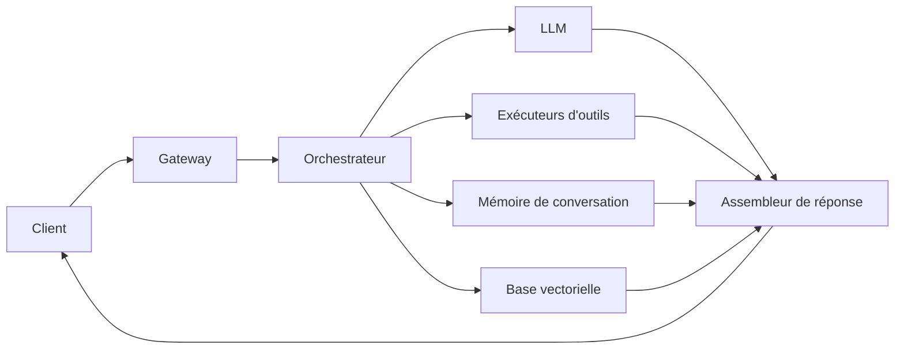

Votre première panne ne viendra pas du modèle. Elle viendra du moment où le retrieval ralentit, où un exécuteur d'outils se bloque et où 10 000 utilisateurs concurrents s'entassent sur le même chemin. C'est le moment où l'architecture cesse d'être un schéma et devient un SLA.

Traitez le modèle comme une dépendance, pas comme l'application. L'[architecture d'agent](https://learn.microsoft.com/en-us/agents/architecture/components-of-agent-architecture) de Microsoft sépare client, stockage, orchestrateur, modèle et outils pour une bonne raison. J'irais quand même plus loin : l'état de conversation doit rester hors de l'orchestrateur. Des workers stateless passent mieux à l'échelle, tombent plus proprement et sont beaucoup moins pénibles à déboguer à 3 heures du matin.

Il y a quatre boîtes que je veux voir dessinées séparément. D'abord, une couche d'entrée qui authentifie, applique la limitation de débit et tague les requêtes. Ensuite, une couche d'orchestration qui construit le contexte et décide quelles capacités peuvent s'exécuter. Puis des exécuteurs d'outils isolés, avec deadlines et idempotence. Le [tool use](https://docs.anthropic.com/en/docs/agents-and-tools/tool-use/overview) d'Anthropic rend cette frontière explicite : c'est l'application qui exécute les outils client, pas le modèle. Enfin, une couche d'accès modèle, souvent via [LiteLLM](https://docs.litellm.ai/) ou une autre passerelle, pour éviter que le routage et le failover soient câblés dans les parcours produit. Si vous auto-hébergez, [vLLM](https://docs.vllm.ai/) appartient à la couche de serving, pas au code d'orchestration.

Si votre schéma ne montre pas le chemin chaud en 10 secondes, il est trop flou. Voilà le trajet minimal que je veux voir affiché.

Avant que ça tourne à la fan fiction d'architecture, imposez un budget de latence dans le design. Je ne veux pas d'une moyenne optimiste planquée dans un slide. Je veux un budget explicite, avec une réaction prévue quand une étape explose.

| Composant                    | Cible p50 | Cible p99 | Action si dépassement                                                                                                  |
| ---------------------------- | --------: | --------: | ---------------------------------------------------------------------------------------------------------------------- |
| Auth et gateway              |    150 ms |    300 ms | Écrémer la charge, resserrer le rate limiting et servir des refus en cache sur les chemins abusifs                     |
| Orchestrateur                |    300 ms |    700 ms | Alléger l'assemblage du prompt, paralléliser les appels sûrs et couper l'enrichissement optionnel                      |
| Retrieval / base vectorielle |    600 ms |   1200 ms | Renvoyer moins de documents, basculer sur du contexte en cache ou bypasser le retrieval pour les requêtes peu risquées |
| Exécuteurs d'outils          |    400 ms |    900 ms | Imposer des deadlines, retomber sur des réponses partielles et déclencher les circuit breakers des outils instables    |
| Inférence modèle             |   2400 ms |   5000 ms | Router vers un modèle de secours plus petit ou une politique de génération plus courte                                 |
| Assemblage et validation     |    150 ms |    300 ms | Sauter le post-traitement non critique et renvoyer le minimum validé                                                   |

Ce budget compte parce que chaque saut supplémentaire vole du temps à l'inférence et augmente le fan-out des pannes. Si vous avez vraiment besoin d'un travail qui dure plusieurs minutes, mettez-le en file d'attente et interrogez son statut ; le [background mode](https://platform.openai.com/docs/guides/background) existe précisément pour cette forme d'exécution. Les frontières de sécurité doivent aussi être dans le schéma, pas dans un ticket de nettoyage. Si le modèle peut influencer les paramètres d'outils ou consommer des documents non fiables, le [Top 10 OWASP LLM](https://genai.owasp.org/llm-top-10/) doit façonner les frontières d'interface dès le premier jour.

Je préfère les architectures qui se dégradent par couches. Si le retrieval tombe, on rend une réponse plus étroite. Si le modèle premium tombe, on route le trafic peu risqué vers un fallback moins cher. Si un outil tombe, on garde un chat utile et explicite sur la limite. Si une seule panne de dépendance fait tomber toute la fonctionnalité, vous avez construit une chaîne, pas un système.

Ma règle est brutale : dès qu'une requête peut se brancher sur plus de deux systèmes externes, ajoutez deadlines, circuit breakers et fallbacks avant de livrer une capacité de plus.
