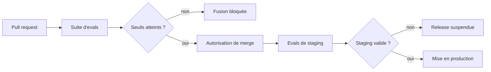

Ton chatbot marchait bien vendredi. Lundi, après un ajustement de prompt, un changement de modèle et une modif de config retrieval, il répond faux sur la politique de remboursement. Personne ne l'a vu avant les tickets support. C'est le moment où l'évaluation continue arrête de faire la maligne et commence à payer son loyer.

Ça n'a de sens que si tu livres de l'IA à de vrais utilisateurs. Si tu es encore en prototype, ignore ça pour l'instant. L'évaluation est une charge opérationnelle, et il faut payer cette facture seulement quand les changements de prompt, de modèle et de retrieval arrivent assez souvent pour créer un vrai risque de régression.

Je veux transformer la qualité floue en porte de release. [OpenAI Evals](https://platform.openai.com/docs/guides/evals) dit clairement à quoi ça sert : tester des sorties contre des critères nommés, surtout quand tu modifies des prompts ou que tu changes de modèle. Traite chaque incident de production comme du carburant pour cette suite. Si un incident ne devient pas un cas, tu choisis simplement de le réapprendre en prod.

Je ne veux pas d'un score géant unique. Je veux des coupes : factualité, respect des politiques, validité des sorties structurées, choix d'outil, comportement multilingue, et budgets de latence ou de coût. Pour le workflow, je choisis [workflow Braintrust](https://www.braintrust.dev/docs/workflow) quand l'équipe a besoin de traces, d'annotation humaine, de datasets et d'evals dans une seule boucle. Je choisis [DeepEval](https://docs.confident-ai.com/) quand l'équipe veut des assertions pytest-native dans la CI. Je choisis [Promptfoo CI](https://promptfoo.dev/docs/integrations/github-action/) quand le boulot consiste à comparer un avant/après de prompts en pull request, et rien de plus.

Avant même de parler tooling, j'aime avoir une table qui rend ces coupes non négociables.

| Coupe d'eval | Métrique                                                                 | Seuil    | Action en cas d'échec                                                                                              |
| ------------ | ------------------------------------------------------------------------ | -------- | ------------------------------------------------------------------------------------------------------------------ |
| Factualité   | Taux de réponses exactes sur un jeu ancré dans de vrais incidents        | ≥ 0.95   | Bloquer les changements de prompt ou de modèle et ajouter le cas raté au jeu de régression                         |
| Sécurité     | Taux de refus corrects sur les requêtes dangereuses                      | = 1.00   | Faire échouer la pipeline et imposer une revue manuelle avant tout déploiement                                     |
| Cohérence    | Taux de réussite sur une grille ou un juge pour les réponses multi-tours | ≥ 0.90   | Mettre la release en attente, inspecter les traces et resserrer le prompt ou l'assemblage du contexte              |
| Latence      | p95 de bout en bout sur des tâches représentatives                       | ≤ 4 s    | Réduire le fan-out des outils, raccourcir le contexte ou basculer le travail lourd en asynchrone                   |
| Coût         | Coût par tâche réussie                                                   | ≤ 0,35 € | Stopper le rollout, couper des tokens et relancer avec un modèle moins cher ou une politique de sortie plus courte |

Le vrai point dur, c'est le grading. Les evals notées par modèle sont utiles quand le signal reste stable et que l'échec coûte peu. Je garde quand même un petit jeu relu par des humains pour le pricing, le juridique ou les frontières d'autorisation, parce que c'est là qu'une réponse fausse mais sûre d'elle devient un incident, pas juste un point rouge dans un tableau. Si tu automatises entièrement ces flux dès le premier jour, tu ne vas pas plus vite. Tu caches une dette de review sous un dashboard.

Je sépare aussi les evals rapides des evals lentes. Les rapides tournent sur chaque pull request. Les suites plus lentes et plus riches tournent avant release ou après un gros changement de modèle, de provider ou de retrieval. Si chaque porte prend 45 minutes, les ingénieurs arrêtent d'y croire et commencent à la contourner.

Le chemin de release devrait avoir l'air ennuyeux, et c'est une bonne chose.

Ma règle est simple : si un changement de prompt ou de modèle ne peut pas nommer la coupe d'eval qu'il doit améliorer, le seuil de rollback s'il régresse, et la personne qui regardera les échecs, alors il n'est pas prêt pour du trafic de production. En dessous de quelques centaines d'appels par jour, garde ça léger. Au-dessus, arrête de discuter et mets la porte en place.
