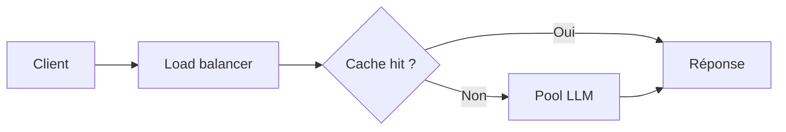

La démo a survécu à cinquante utilisateurs, donc tout le monde a fait semblant que le système était prêt. Puis un client a collé un an d'historique de tickets, un autre a ouvert cinq onglets, et votre temps de file a dépassé le temps d'inférence. La douleur de scalabilité dans une app IA commence le plus souvent par trop de travail par requête, pas par un manque de GPU.

Le premier correctif est ennuyeux, donc les équipes l'évitent. Le [guide de latence](https://developers.openai.com/api/docs/guides/latency-optimization) dit que les tokens de sortie dominent la latence et que raccourcir le prompt aide moins, sauf quand le contexte est déjà énorme. Les préfixes répétés doivent utiliser le [prompt caching](https://docs.anthropic.com/en/docs/build-with-claude/prompt-caching), parce que recalculer le même prompt système à chaque appel est une douleur qu'on s'inflige soi-même. Si vous servez vos propres poids, [vLLM](https://docs.vllm.ai/) sert précisément à l'inférence à haut débit, et le [papier vLLM](https://arxiv.org/abs/2309.06180) reste la référence pour comprendre pourquoi la mémoire KV paginée et le continuous batching tiennent quand la concurrence monte. Pour la passerelle, je partirais sur [LiteLLM routing](https://docs.litellm.ai/docs/routing), pas sur un routeur maison, et je garderais son défaut documenté `simple-shuffle` tant que le trafic réel ne prouve pas qu'une stratégie plus coûteuse vaut le coup.

Je scale les systèmes IA dans cet ordre. D'abord, supprimer les tokens inutiles. Ensuite, séparer le trafic selon la criticité métier. Puis mettre en cache ou batcher les chemins qui se répètent. Enfin, ajouter de la capacité. La plupart des équipes commencent à l'étape quatre parce qu'acheter de la capacité est politiquement plus simple que dire aux propriétaires des prompts qu'ils gaspillent la moitié du budget de latence. Elles évitent aussi le test de charge moche, celui avec des conversations longues, des tenants de tailles très différentes, des ratés de retrieval et des annulations côté client. C'est exactement là que la file commence à mentir.

Si la personne d'astreinte ne peut pas dessiner le chemin chaud en dix secondes, l'architecture est déjà trop floue. Voilà le flux de requête que je veux voir sur le tableau blanc en premier.



Et quand je dis « scaler le système », je parle de choisir la tactique la moins chère qui colle vraiment au goulot.

| Tactique de scalabilité | Quand je l'utilise                                                                         | Le compromis que j'accepte                                                   |
| ----------------------- | ------------------------------------------------------------------------------------------ | ---------------------------------------------------------------------------- |
| Horizontal scaling      | Quand les workers sont surtout stateless et que la douleur immédiate, c'est la concurrence | Plus de coût infra et davantage de coordination autour des limites partagées |
| Caching                 | Quand prompts, préfixes ou réponses reviennent assez souvent pour que ça compte            | Risque de stale data et travail d'invalidation que personne n'aime faire     |
| Batching                | Quand le débit compte plus que la réponse instantanée sur une classe de requêtes           | Plus de mise en file et un tail latency moins bon sur l'interactif           |
| Async queues            | Quand l'utilisateur peut attendre et que le boulot est coûteux ou bursty                   | Plus de complexité produit autour du statut, des retries et des annulations  |
| Model sharding          | Quand le trafic se découpe clairement par SLA, plafond de coût ou capacité modèle          | Plus de logique de routage et un vrai risque de capacité fragmentée          |

Voici la forme de routage que je mettrais en production en premier.

```yaml
model_list:
  - model_name: fast-lane
    litellm_params:
      model: openai/gpt-4.1-mini
      weight: 3
  - model_name: fast-lane
    litellm_params:
      model: openai/gpt-4.1
      weight: 1
  - model_name: quality-lane
    litellm_params:
      model: openai/gpt-4.1

router_settings:
  routing_strategy: simple-shuffle
```

Ça garde une politique lisible. Le produit choisit `fast-lane` ou `quality-lane` selon le SLA, et le routeur reste sur la stratégie la moins coûteuse tant que vous n'avez pas de mesures qui justifient une stratégie basée sur la latence ou l'usage. Je rendrais aussi le backpressure explicite : plafonds de file, quotas par tenant, budgets de timeout et annulation quand le client disparaît. Continuer à travailler sur des requêtes abandonnées, c'est la façon la plus bête de brûler de la marge tout en ratant ses objectifs de latence.

Ma règle est sèche : si le P95 rate la cible alors que l'infrastructure de serving est tranquillement sous-utilisée, redessinez le chemin de requête. Si l'utilisation est élevée et que la file continue de gonfler après nettoyage du prompt, caching et batching, alors seulement achetez de la capacité.
