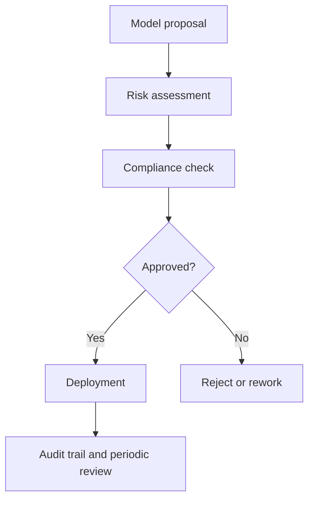

Nobody asks about your prompt chain during a pilot. They ask after procurement, legal, or the first security review: who approved this use case, what data reaches the model, and how do we shut it off when behavior drifts? That is when most teams discover they built an AI demo, not AI governance.

Real governance is not a committee collecting slides. It is decision rights wired into delivery. The [EU AI Act](https://eur-lex.europa.eu/eli/reg/2024/1689/oj/eng) applies obligations based on the system's role and risk category. The [NIST AI RMF](https://www.nist.gov/itl/ai-risk-management-framework) gives the operating shape I would actually use in production: govern, map, measure, manage. Those frameworks matter because they force ownership. Someone has to own the model family, the data boundary, the evaluation bar, and the kill switch.

I would keep the review group small and give it authority. Product owns user impact. Security owns abuse cases. Legal or compliance owns regulated constraints. Platform owns model access, logging, and rollback. That group should review model families, data classes, automation levels, and irreversible actions. It should not waste a week approving prompt wording tweaks.

If governance is real, the workflow from idea to deployment should be boringly explicit.



I also want names, not vague accountability theater.

| Role               | What I expect it to own                                                                                      |
| ------------------ | ------------------------------------------------------------------------------------------------------------ |
| AI Governance Lead | Owns the review cadence, the model registry, the policy updates, and the evidence pack auditors will ask for |
| Risk Officer       | Scores misuse risk, automation risk, human-review thresholds, and irreversible-action exposure               |
| Compliance Officer | Maps regulation, contracts, provider policy, and retention rules to concrete release constraints             |
| Engineering        | Enforces access controls, logging, kill switches, rollback paths, and the approved model boundary in code    |
| Product            | Owns the use case, user harm analysis, rollout scope, and whether the business benefit justifies the risk    |

That policy has to survive contact with production. If it is not in config and logs, it is theater. A model registry is boring. Good. Boring survives audits.

```yaml
use_case: customer-support-routing
owner: service-operations
risk_level: medium
allowed_models:
  - approved-small-model
  - approved-large-model
data_classes:
  - public
  - customer-account-metadata
human_review_required: false
tool_actions:
  - create_ticket
kill_switch: customer-support-routing-disabled
```

Provider rules still apply. If you ship on OpenAI, your internal sign-off does not override the [usage policies](https://openai.com/policies/usage-policies). If you accept tool calls or untrusted retrieval content, the [OWASP LLM Top 10](https://genai.owasp.org/llm-top-10/) belongs in governance, not only in a pentest.

The part most teams skip is evidence. The [NIST GenAI Profile](https://doi.org/10.6028/NIST.AI.600-1) pushes documentation, monitoring, and human oversight because incidents get ugly fast when you cannot reconstruct inputs, models, safeguards, and decisions. In practice, every material output should tie back to a model version, a prompt version, an evaluation result, and a named owner. Without lineage, leadership only has one question during an incident: what changed.

Use this rule and be strict about it: if a team cannot tell you in under one minute which model is running, what data class it sees, who owns it, and how to disable it, that feature is not governed enough to ship.
