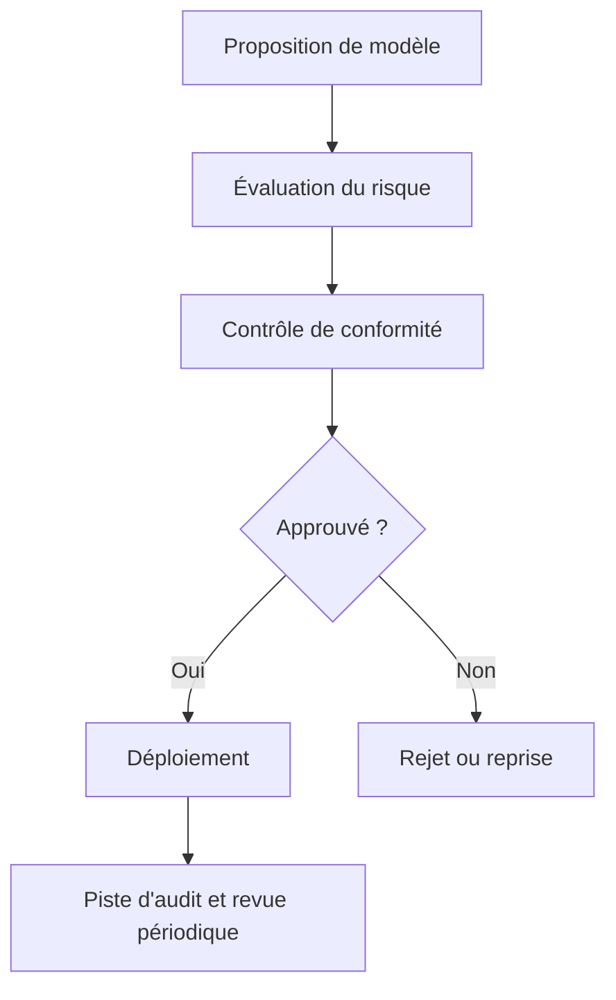

Personne ne vous interroge sur votre chaîne de prompts pendant un pilote. Les questions arrivent après le passage achats, juridique ou la première revue sécurité : qui a approuvé ce cas d'usage, quelles données atteignent le modèle, et comment on le coupe quand le comportement dérive ? C'est là que beaucoup d'équipes découvrent qu'elles ont construit une démo IA, pas une gouvernance IA.

La vraie gouvernance, ce n'est pas un comité qui collectionne des slides. Ce sont des droits de décision branchés dans la livraison. L'[AI Act européen](https://eur-lex.europa.eu/eli/reg/2024/1689/oj/fra) applique des obligations selon le rôle du système et sa catégorie de risque. Le [NIST AI RMF](https://www.nist.gov/itl/ai-risk-management-framework) donne la forme opérationnelle que je choisirais en production : govern, map, measure, manage. Ces cadres comptent parce qu'ils forcent l'attribution claire des responsabilités. Quelqu'un doit posséder la famille de modèles, la frontière de données, le niveau d'exigence des évaluations et le kill switch.

Je garderais le groupe de revue petit, avec un vrai pouvoir de décision. Le produit porte l'impact utilisateur. La sécurité porte les scénarios d'abus. Le juridique ou la conformité portent les contraintes réglementaires. La plateforme porte l'accès aux modèles, la journalisation et le rollback. Ce groupe doit revoir les familles de modèles, les classes de données, les niveaux d'automatisation et les actions irréversibles. Il ne doit pas perdre une semaine à approuver des retouches de prompts.

Si la gouvernance est réelle, le chemin entre l'idée et la prod doit être explicite au point d'en devenir banal.



Je veux aussi des noms sur les responsabilités, pas un vague théâtre de l'accountability.

| Rôle                       | Ce que j'attends qu'il porte                                                                                                              |
| -------------------------- | ----------------------------------------------------------------------------------------------------------------------------------------- |
| Responsable gouvernance IA | Porte le rythme des revues, le registre des modèles, les mises à jour de policy et le dossier de preuves demandé en audit                 |
| Responsable risques        | Note les risques d'abus, d'automatisation, les seuils de revue humaine et l'exposition aux actions irréversibles                          |
| Responsable conformité     | Traduit réglementation, contrats, policy provider et règles de rétention en contraintes de livraison concrètes                            |
| Engineering                | Implémente les contrôles d'accès, les logs, les kill switches, les chemins de rollback et la frontière des modèles approuvés dans le code |
| Product                    | Porte le cas d'usage, l'analyse du préjudice utilisateur, le périmètre de déploiement et l'arbitrage bénéfice-risque                      |

Cette politique doit survivre au réel. Si elle n'existe pas dans la configuration et dans les logs, c'est du théâtre. Un registre de modèles, c'est banal. Très bien. Le banal survit aux audits.

```yaml
use_case: customer-support-routing
owner: service-operations
risk_level: medium
allowed_models:
  - approved-small-model
  - approved-large-model
data_classes:
  - public
  - customer-account-metadata
human_review_required: false
tool_actions:
  - create_ticket
kill_switch: customer-support-routing-disabled
```

Les règles du fournisseur continuent de s'appliquer. Si vous déployez sur OpenAI, votre validation interne n'annule pas les [usage policies](https://openai.com/policies/usage-policies). Si votre système accepte des tool calls ou du contenu de récupération non fiable, le [Top 10 OWASP LLM](https://genai.owasp.org/llm-top-10/) doit entrer dans la gouvernance, pas seulement dans un pentest.

La partie que la plupart des équipes sautent, c'est la preuve. Le [profil GenAI du NIST](https://doi.org/10.6028/NIST.AI.600-1) insiste sur la documentation, la supervision et le suivi parce qu'un incident tourne vite au chaos quand vous ne pouvez plus reconstruire les entrées, les modèles, les garde-fous et les décisions. En pratique, chaque sortie importante devrait remonter à une version de modèle, une version de prompt, un résultat d'évaluation et un responsable nommé. Sans lignage, la direction n'a plus qu'une seule question pendant l'incident : qu'est-ce qui a changé ?

Gardez cette règle et soyez dur dessus : si une équipe ne peut pas vous dire en moins d'une minute quel modèle tourne, quelle classe de données il voit, qui en est responsable et comment le désactiver, cette fonctionnalité n'est pas assez gouvernée pour passer en production.
