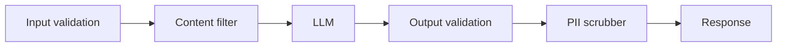

Your AI feature ships fast and looks smart in demos. Then one user lands a prompt injection, pulls internal instructions, and makes a tool call with junk arguments. Guardrails are the work teams postpone until the first ugly incident. That is backwards. In production, guardrails are control points wrapped around the full request lifecycle, not a moderation checkbox stapled to the front.

The [OWASP Top 10](https://genai.owasp.org/llm-top-10/) is where I start because it names the failures that matter in prod: prompt injection, insecure output handling, and sensitive information disclosure. That list should change the design, not sit in a slide deck. I do not trust one classifier in front of the model. I want three rails that fail independently: input validation before inference, execution constraints around tools, and output validation before anything reaches the user.

That is why I reach for [NeMo Guardrails docs](https://docs.nvidia.com/nemo/guardrails/latest/index.html) or [Guardrails AI docs](https://www.guardrailsai.com/docs). Not because a framework makes the problem easy, but because explicit policy beats vibes. If a model can search, send mail, or hit an internal API, the rail belongs next to that capability. Hiding the rule inside the system prompt is lazy engineering.

A minimal production flow should look more like a gateway than a chat wrapper. Put the contract in code, then let the model operate inside it.

If I need to explain the stack to a new teammate, I draw the path before I argue about frameworks:



```python
policy = {
    "max_prompt_chars": 12000,
    "blocked_topics": ["credentials", "payment card data"],
    "tool_allowlist": ["search_docs", "create_ticket"],
}

user_input = validate_input(message, policy)
response = llm.generate(user_input, tools=policy["tool_allowlist"])
validated = validate_output(response, schema=AnswerSchema)

if validated.escalate:
    return route_to_human(validated.reason)

return validated.answer
```

The part people get wrong is the fallback. Keyword blacklists are cheap to ship and expensive to trust. Real guardrails are contextual: they know which tools are exposed, which data classes are in play, and which failures must escalate instead of being silently refused. They also need to align with provider rules in docs such as the [OpenAI safety guide](https://platform.openai.com/docs/guides/safety-best-practices). Your policy and your vendor's policy are separate gates. Treat them that way.

When a team asks me what actually runs where, I use a blunt control table like this:

| Control type                 | Layer             | Example                                                                              | Action on trigger                                                             |
| ---------------------------- | ----------------- | ------------------------------------------------------------------------------------ | ----------------------------------------------------------------------------- |
| Schema and size checks       | Input validation  | Prompt body is missing required fields or exceeds 12k chars                          | Reject the request and return a user-safe error                               |
| Source and file allowlist    | Input validation  | User uploads an unsupported file type or a private document from the wrong workspace | Quarantine the input and require manual review                                |
| Prompt-injection screening   | Content filter    | Message says “ignore previous instructions” and asks for hidden system rules         | Block, strip, or route to human review                                        |
| Structured output validation | Output validation | Model returns invalid JSON or missing required keys                                  | Retry once with stricter instructions, then escalate                          |
| Policy and citation checks   | Output validation | Draft includes a prohibited action or an uncited factual claim                       | Refuse delivery and fall back to a safer response                             |
| Sensitive-data redaction     | PII scrubber      | Response contains an email, SSN, or API key pattern                                  | Redact the value, log the event, and continue only if the answer stays useful |

I care more about observability than framework branding. Log every blocked action, every override, every schema failure. Review false positives every week, because guardrails that nobody can explain will get bypassed by the on-call team at 2 a.m.

My rule is simple: if the model acts on behalf of a user, guardrails are mandatory. If it can touch money, private data, or production systems, put a deterministic approval step in the path. If that extra hop feels too expensive, the feature is probably too risky to automate.
