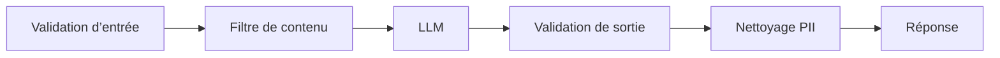

Votre fonctionnalité IA part vite en prod et impressionne en démo. Puis un utilisateur réussit une prompt injection, récupère des instructions internes et déclenche un appel d'outil avec des arguments absurdes. Les garde-fous, c'est le travail que les équipes repoussent jusqu'au premier incident sale. C'est une erreur. En production, les garde-fous sont des points de contrôle autour de tout le cycle de requête, pas une case « modération » agrafée au début.

Je pars du [Top 10 OWASP](https://genai.owasp.org/llm-top-10/) parce qu'il nomme les pannes qui comptent en prod : prompt injection, sorties dangereuses et fuite d'informations sensibles. Cette liste doit changer le design, pas finir dans un slide. Je ne fais pas confiance à un classifieur unique devant le modèle. Je veux trois rails capables d'échouer séparément : validation d'entrée avant l'inférence, contraintes d'exécution autour des outils et validation de sortie avant qu'un texte atteigne l'utilisateur.

C'est pour ça que je vais vers les [docs NeMo Guardrails](https://docs.nvidia.com/nemo/guardrails/latest/index.html) ou les [docs Guardrails AI](https://www.guardrailsai.com/docs). Pas parce qu'un framework rend le problème simple, mais parce qu'une politique explicite vaut mieux qu'une intuition floue. Si un modèle peut chercher, envoyer un email ou appeler une API interne, le garde-fou doit vivre au niveau de cette capacité. Cacher la règle dans le prompt système, c'est de l'ingénierie paresseuse.

Un flux de prod minimal doit ressembler à une passerelle plus qu'à une surcouche de chat. Mettez le contrat dans le code, puis laissez le modèle évoluer à l'intérieur.

Quand je dois expliquer la pile à un nouveau collègue, je commence par dessiner le trajet avant de discuter framework :



```python
policy = {
    "max_prompt_chars": 12000,
    "blocked_topics": ["credentials", "payment card data"],
    "tool_allowlist": ["search_docs", "create_ticket"],
}

user_input = validate_input(message, policy)
response = llm.generate(user_input, tools=policy["tool_allowlist"])
validated = validate_output(response, schema=AnswerSchema)

if validated.escalate:
    return route_to_human(validated.reason)

return validated.answer
```

La partie que les équipes ratent, c'est le repli. Les listes de mots-clés sont rapides à livrer et coûteuses à croire. Les vrais garde-fous sont contextuels : ils savent quels outils sont exposés, quelles classes de données sont en jeu et quels échecs doivent déclencher une escalade au lieu d'un refus silencieux. Ils doivent aussi rester alignés sur les règles du fournisseur, par exemple le [guide sécurité d'OpenAI](https://platform.openai.com/docs/guides/safety-best-practices). Votre politique et celle du fournisseur sont deux barrières distinctes. Traitez-les comme telles.

Quand une équipe me demande qui contrôle quoi, je sors un tableau très terre à terre :

| Type de contrôle                          | Couche               | Exemple                                                                                 | Action si déclenché                                                                            |
| ----------------------------------------- | -------------------- | --------------------------------------------------------------------------------------- | ---------------------------------------------------------------------------------------------- |
| Vérification de schéma et de taille       | Validation d'entrée  | Le prompt n'a pas les champs attendus ou dépasse 12 000 caractères                      | Rejeter la requête avec une erreur exploitable côté produit                                    |
| Allowlist de sources et de fichiers       | Validation d'entrée  | L'utilisateur envoie un type de fichier interdit ou un document privé du mauvais espace | Mettre l'entrée en quarantaine et demander une revue manuelle                                  |
| Détection de prompt injection             | Filtre de contenu    | Le message dit « ignore les instructions précédentes » et réclame les règles système    | Bloquer, nettoyer ou escalader vers un humain                                                  |
| Validation de sortie structurée           | Validation de sortie | Le modèle renvoie un JSON invalide ou oublie une clé obligatoire                        | Retenter une fois avec des consignes plus strictes, puis escalader                             |
| Vérification de politique et de citations | Validation de sortie | Le brouillon propose une action interdite ou affirme un fait sans source                | Refuser la livraison et basculer vers une réponse plus sûre                                    |
| Masquage des données sensibles            | Nettoyage PII        | La réponse contient un email, un numéro sensible ou un motif de clé API                 | Masquer la valeur, journaliser l'événement, puis continuer seulement si la réponse reste utile |

Je me soucie plus de l'observabilité que de la marque du framework. Journalisez chaque action bloquée, chaque override, chaque échec de schéma. Revoyez les faux positifs chaque semaine, parce que des garde-fous que personne ne sait expliquer finiront contournés par l'astreinte à 2 h du matin.

Ma règle est simple : si le modèle agit au nom d'un utilisateur, les garde-fous sont obligatoires. S'il peut toucher à l'argent, à des données privées ou à des systèmes de production, ajoutez une étape d'approbation déterministe dans le flux. Si ce détour vous paraît trop cher, la fonctionnalité est probablement trop risquée pour être automatisée.
