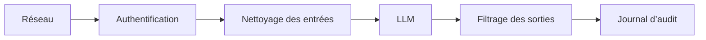

Votre démo fonctionne. Puis quelqu'un pose la question qui change l'ambiance d'un coup : qu'est-ce qui empêche cet assistant de fuiter des données, d'appeler le mauvais outil, ou de brûler votre budget pendant la nuit ? Vous n'avez pas besoin d'un bunker dès le premier jour, mais il vous faut des portes qui ferment bien.

Le premier changement de posture utile, c'est de voir une fonctionnalité IA comme un petit système, pas seulement comme un prompt plus un modèle. Elle a des entrées, des secrets, des permissions, des logs, des outils, des limites de débit, et des modes de panne. Le [OWASP LLM Top 10](https://genai.owasp.org/llm-top-10/) aide bien quand on débute, parce qu'il montre les pannes les plus courantes, y compris la prompt injection, c'est-à-dire un texte utilisateur qui essaie de contourner vos règles.

Ma règle, volontairement tranchée, est simple : traitez le modèle comme un stagiaire brillant, utile et rapide, mais jamais comme l'autorité finale sur la sécurité. Une fois ce choix posé, l'étape suivante devient beaucoup plus claire.

Commencez par l'identité et les permissions. Le modèle doit agir pour un utilisateur ou un service identifié, jamais comme un super-admin caché. Si votre application expose des outils, chaque outil doit revérifier l'autorisation côté serveur, parce que [Apps SDK security](https://developers.openai.com/apps-sdk/guides/security-privacy) recommande explicitement le moindre privilège, le consentement explicite, la validation des entrées, et la vérification des scopes à chaque appel d'outil.

Ensuite, protégez les données avant de courir après des défenses plus sophistiquées. Gardez des prompts courts, retirez les secrets, et décidez ce que vous allez journaliser avant la mise en production. [OpenAI data controls](https://developers.openai.com/api/docs/guides/your-data) explique que le contenu API peut apparaître par défaut dans les journaux de surveillance des abus et documente des options comme Modified Abuse Monitoring et Zero Data Retention pour les clients éligibles. C'est important, parce que vos propres traces et logs de debug sont souvent plus faciles à faire fuiter que le modèle lui-même.

Ajoutez ensuite des couches. Je procéderais dans cet ordre, parce que les contrôles les plus ordinaires sont souvent ceux qui sauvent les débutants en premier :

- Contrôles d'entrée : validez le type de fichier, la taille, la source, et les actions autorisées avant que le texte arrive au modèle.
- Contrôles de sortie : validez les sorties structurées et bloquez les appels d'outils dangereux au lieu d'espérer que le modèle se comporte bien.
- Contrôles opérationnels : ajoutez des limites de débit, des plafonds de budget, du monitoring, et des journaux d'audit pour qu'un seul mauvais prompt ne devienne pas une longue panne.
- Contrôles de reprise : gardez des timeouts, des retries, des fallbacks, et un kill switch prêt pour le jour où quelque chose déraille.

Si je devais esquisser le premier chemin raisonnable au tableau blanc, ça donnerait ça :

[OpenAI safety](https://developers.openai.com/api/docs/guides/safety-best-practices) recommande les tests adversariaux, la revue humaine pour les usages à fort enjeu, des entrées et sorties contraintes, et un moyen clair pour les utilisateurs de signaler un problème, c'est exactement pour cela qu'une défense en couches tient mieux qu'un gros prompt.

Je cartographie aussi les modes de casse les plus moches, parce que « on prend la sécurité au sérieux » n'a jamais bloqué une attaque :

| Menace                  | Contrôle                                                        | Couche                | Mitigation                                                                                             |
| ----------------------- | --------------------------------------------------------------- | --------------------- | ------------------------------------------------------------------------------------------------------ |
| Prompt injection        | Hiérarchie d'instructions et détection de motifs suspects       | Nettoyage des entrées | Attraper tôt les tentatives de contournement et envoyer les requêtes douteuses vers un chemin plus sûr |
| Exfiltration de données | Allowlist d'outils et autorisation côté serveur avec scopes     | Authentification      | Empêcher le modèle de lire ou d'exporter des données hors des droits du demandeur                      |
| Model inversion         | Limites de débit, façonnage des réponses et surveillance d'abus | Réseau                | Ralentir les tentatives d'extraction et signaler les patterns de sondage répétés                       |
| Jailbreak               | Vérifications de politique et formats de sortie contraints      | Filtrage des sorties  | Bloquer les complétions dangereuses avant qu'elles atteignent l'utilisateur ou un outil aval           |
| Fuite de PII            | Règles de masquage et nettoyage des logs                        | Journal d'audit       | Retirer les valeurs sensibles des réponses et des traces avant qu'elles se propagent                   |

Si vous ne gardez qu'une règle de décision, prenez celle-ci : tout outil qui peut dépenser de l'argent, modifier des données, ou contacter quelqu'un devrait demander une vérification serveur supplémentaire ou une approbation humaine avant d'agir. Une fois cette frontière solide, lisez ensuite le guide sur les guardrails, parce que c'est là que ces habitudes de sécurité deviennent des contrôles répétables.
