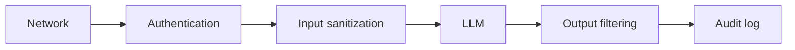

Your demo works. Then someone asks the question that changes the mood fast: what stops this assistant from leaking data, calling the wrong tool, or burning your budget overnight? You do not need a bunker on day one, but you do need doors that lock.

The first useful mindset shift is to see an AI feature as a small system, not just a prompt plus a model. It has inputs, secrets, permissions, logs, tools, rate limits, and failure modes. The [OWASP LLM Top 10](https://genai.owasp.org/llm-top-10/) helps beginners because it maps the common ways these systems fail, including prompt injection, a trick where user text tries to override your rules.

My opinionated rule is simple: treat the model like a clever intern, helpful and fast, but never the final authority on safety. That choice makes the next step obvious.

Start with identity and permissions. The model should act for a known user or service, never as a hidden super-admin. If your app exposes tools, each tool should check authorization again on the server, because [Apps SDK security](https://developers.openai.com/apps-sdk/guides/security-privacy) explicitly recommends least privilege, explicit consent, input validation, and scope checks on every tool call.

Next, protect data before you chase fancy defenses. Keep prompts short, remove secrets, and decide what you will log before shipping. [OpenAI data controls](https://developers.openai.com/api/docs/guides/your-data) explains that API content may appear in abuse monitoring logs by default and documents options such as Modified Abuse Monitoring and Zero Data Retention for eligible customers. That matters because your own traces and debug logs are often easier to leak than the model itself.

Then add layers. I would do it in this order, because boring controls usually save beginners first:

- Input controls: validate file type, size, source, and allowed actions before text reaches the model.
- Output controls: validate structured output and stop dangerous tool calls instead of hoping the model behaves.
- Operational controls: add rate limits, budget caps, monitoring, and audit logs so one bad prompt cannot turn into a long outage.
- Recovery controls: keep timeouts, retries, fallbacks, and a kill switch ready for the day something goes sideways.

If I had to sketch the first sane path on a whiteboard, it would look like this:

[OpenAI safety](https://developers.openai.com/api/docs/guides/safety-best-practices) recommends adversarial testing, human review for high-stakes uses, constrained input and output, and a clear way for users to report problems, which is exactly why layered controls work better than one big prompt.

I would also map the ugly failure modes explicitly, because “we take security seriously” is not a control:

| Threat            | Control                                             | Layer              | Mitigation                                                                     |
| ----------------- | --------------------------------------------------- | ------------------ | ------------------------------------------------------------------------------ |
| Prompt injection  | Instruction hierarchy plus prompt-pattern detection | Input sanitization | Catch override attempts early and route suspicious requests to a safer path    |
| Data exfiltration | Tool allowlist and scoped server-side authorization | Authentication     | Stop the model from reading or exporting data outside the caller’s permissions |
| Model inversion   | Rate limits, response shaping, and abuse monitoring | Network            | Slow down extraction attempts and flag repeated probing patterns               |
| Jailbreak         | Safety policy checks and constrained output formats | Output filtering   | Block unsafe completions before they reach the user or a downstream tool       |
| PII leakage       | Redaction rules and log scrubbing                   | Audit log          | Remove sensitive values from responses and traces before they spread           |

If you want one decision rule, use this: any tool that can spend money, change data, or contact someone should require an extra server check or a human approval step before the model acts.
