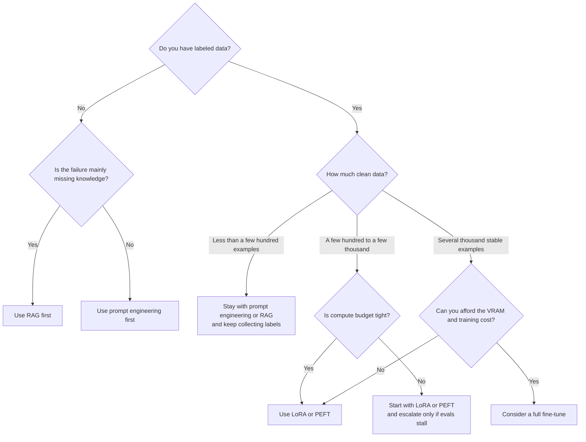

Your prompt looks great in demos, then breaks on the tickets people actually escalate: domain jargon, rigid output format, tone that must sound like a real operator instead of a generic assistant. Fine-tuning can help, but it is also the fastest way to buy a GPU bill for a problem that was really a prompt bug or a weak retrieval layer.

My rule is blunt: I do not fine-tune until prompting, retrieval, and evals are boring. The [OpenAI guide](https://platform.openai.com/docs/guides/fine-tuning) frames optimization as a loop of evals, prompts, and fine-tuning, and it also says the OpenAI fine-tuning platform is winding down for new users. So if you already have access, use it as a managed shortcut. If you are starting fresh, I would not anchor a roadmap on it.

That forces the next question: what is still worth doing? For me, it is dataset design. I write the repeated failure in one sentence before I touch training code. “Be better at support” is useless. “Answer plan questions in the required escalation format, cite contract limits correctly, and ask one clarification question when account state is missing” is trainable.

When I need to make the call fast, this is the decision tree I use.



Before you launch a job, I would shape the examples like this so every row teaches one habit.

```python
examples = [
    {
        "messages": [
            {"role": "system", "content": "You are a SaaS support assistant."},  # stable behavior
            {"role": "user", "content": "Is SSO included in the Pro plan?"},
            {
                "role": "assistant",
                "content": "SSO is available on the Enterprise plan. Say that first, suggest the upgrade path, and ask whether the team already uses SAML.",  # exact behavior to copy
            },
        ]
    },
    {
        "messages": [
            {"role": "system", "content": "You are a SaaS support assistant."},
            {"role": "user", "content": "Can you confirm our data retention period?"},
            {
                "role": "assistant",
                "content": "State the exact retention window from policy, avoid guessing, and ask for the workspace region if the policy depends on residency.",  # one clarification step
            },
        ]
    },
]
```

I would rather ship 400 clean examples than 40,000 noisy ones, and I would redact secrets or customer identifiers before anything leaves production. The [Transformers training guide](https://huggingface.co/docs/transformers/training) is still the clearest reminder to split train and eval early, keep an actual test split, and measure on ugly cases instead of polished demos. If the model only improves on pretty prompts, you did not train robustness, you trained a benchmark story.

The next trap is cost. If the full model barely fits, I would reach for [PEFT](https://huggingface.co/docs/peft/index) before I touch a full-weights run, because training a small set of adapter parameters is usually the better trade for iteration speed and storage. When memory is still the blocker, [bitsandbytes](https://huggingface.co/docs/bitsandbytes/index) documents why 8-bit and 4-bit loading or QLoRA can shrink the hardware bill enough for a small team to keep moving.

This is the comparison I would actually use before spending another GPU hour.

| Approach           | Data Needed                                                          | VRAM          | When to Use                                                                                      | Risk                                                                                 |
| ------------------ | -------------------------------------------------------------------- | ------------- | ------------------------------------------------------------------------------------------------ | ------------------------------------------------------------------------------------ |
| Prompt engineering | Little to none beyond a few representative failures                  | Lowest        | The base model is already close and you mostly need clearer instructions, structure, or examples | You mistake prompt cleverness for a durable fix and end up with brittle chains       |
| RAG                | Documents plus enough eval queries to prove retrieval quality        | Low to medium | The model lacks knowledge, citations, or fresh context more than behavior                        | Weak retrieval gets blamed on the model and hides the real bottleneck                |
| LoRA or PEFT       | A few hundred to a few thousand clean labeled examples               | Medium        | The failure pattern repeats often, the base model is solid, and you need cheaper iteration       | You overfit narrow habits or convince yourself adapters fixed bad data               |
| Full fine-tune     | Several thousand stable, high-quality examples and a mature eval set | Highest       | You need deep behavioral change and can justify the infrastructure and review loop               | Expensive runs amplify dataset mistakes, regression risk, and operational complexity |

My threshold is simple: if you have fewer than a few hundred high-quality examples, or the prompt plus RAG stack is still changing every week, do not fine-tune yet. If the same failure keeps showing up across hundreds of labeled conversations, the base model is already stable, and adapter training is cheaper than stuffing more examples into every prompt, then fine-tuning has finally earned its keep.
