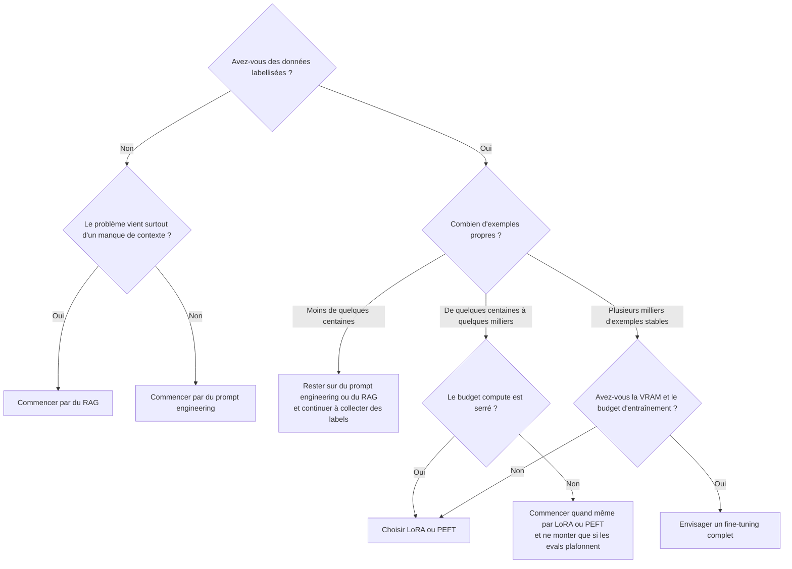

Votre prompt a l'air solide en démo, puis casse sur les tickets que les gens escaladent vraiment : jargon métier, format de sortie rigide, ton qui doit ressembler à un vrai opérateur et pas à un assistant générique. Le fine-tuning peut aider, mais c'est aussi la manière la plus rapide d'acheter une facture GPU pour un problème qui venait surtout d'un prompt bancal ou d'une couche de retrieval trop faible.

Ma règle est sèche : je ne fine-tune rien tant que le prompting, le retrieval et les evals ne sont pas devenus ennuyeux. Le [guide OpenAI](https://platform.openai.com/docs/guides/fine-tuning) présente l'optimisation comme une boucle entre evals, prompts et fine-tuning, et il précise aussi que la plateforme de fine-tuning OpenAI est en extinction pour les nouveaux utilisateurs. Donc si vous y avez déjà accès, servez-vous-en comme d'un raccourci managé. Si vous partez de zéro, je n'adosserais pas une feuille de route dessus.

La vraie question devient alors : qu'est-ce qui vaut encore le coup ? Pour moi, c'est le design du dataset. J'écris l'échec répétitif en une phrase avant de toucher au code d'entraînement. « Être meilleur en support » ne sert à rien. « Répondre aux questions sur les plans dans le format d'escalade attendu, citer correctement les limites contractuelles et poser une question de clarification quand l'état du compte manque » est entraînable.

Quand je dois trancher vite, voilà l'arbre de décision que j'utilise.



Avant de lancer un job, je mettrais les exemples dans cette forme pour que chaque ligne n'enseigne qu'une seule habitude.

```python
examples = [
    {
        "messages": [
            {"role": "system", "content": "You are a SaaS support assistant."},  # comportement stable
            {"role": "user", "content": "Is SSO included in the Pro plan?"},
            {
                "role": "assistant",
                "content": "SSO is available on the Enterprise plan. Say that first, suggest the upgrade path, and ask whether the team already uses SAML.",  # comportement exact à reproduire
            },
        ]
    },
    {
        "messages": [
            {"role": "system", "content": "You are a SaaS support assistant."},
            {"role": "user", "content": "Can you confirm our data retention period?"},
            {
                "role": "assistant",
                "content": "State the exact retention window from policy, avoid guessing, and ask for the workspace region if the policy depends on residency.",  # une seule étape de clarification
            },
        ]
    },
]
```

Je préfère livrer 400 exemples propres plutôt que 40 000 exemples bruyants, et je retirerais les secrets ou identifiants clients avant qu'un seul octet quitte la production. Le [guide d'entraînement Transformers](https://huggingface.co/docs/transformers/training) reste le meilleur rappel pour séparer train et eval tôt, garder un vrai split de test et mesurer sur des cas moches plutôt que sur des démos lisses. Si le modèle ne progresse que sur des prompts vitrine, vous n'avez pas entraîné de la robustesse, vous avez entraîné une belle histoire de benchmark.

Le piège suivant, c'est le coût. Si le modèle complet rentre à peine en mémoire, je choisirais [PEFT](https://huggingface.co/docs/peft/index) avant de toucher à un entraînement full weights, parce qu'entraîner un petit ensemble de paramètres d'adaptation est souvent le meilleur compromis pour itérer vite et stocker moins. Si la mémoire reste le vrai blocage, [bitsandbytes](https://huggingface.co/docs/bitsandbytes/index) documente pourquoi le chargement en 8 bits, en 4 bits ou QLoRA peut réduire assez la facture matérielle pour qu'une petite équipe continue d'avancer.

C'est le comparatif que je regarderais vraiment avant de brûler une heure GPU de plus.

| Approche            | Données nécessaires                                                                       | VRAM             | À utiliser quand                                                                                                               | Risque                                                                                                      |
| ------------------- | ----------------------------------------------------------------------------------------- | ---------------- | ------------------------------------------------------------------------------------------------------------------------------ | ----------------------------------------------------------------------------------------------------------- |
| Prompt engineering  | Très peu de données, à part quelques échecs représentatifs                                | La plus faible   | Le modèle de base est déjà proche du bon comportement et il faut surtout clarifier les instructions, le format ou les exemples | On prend une rustine de prompt pour une vraie solution durable et on finit avec une chaîne fragile          |
| RAG                 | Des documents, plus assez de requêtes d'eval pour prouver que la retrieval tient la route | Faible à moyenne | Le modèle manque surtout de connaissance, de citations ou de contexte frais                                                    | Une retrieval médiocre se fait passer pour un problème de modèle et masque le vrai goulot d'étranglement    |
| LoRA/PEFT           | De quelques centaines à quelques milliers d'exemples labellisés propres                   | Moyenne          | Le même échec revient souvent, le modèle de base est stable et il faut itérer à moindre coût                                   | On sur-apprend des habitudes trop étroites ou on se persuade que les adapters ont réparé un dataset mauvais |
| Fine-tuning complet | Plusieurs milliers d'exemples stables et de haute qualité, avec un vrai jeu d'eval mûr    | La plus élevée   | Il faut changer le comportement plus en profondeur et l'infra se justifie réellement                                           | Des runs coûteux amplifient les erreurs de dataset, le risque de régression et la complexité opérationnelle |

Mon seuil est simple : si vous n'avez pas au moins quelques centaines d'exemples de haute qualité, ou si votre pile prompt plus RAG change encore chaque semaine, ne fine-tunez pas. Si le même échec revient sur des centaines de conversations labellisées, que le modèle de base est déjà stable et que l'entraînement par adapters coûte moins cher que d'empiler encore des exemples dans chaque prompt, alors le fine-tuning a enfin mérité sa place.
