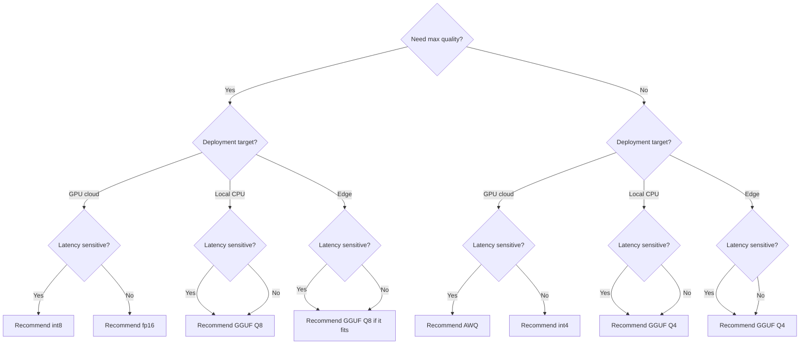

You loaded a 70B model, your GPU ran out of memory, and now the “cheap local inference” plan is somehow more expensive than the API bill. That is when quantization stops being a nice optimization topic and becomes a deployment choice.

My default opinion is simple: try quantization before you swap models. Teams jump too fast from “FP16 does not fit” to “we need a smaller model”. I usually get better product quality by keeping the same checkpoint and changing the weight format first.

The fastest current path is [Transformers bitsandbytes](https://huggingface.co/docs/transformers/quantization/bitsandbytes). In practice, 8-bit is my first stop because LLM.int8 keeps the setup small, usually cuts weight memory roughly in half, and still behaves closer to full precision than the more aggressive options. That matters because GPU savings are nice, but engineering time is expensive too.

If 8-bit still does not fit, 4-bit is the escape hatch, but I only trust it after task evals. [QLoRA](https://arxiv.org/abs/2305.14314) is the reason `nf4` exists, so that is the 4-bit mode I test first in Transformers. Then I keep [AWQ](https://arxiv.org/abs/2306.00978) in mind as the reality check: low-bit success comes from protecting the sensitive parts of the model, not from pretending every layer tolerates the same compression.

When the target is laptop, CPU, or edge deployment, I switch to [GGUF](https://github.com/ggml-org/ggml/blob/master/docs/gguf.md). The format is built for single-file inference artifacts and fast loading, and [llama.cpp](https://github.com/ggml-org/llama.cpp) is the runtime I would pick when portability matters more than training convenience.

That is why I keep a rough comparison table in front of me before I start arguing about kernels and benchmarks.

| Format  | Bits | VRAM Saving | Quality Loss  | Best For                                                               |
| ------- | ---- | ----------- | ------------- | ---------------------------------------------------------------------- |
| fp16    | 16   | None        | None          | Baseline GPU inference when I want the cleanest reference output       |
| int8    | 8    | ~50%        | Low           | My first production downgrade on GPU cloud                             |
| int4    | 4    | ~70-75%     | Medium        | When 8-bit still does not fit and I am willing to re-evaluate the task |
| GGUF Q4 | 4    | ~70-75%     | Medium        | Local CPU, laptop, and edge deployments that need to fit first         |
| GGUF Q8 | 8    | ~50%        | Low           | Local inference when I can spend more RAM to keep output cleaner       |
| AWQ     | 4    | ~70%        | Low to medium | Latency-sensitive GPU serving with careful calibration                 |

When I need to choose fast, I reduce it to a deployment question instead of a purity debate.



The trap most guides skip is evaluation scope. A short demo prompt can look fine while long context, repeated tool calls, JSON extraction, and multilingual output quietly get worse. That is how a memory win turns into support cost.

This is the loading pattern I keep around so the quantization choice stays explicit instead of leaking into random call sites.

```python
import torch
from transformers import AutoModelForCausalLM, AutoTokenizer, BitsAndBytesConfig


def load_quantized_model(model_id: str, mode: str = "8bit"):
    if mode == "8bit":
        quantization_config = BitsAndBytesConfig(
            load_in_8bit=True,  # safest first try when VRAM is tight
        )
    elif mode == "4bit":
        quantization_config = BitsAndBytesConfig(
            load_in_4bit=True,
            bnb_4bit_quant_type="nf4",  # good default for serious 4-bit testing
            bnb_4bit_use_double_quant=True,  # saves more memory with small quality impact
            bnb_4bit_compute_dtype=torch.bfloat16,  # keeps matmuls stable on recent GPUs
        )
    else:
        quantization_config = None

    tokenizer = AutoTokenizer.from_pretrained(model_id)
    model = AutoModelForCausalLM.from_pretrained(
        model_id,
        device_map="auto",  # spread layers across available devices
        quantization_config=quantization_config,
        dtype="auto",  # keep non-quantized modules in the model dtype
    )
    return tokenizer, model
```

My rule is boring on purpose: ship 8-bit when it fits and latency stays inside budget. Switch to 4-bit only when 8-bit still misses the VRAM target, and block release until long-context plus structured-output evals pass. If 4-bit changes product behavior, stop compressing and change the hardware or the model.
