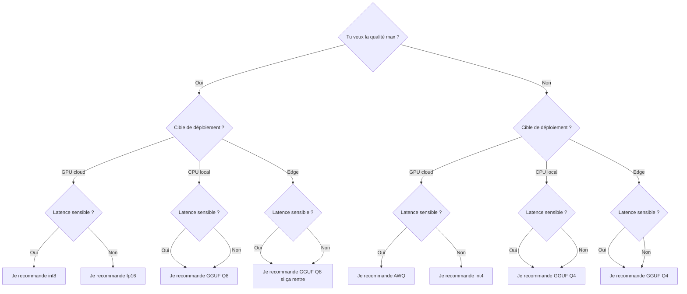

Tu charges un modèle 70B, ton GPU sature, et ton plan de « petite inférence locale pas chère » finit par coûter plus qu'une facture API. C'est là que la quantification cesse d'être un sujet sympa d'optimisation pour devenir un vrai choix de déploiement.

Ma position est simple : j'essaie la quantification avant de changer de modèle. Beaucoup d'équipes passent trop vite de « le FP16 ne rentre pas » à « il nous faut un plus petit modèle ». En pratique, je garde plus souvent la qualité produit en conservant le même checkpoint et en changeant d'abord le format des poids.

Le chemin le plus rapide aujourd'hui, c'est [Transformers bitsandbytes](https://huggingface.co/docs/transformers/quantization/bitsandbytes). En pratique, je commence par le 8 bits parce que LLM.int8 garde une intégration légère, coupe souvent la mémoire des poids à peu près de moitié, et reste plus proche de la pleine précision que les options plus agressives. C'est important, parce que les économies GPU sont utiles, mais le temps d'ingénierie coûte cher lui aussi.

Si le 8 bits ne rentre toujours pas, le 4 bits devient l'échappatoire, mais je ne lui fais confiance qu'après des evals sur tâches réelles. [QLoRA](https://arxiv.org/abs/2305.14314) explique pourquoi `nf4` existe, donc c'est le mode 4 bits que je teste d'abord dans Transformers. Ensuite, je garde [AWQ](https://arxiv.org/abs/2306.00978) comme rappel salutaire : réussir une quantification basse précision, ce n'est pas supposer que toutes les couches encaissent la même compression, c'est protéger les parties sensibles du modèle.

Quand la cible est un laptop, du CPU, ou un déploiement edge, je passe à [GGUF](https://github.com/ggml-org/ggml/blob/master/docs/gguf.md). Le format est pensé pour des artefacts d'inférence en un seul fichier et pour un chargement rapide, et [llama.cpp](https://github.com/ggml-org/llama.cpp) reste le runtime que je choisirais quand la portabilité compte plus que le confort côté entraînement.

C'est pour ça que je garde un tableau de comparaison sous les yeux avant de partir dans des débats de kernels et de benchmarks.

| Format  | Bits | Gain VRAM | Perte qualité    | Idéal pour                                                                               |
| ------- | ---- | --------- | ---------------- | ---------------------------------------------------------------------------------------- |
| fp16    | 16   | Aucun     | Aucune           | L'inférence GPU de référence quand je veux la sortie la plus propre                      |
| int8    | 8    | ~50 %     | Faible           | Mon premier compromis en production sur GPU cloud                                        |
| int4    | 4    | ~70-75 %  | Moyenne          | Quand le 8 bits ne rentre toujours pas et que j'accepte de tout réévaluer                |
| GGUF Q4 | 4    | ~70-75 %  | Moyenne          | Les déploiements CPU locaux, laptop et edge où il faut d'abord rentrer                   |
| GGUF Q8 | 8    | ~50 %     | Faible           | L'inférence locale quand je peux dépenser plus de RAM pour garder une sortie plus propre |
| AWQ     | 4    | ~70 %     | Faible à moyenne | Le serving GPU sensible à la latence avec une bonne calibration                          |

Quand je dois trancher vite, je ramène le sujet à une question de déploiement plutôt qu'à un débat de pureté.



Le piège que beaucoup de guides ratent, c'est le périmètre d'évaluation. Une démo courte peut sembler propre alors que le contexte long, les appels d'outils répétés, l'extraction JSON et la sortie multilingue se dégradent en silence. C'est comme ça qu'un gain mémoire se transforme en coût de support.

Voici le patron de chargement que je garde sous la main pour que le choix de quantification reste explicite au lieu de fuir dans des appels dispersés.

```python
import torch
from transformers import AutoModelForCausalLM, AutoTokenizer, BitsAndBytesConfig


def load_quantized_model(model_id: str, mode: str = "8bit"):
    if mode == "8bit":
        quantization_config = BitsAndBytesConfig(
            load_in_8bit=True,  # premier essai le plus sûr quand la VRAM manque
        )
    elif mode == "4bit":
        quantization_config = BitsAndBytesConfig(
            load_in_4bit=True,
            bnb_4bit_quant_type="nf4",  # bon défaut pour un vrai test en 4 bits
            bnb_4bit_use_double_quant=True,  # gagne encore un peu de mémoire
            bnb_4bit_compute_dtype=torch.bfloat16,  # stabilise les calculs sur GPU récents
        )
    else:
        quantization_config = None

    tokenizer = AutoTokenizer.from_pretrained(model_id)
    model = AutoModelForCausalLM.from_pretrained(
        model_id,
        device_map="auto",  # répartit les couches sur les devices disponibles
        quantization_config=quantization_config,
        dtype="auto",  # garde les modules non quantifiés dans le dtype du modèle
    )
    return tokenizer, model
```

Ma règle est volontairement ennuyeuse : je mets le 8 bits en prod quand il rentre et que la latence reste dans le budget. Je ne passe au 4 bits que si le 8 bits manque encore la cible VRAM, puis je bloque la mise en ligne tant que les evals sur contexte long et sortie structurée ne passent pas. Si le 4 bits change le comportement produit, j'arrête de compresser et je change le hardware ou le modèle.
