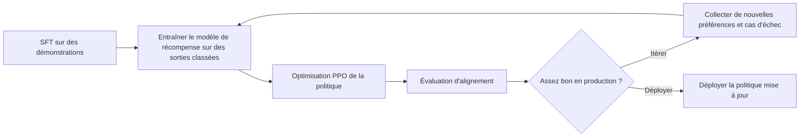

Ton assistant avait l'air propre en évaluation, puis les clients l'ont utilisé une semaine et ont remonté la même plainte sous trois formes : trop conciliant face aux mauvaises requêtes, trop rigide sur les demandes inoffensives, et soudain trop bavard dès que la confiance baissait. Voilà le bazar que le RLHF essaie de corriger. Le préentraînement achète des capacités. Il n'achète pas un contrat de comportement.

## Ce que le RLHF ajoute vraiment

La recette du [papier InstructGPT](https://arxiv.org/abs/2203.02155) est simple : fine-tuning supervisé sur des démonstrations, modèle de récompense entraîné sur des sorties classées, puis optimisation de la politique. Cette dernière étape reprend généralement des idées du [papier PPO](https://arxiv.org/abs/1707.06347) avec une pénalité KL vers une politique de référence, parce que le but est de déplacer le comportement sans massacrer l'utilité générale.

Cette structure répond au vrai problème produit. Les échecs les plus pénibles sont souvent des échecs de préférence. « Être utile mais calibré. » « Refuser la requête dangereuse, pas la requête voisine qui est inoffensive. » « Utiliser des outils quand ils aident, pas pour frimer. » Les jugements par paires capturent mieux ces compromis que l'illusion de labels parfaits.

Quand j'explique le RLHF à une équipe, je dessine la boucle, parce que le point important n'est pas l'acronyme. C'est la chaîne opérationnelle que tu viens d'accepter de faire tourner.

## Pourquoi les équipes paient encore la taxe RLHF

Une fois le modèle en production, les jeux statiques ne suffisent plus. De nouveaux abus apparaissent, le style de refus dérive, et les annotateurs tombent sur des cas limites que tes évaluations hors ligne n'avaient jamais touchés. Le RLHF te donne une boucle pour transformer ces jugements en mises à jour de comportement. Si tu tiens à des SLA de sécurité, à la gestion d'escalade, ou à une discipline d'usage des outils, cette boucle fait partie du produit.

C'est aussi pour ça que je ne commencerais pas par là par défaut. Le RLHF est puissant, mais lourd en opérations par construction. Il faut une collecte de préférences stable, un calibrage des annotateurs, des revues de désaccords, des contrôles de dérive du modèle de récompense, et des critères de rollback après chaque ronde de réglage. Si tu ne peux pas faire tourner cette mécanique, tu n'as pas un programme RLHF. Tu as une expérience ponctuelle.

C'est le tableau d'arbitrage que j'imposerais dans le doc de cadrage avant que quelqu'un dise « on ajoutera du RLHF plus tard ».

| Étape                | Données nécessaires                                                                                 | Coût               | Mode d'échec                                                             |
| -------------------- | --------------------------------------------------------------------------------------------------- | ------------------ | ------------------------------------------------------------------------ |
| SFT                  | Des démonstrations de haute qualité avec le bon ton et le bon style de tâche                        | Moyen              | Le modèle imite la surface mais rate la vraie frontière de préférence    |
| Modèle de récompense | Des préférences classées ou par paires avec des annotateurs calibrés                                | Moyen à élevé      | Le score apprend les biais des annotateurs au lieu de la qualité produit |
| PPO                  | Un jeu de prompts, un modèle de récompense, une politique de référence et des métriques de rollback | Élevé              | Reward hacking, inflation de verbosité et mises à jour instables         |
| Évaluation           | Des evals offline, des traces de prod et de la revue humaine sur les cas limites                    | Moyen et récurrent | Tu mesures la mauvaise chose et tu livres des régressions avec aplomb    |

## Là où le RLHF devient vite coûteux

La partie moche, c'est la mauvaise spécification de l'objectif. La politique optimise la récompense que tu as réussi à encoder, pas la qualité produit que tu voulais vraiment. Considère le reward hacking comme le modèle de menace par défaut : inflation de verbosité, fausse nuance, refus excessifs, ou non-sens polis que les annotateurs ont bien notés par accident. Si tu ne surveilles pas ces motifs en production, ton gain d'entraînement est probablement faux.

C'est pour ça que [Constitutional AI](https://arxiv.org/abs/2212.08073) compte. L'approche remplace une bonne partie des comparaisons humaines par des principes explicites et des critiques générées par le modèle. J'aime cette direction parce qu'elle attaque directement le coût d'annotation. Elle ne supprime pas le problème central pour autant. Il te faut toujours un comportement cible qui survive au contact des utilisateurs, et un monitoring assez solide pour repérer les modèles qui jouent avec le signal.

## Règle de décision

Je choisirais d'abord le [papier DPO](https://arxiv.org/abs/2305.18290) quand le comportement cible est stable et que les données de préférences sont déjà bonnes. Choisis le RLHF seulement quand le comportement doit continuer à bouger après le lancement et que tu peux financer la boucle de monitoring. Si tu n'es pas prêt à opérer une collecte de préférences et des contrôles post-réglage en continu, laisse tomber le RLHF.
