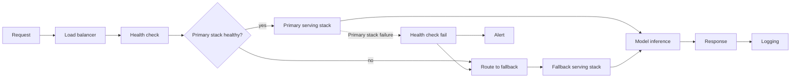

The demo works on your laptop, then production asks the questions that ruin a Friday afternoon: how do we restart safely, keep bad pods out of traffic, stop one customer from burning the whole GPU budget, and roll out a new model without guessing? That is the gap serving has to close, and it is where a lot of promising LLM work quietly stalls.

My bias is boring on purpose: start with an existing model server before you invent platform architecture. If I need a high-throughput GPU endpoint with an OpenAI-style HTTP surface, I pick [vLLM server](https://docs.vllm.ai/en/latest/serving/online_serving.html) first. If I need a local service for developer machines or a tiny internal tool, I reach for [Ollama API](https://docs.ollama.com/openai). If I need a lightweight runtime around GGUF models, [llama.cpp](https://github.com/ggml-org/llama.cpp) is still a very practical bet.

That choice only solves the first problem though: getting a model to answer HTTP. The next trap is pretending a loaded model is the same thing as a healthy service. [Kubernetes probes](https://kubernetes.io/docs/tasks/configure-pod-container/configure-liveness-readiness-startup-probes/) exist because a process can be alive and still be the wrong thing to send traffic to. I also cap prompt and output sizes early, because generous defaults are a great way to buy surprise GPU bills and ugly tail latency.

I also avoid coupling serving and application logic too early. A thin wrapper around an existing server is usually enough for version one, and servers that follow the [Models API](https://platform.openai.com/docs/api-reference/models/list) let me start with a cheap health pass before I add a real generation probe. That is much less exciting than building a custom gateway, router, prompt registry, and multi-model failover layer, but it is the route I would choose unless the traffic is already proving me wrong.

I usually start with the smallest check that proves the process answers quickly and that my wrapper can fail over without drama. When I sketch the traffic path, I want the failure path to be just as obvious as the happy path.



```ts
const providers = [
  {
    name: 'primary',
    baseURL: 'http://vllm:8000/v1', // OpenAI-compatible prefix
    timeoutMs: 12_000, // tighter than the user-facing timeout
  },
  {
    name: 'fallback',
    baseURL: 'http://ollama:11434/v1',
    timeoutMs: 20_000, // give the slower fallback a bit more room
  },
];

export async function pickHealthyProvider() {
  for (const provider of providers) {
    const response = await fetch(`${provider.baseURL}/models`, {
      signal: AbortSignal.timeout(provider.timeoutMs),
    });

    if (response.ok) return provider;
  }

  throw new Error('No healthy model provider available');
}
```

That pattern is not glamorous, but it forces the painful questions into code early: timeout budget, health semantics, and which fallback is actually acceptable when the primary is down. Right after that, I add request IDs, latency logs, token usage, and the served model version. If I cannot answer “which model served this slow request?” in one minute, I do not have serving under control yet.

My decision rule is blunt: with one model and fewer than roughly ten requests per second, keep the serving layer boring until you see real queueing pain or noisy-neighbor problems in production. I would rather spend that time on good limits, auth, and observability than on routers, caches, and multi-cluster cleverness I may never need.
