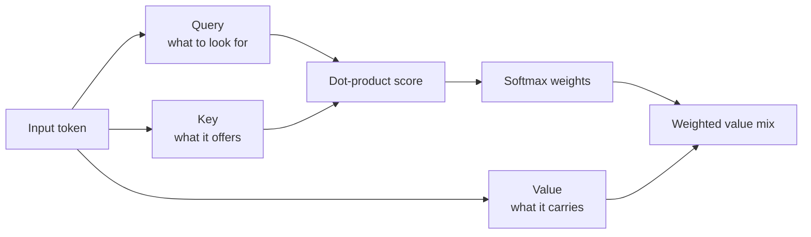

If the only sentence that matters is buried in the middle of a long prompt, the model will often answer the padding and miss the point. That is frustrating, and it does not mean you picked a broken model. Most of the time it means attention did not give the right tokens enough weight when predicting the next one.

## Attention is learned retrieval

The original transformer [paper](https://arxiv.org/abs/1706.03762) made attention the core move: each token produces queries, keys, and values, then scores the rest of the sequence to decide what to pull forward. I still think “learned retrieval” is the cleanest mental model. It is more useful than pretending the model absorbs the whole prompt at once.

That can feel oddly mechanical the first time you hear it, but I find that reassuring. If attention is retrieval, you can improve the prompt by making the right evidence easier to retrieve.

If you want the shortest concrete version, PyTorch exposes the exact primitive in [`scaled_dot_product_attention`](https://docs.pytorch.org/docs/stable/generated/torch.nn.functional.scaled_dot_product_attention.html):

```python
import torch
from torch.nn.functional import scaled_dot_product_attention

query = torch.randn(1, 8, 128, 64)  # batch, heads, target tokens, head size
key = torch.randn(1, 8, 128, 64)    # same head size, source tokens
value = torch.randn(1, 8, 128, 64)  # vectors retrieved after scoring

output = scaled_dot_product_attention(
    query=query,
    key=key,
    value=value,
    dropout_p=0.0,   # turn dropout off at inference
    is_causal=True,  # forbid access to future tokens
)

print(output.shape)  # torch.Size([1, 8, 128, 64]) -> same shape as query
```

Multi-head attention matters because one notion of relevance is too fragile. In practice, different heads can specialize in different patterns, so the model gets several retrieval views at once instead of betting everything on one.

A quick sketch makes that flow easier to trust than one more paragraph.



## Why long prompts get expensive fast

That retrieval story answers the first problem. The next one is cost. In the original transformer formulation, full self-attention compares each token with every other token in the layer, so memory and compute climb quickly as sequence length grows. That is why long prompts hurt twice: you pay for more input tokens, and the serving stack has more work to do before it can emit the first useful token.

Modern serving stacks respond with [FlashAttention](https://arxiv.org/abs/2205.14135), [grouped-query attention](https://arxiv.org/abs/2305.13245), and a [KV cache](https://huggingface.co/docs/transformers/en/cache_explanation). I would treat those as serving tools, not concepts to memorize.

| Technique               | What changes                                                       | Why I would pick it                                | Main caveat                                               |
| ----------------------- | ------------------------------------------------------------------ | -------------------------------------------------- | --------------------------------------------------------- |
| Full self-attention     | Every token can compare itself with every other token in the layer | Clean baseline for short or moderate contexts      | Cost grows quickly as the sequence gets longer            |
| FlashAttention          | Exact attention is computed with a more IO-efficient kernel        | Better speed and memory behavior on long sequences | Kernel support and hardware details still matter          |
| Grouped-query attention | Several query heads share fewer key and value heads                | Smaller KV cache and faster decoding               | It is a serving trade-off, not free extra quality         |
| KV cache                | Past keys and values are reused during generation                  | Lower latency after the first token                | Inference only, and cache memory still grows with context |

Longer prompts also make provider quotas easier to hit, so I trim context before I start debating rate limits. If the useful evidence is buried under pages of repetition, more context is usually the expensive version of a retrieval bug.

## The trap I would avoid

Once people learn that attention picks what matters, they start reading attention maps like an explanation. I would not. The [Attention is not Explanation](https://arxiv.org/abs/1902.10186) paper is still the right cold shower here: attention weights can be useful signals, but they are not reliable proof that the model reasoned correctly.

That changes how I write prompts. If one paragraph is critical, I do not bury it in five screens of retrieval results and hope the model notices. I isolate the evidence, label it, and put the actual instruction nearby.

## Practical pattern: separate relevance from trust

That still leaves one uncomfortable question: if attention is good at retrieval, can I trust it to ignore hostile text? No. Untrusted context can still compete for the model’s next-token decisions, which is why Anthropic’s [prompt injection guidance](https://docs.anthropic.com/en/docs/test-and-evaluate/strengthen-guardrails/prompt-injection) recommends keeping a strict boundary between trusted instructions and untrusted content. My default is simple: keep system rules separate, delimit external text clearly, and shorten the context until the evidence is obvious instead of merely present.

My rule: if the fact you need is hard to spot in under a screen of context, do not ask attention to rescue you. Rewrite the prompt or fix retrieval first.
