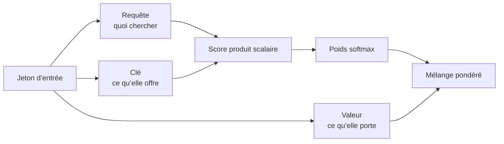

Si la seule phrase qui compte se retrouve noyée au milieu d’un long prompt, le modèle répond souvent au remplissage et rate l’essentiel. C’est frustrant, et ça ne veut pas dire que vous avez choisi un modèle cassé. La plupart du temps, cela veut juste dire que l’attention n’a pas donné assez de poids aux bons tokens au moment de prédire le suivant.

## L’attention comme récupération apprise

Le [papier fondateur](https://arxiv.org/abs/1706.03762) des transformers a fait de l’attention le mouvement central : chaque token produit des requêtes, des clés et des valeurs, puis note le reste de la séquence pour décider quoi ramener au premier plan. Je continue à penser que “récupération apprise” est le meilleur modèle mental. C’est plus utile que de prétendre que le modèle absorbe tout le prompt d’un seul coup.

La première fois, cette mécanique peut sembler un peu froide, mais je la trouve plutôt rassurante. Si l’attention est une forme de récupération, on peut améliorer le prompt en rendant la bonne preuve plus facile à récupérer.

Si vous voulez la version concrète la plus courte, PyTorch expose exactement cette primitive avec [`scaled_dot_product_attention`](https://docs.pytorch.org/docs/stable/generated/torch.nn.functional.scaled_dot_product_attention.html) :

```python
import torch
from torch.nn.functional import scaled_dot_product_attention

query = torch.randn(1, 8, 128, 64)  # batch, têtes, tokens cibles, taille d’une tête
key = torch.randn(1, 8, 128, 64)    # même taille de tête, tokens source
value = torch.randn(1, 8, 128, 64)  # vecteurs récupérés après le scoring

output = scaled_dot_product_attention(
    query=query,
    key=key,
    value=value,
    dropout_p=0.0,   # couper le dropout à l’inférence
    is_causal=True,  # interdire l’accès aux tokens futurs
)

print(output.shape)  # torch.Size([1, 8, 128, 64]) -> même forme que query
```

L’attention multi-tête compte parce qu’une seule notion de pertinence est trop fragile. En pratique, différentes têtes peuvent se spécialiser sur différents motifs, donc le modèle obtient plusieurs vues de récupération au lieu de tout miser sur une seule.

Un petit schéma aide souvent plus qu’un paragraphe de plus pour faire confiance au flux.



## Pourquoi les prompts longs coûtent vite cher

Cette idée de récupération répond au premier problème. Le suivant, c’est le coût. Dans la formulation originale du transformer, l’auto-attention complète compare chaque token à tous les autres dans la couche, donc la mémoire et le calcul grimpent vite quand la séquence s’allonge. C’est pour ça qu’un prompt long fait mal deux fois : vous payez plus de tokens en entrée, et la pile d’inférence a plus de travail avant de pouvoir émettre le premier token utile.

Les piles d’inférence modernes s’en sortent grâce à [FlashAttention](https://arxiv.org/abs/2205.14135), à la [grouped-query attention](https://arxiv.org/abs/2305.13245) et à un [cache KV](https://huggingface.co/docs/transformers/en/cache_explanation). Je traiterais ces idées comme des outils de serving, pas comme des notions à apprendre par cœur.

| Technique               | Ce qui change                                                                  | Pourquoi je le choisirais                                             | Limite principale                                                                 |
| ----------------------- | ------------------------------------------------------------------------------ | --------------------------------------------------------------------- | --------------------------------------------------------------------------------- |
| Auto-attention complète | Chaque token peut se comparer à tous les autres tokens de la couche            | Base simple pour des contextes courts ou moyens                       | Le coût grimpe vite quand la séquence s’allonge                                   |
| FlashAttention          | L’attention exacte est calculée avec un kernel plus économe en entrées-sorties | Meilleure vitesse et meilleur usage mémoire sur les longues séquences | Le support du kernel et le matériel comptent encore                               |
| Grouped-query attention | Plusieurs têtes de requête partagent moins de têtes de clé et de valeur        | Cache KV plus petit et décodage plus rapide                           | C’est un compromis de serving, pas de la qualité gratuite                         |
| Cache KV                | Les clés et valeurs passées sont réutilisées pendant la génération             | Latence plus faible après le premier token                            | Réservé à l’inférence, et la mémoire du cache grandit quand même avec le contexte |

Les prompts plus longs rendent aussi les quotas fournisseur plus faciles à heurter, donc je coupe le contexte avant de commencer à débattre des quotas. Si la preuve utile est enfouie sous des pages de répétition, plus de contexte est souvent la version coûteuse d’un bug de récupération.

## Le piège que j’éviterais

Dès que les gens apprennent que l’attention choisit ce qui compte, ils commencent à lire les cartes d’attention comme une explication. Je ne le ferais pas. Le papier [Attention is not Explanation](https://arxiv.org/abs/1902.10186) reste la bonne douche froide ici : les poids d’attention peuvent être des signaux utiles, mais ce ne sont pas une preuve fiable que le modèle a correctement raisonné.

Ça change ma manière d’écrire les prompts. Si un paragraphe est critique, je ne l’enterre pas dans cinq écrans de résultats de récupération en espérant que le modèle le remarque. J’isole la preuve, je l’étiquette et je place l’instruction juste à côté.

## Pattern pratique : séparer pertinence et confiance

Il reste quand même une question inconfortable : si l'attention est bonne pour récupérer l'information utile, puis-je lui faire confiance pour ignorer un texte hostile ? Non. Un contexte non fiable peut toujours entrer en compétition dans les décisions du modèle sur le prochain token, c'est pourquoi le guide Anthropic sur la [prompt injection](https://docs.anthropic.com/en/docs/test-and-evaluate/strengthen-guardrails/prompt-injection) recommande de garder une frontière stricte entre les instructions fiables et le contenu non fiable. Mon réflexe est simple : je garde les règles système séparées, je délimite clairement le texte externe et je raccourcis le contexte jusqu'à ce que la preuve soit évidente au lieu d'être simplement présente.

Ma règle : si le fait dont vous avez besoin est difficile à repérer sur moins d’un écran de contexte, ne demandez pas à l’attention de vous sauver. Réécrivez le prompt ou corrigez d’abord la récupération.
