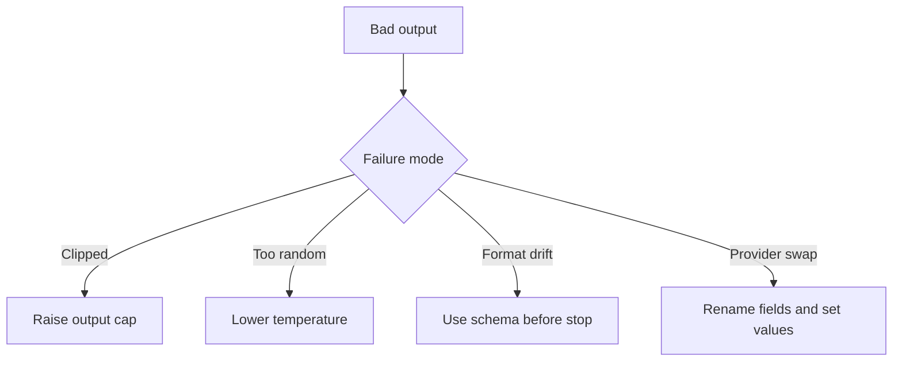

When a response starts as clean JSON and ends as half a sentence, the prompt is rarely the first suspect. The real mess is often a preset copied from another provider, where the same knob changed name, casing, or behavior.

## Start by mapping the knobs before tuning them

My bias is intentionally boring: set the output cap explicitly, set temperature explicitly, and leave the rest alone until you can name the failure. [Responses API](https://platform.openai.com/docs/api-reference/responses/create) exposes `temperature`, `top_p`, `max_output_tokens`, and `stop`; [Messages API](https://docs.anthropic.com/en/api/messages) uses `temperature`, `top_p`, `top_k`, `max_tokens`, and `stop_sequences`; [GenerationConfig](https://ai.google.dev/api/generate-content#v1beta.GenerationConfig) moves the family under `generationConfig` with camelCase names such as `topP`, `topK`, `maxOutputTokens`, and `stopSequences`. Anthropic documents `temperature` defaulting to `1.0`, while Google says several sampling defaults vary by model, which is exactly why I set values myself when portability matters.

| Goal                        | OpenAI                       | Anthropic        | Google                                          | What I'd choose                                          |
| --------------------------- | ---------------------------- | ---------------- | ----------------------------------------------- | -------------------------------------------------------- |
| Reduce randomness           | `temperature`                | `temperature`    | `generationConfig.temperature`                  | Start here first                                         |
| Trim the probability tail   | `top_p`                      | `top_p`          | `generationConfig.topP`                         | Leave it at `1` until temperature is not enough          |
| Hard-limit candidate tokens | Not exposed in Responses API | `top_k`          | `generationConfig.topK` on models that allow it | Skip it unless the provider and model clearly support it |
| Prevent clipped answers     | `max_output_tokens`          | `max_tokens`     | `generationConfig.maxOutputTokens`              | Always set it on purpose                                 |
| Stop on a marker            | `stop`                       | `stop_sequences` | `generationConfig.stopSequences`                | Treat it as a soft boundary, not a validator             |

## The first real trap is provider compatibility

The nastiest surprise right now is Anthropic model compatibility, not theory. [Messages examples](https://docs.anthropic.com/en/api/messages-examples) notes that Claude Opus 4.7 and later return a 400 if you send non-default `temperature`, `top_p`, or `top_k`. That is a good reminder to check model-specific notes before blaming your prompt, especially after a model swap.

If you are wondering which knob to touch first, this is the tiny triage map I actually use:



## Safe starter presets

If I want a stable first pass on OpenAI, I start with the smallest boring preset that can still finish the answer.

```js
import OpenAI from 'openai';

const client = new OpenAI({ apiKey: process.env.OPENAI_API_KEY });

const response = await client.responses.create({
  model: 'gpt-5',
  input: 'Return one product title and one sentence of description.',
  temperature: 0.2, // First knob to touch for more stable wording
  top_p: 1, // Leave nucleus sampling alone until you can name the problem
  max_output_tokens: 120, // Prevent clipping without paying for rambling
  stop: ['\n\n'], // Optional soft boundary, not a schema guarantee
});

console.log(response.output_text);
```

If I need the Anthropic version, I keep the same intent but rename the cap and the stop field.

```js
import Anthropic from '@anthropic-ai/sdk';

const client = new Anthropic({ apiKey: process.env.ANTHROPIC_API_KEY });

const message = await client.messages.create({
  model: 'claude-sonnet-4-5',
  max_tokens: 120, // Same job as max_output_tokens on OpenAI
  temperature: 0.2, // Anthropic documents 1.0 as the default
  top_p: 1, // I leave this alone unless I can explain the tail problem
  stop_sequences: ['\n\n'], // Custom stop strings if you really need them
  messages: [{ role: 'user', content: 'Return one product title and one sentence of description.' }],
});

console.log(message.content[0].text);
```

Gemini is the one that trips people most often, so I say the awkward part out loud: in the REST API this lives under `generationConfig`, and in the JavaScript SDK you pass it as `config`.

```js
import { GoogleGenAI } from '@google/genai';

const client = new GoogleGenAI({ apiKey: process.env.GEMINI_API_KEY });

const response = await client.models.generateContent({
  model: 'gemini-2.5-flash',
  contents: 'Return one product title and one sentence of description.',
  config: {
    temperature: 0.2, // Same intent, different nesting
    topP: 1, // CamelCase and model-dependent defaults
    maxOutputTokens: 120, // Same safety net as the other providers
    stopSequences: ['\n\n'], // Optional boundary marker
  },
});

console.log(response.text);
```

When strict structure matters more than stylistic freedom, I pick a schema over a stop string every time. [Structured Outputs](https://platform.openai.com/docs/guides/structured-outputs) makes refusals and schema mismatches easier to detect in automations, which is safer than hoping a delimiter never appears in the text.

Longer caps, retries, and wide tuning sweeps all spend tokens, so keep an eye on [rate limits](https://platform.openai.com/docs/guides/rate-limits) before turning parameter tuning into a slot machine.

If you are changing more than one sampling knob at once, stop there: set the cap, set temperature, and if that still does not explain the failure, switch to schemas or a different model instead of inventing a bigger preset.
