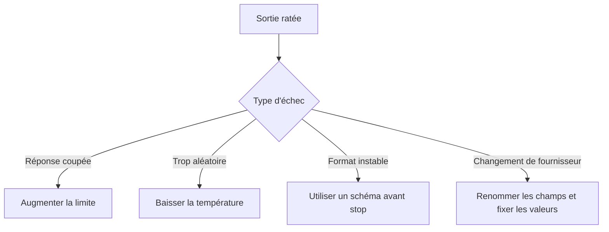

Quand une réponse commence en JSON propre et finit en demi-phrase, le prompt n'est presque jamais le premier suspect. Le vrai bazar vient souvent d'un preset copié depuis un autre fournisseur, où le même levier a changé de nom, de casse ou de comportement.

## Commence par cartographier les leviers avant de les régler

Mon biais est volontairement ennuyeux : je fixe la limite de sortie, je fixe la température, puis je laisse le reste tranquille tant que je ne peux pas nommer l'échec. La [Responses API](https://platform.openai.com/docs/api-reference/responses/create) expose `temperature`, `top_p`, `max_output_tokens` et `stop` ; la [Messages API](https://docs.anthropic.com/en/api/messages) utilise `temperature`, `top_p`, `top_k`, `max_tokens` et `stop_sequences` ; [GenerationConfig](https://ai.google.dev/api/generate-content#v1beta.GenerationConfig) déplace la même famille sous `generationConfig` avec des noms en camelCase comme `topP`, `topK`, `maxOutputTokens` et `stopSequences`. Anthropic documente une `temperature` par défaut à `1.0`, alors que Google précise que plusieurs valeurs par défaut dépendent du modèle, et c'est exactement pour ça que je préfère les définir moi-même quand la portabilité compte.

| Objectif                       | OpenAI                           | Anthropic        | Google                                                   | Ce que je choisirais                                                            |
| ------------------------------ | -------------------------------- | ---------------- | -------------------------------------------------------- | ------------------------------------------------------------------------------- |
| Réduire l'aléatoire            | `temperature`                    | `temperature`    | `generationConfig.temperature`                           | Commencer par là                                                                |
| Couper la queue de probabilité | `top_p`                          | `top_p`          | `generationConfig.topP`                                  | Le laisser à `1` tant que la température suffit                                 |
| Limiter durement les candidats | Non exposé dans la Responses API | `top_k`          | `generationConfig.topK` sur les modèles qui l'autorisent | Le laisser de côté sauf si le fournisseur et le modèle le supportent clairement |
| Éviter les réponses coupées    | `max_output_tokens`              | `max_tokens`     | `generationConfig.maxOutputTokens`                       | Toujours le régler intentionnellement                                           |
| S'arrêter sur un marqueur      | `stop`                           | `stop_sequences` | `generationConfig.stopSequences`                         | Le traiter comme une frontière souple, pas comme un validateur                  |

## Le premier vrai piège, c'est la compatibilité fournisseur

La mauvaise surprise la plus pénible aujourd'hui, ce n'est pas la théorie, c'est la compatibilité des modèles Anthropic. Les [Messages examples](https://docs.anthropic.com/en/api/messages-examples) indiquent que Claude Opus 4.7 et les versions suivantes renvoient une erreur 400 si tu envoies `temperature`, `top_p` ou `top_k` avec une valeur non par défaut. C'est un bon rappel : après un changement de modèle, vérifie d'abord les notes de compatibilité avant d'accuser ton prompt.

Si tu hésites sur le premier levier à toucher, voici la mini carte de triage que j'utilise vraiment.



## Des presets de départ raisonnables

Si je veux un premier essai stable sur OpenAI, je pars du preset le plus ennuyeux possible qui laisse quand même la réponse se terminer.

```js
import OpenAI from 'openai';

const client = new OpenAI({ apiKey: process.env.OPENAI_API_KEY });

const response = await client.responses.create({
  model: 'gpt-5',
  input: 'Return one product title and one sentence of description.',
  temperature: 0.2, // Premier levier à toucher pour stabiliser la formulation
  top_p: 1, // Je laisse le nucleus sampling tranquille tant que je ne peux pas nommer le problème
  max_output_tokens: 120, // Évite la coupe sans payer pour du remplissage inutile
  stop: ['\n\n'], // Frontière souple facultative, pas une garantie de schéma
});

console.log(response.output_text);
```

Si j'ai besoin de la version Anthropic, je garde la même intention mais je renomme la limite et le champ d'arrêt.

```js
import Anthropic from '@anthropic-ai/sdk';

const client = new Anthropic({ apiKey: process.env.ANTHROPIC_API_KEY });

const message = await client.messages.create({
  model: 'claude-sonnet-4-5',
  max_tokens: 120, // Même rôle que max_output_tokens chez OpenAI
  temperature: 0.2, // Anthropic documente 1.0 comme valeur par défaut
  top_p: 1, // Je n'y touche pas tant que je ne peux pas expliquer le problème de queue
  stop_sequences: ['\n\n'], // Séquences d'arrêt personnalisées si tu en as vraiment besoin
  messages: [{ role: 'user', content: 'Return one product title and one sentence of description.' }],
});

console.log(message.content[0].text);
```

Gemini est celui qui fait trébucher le plus de monde, donc je préfère dire la partie pénible franchement : dans la REST API, tout ça vit sous `generationConfig`, et dans le SDK JavaScript tu le passes via `config`.

```js
import { GoogleGenAI } from '@google/genai';

const client = new GoogleGenAI({ apiKey: process.env.GEMINI_API_KEY });

const response = await client.models.generateContent({
  model: 'gemini-2.5-flash',
  contents: 'Return one product title and one sentence of description.',
  config: {
    temperature: 0.2, // Même intention, mais avec un autre emplacement
    topP: 1, // CamelCase et valeurs par défaut dépendantes du modèle
    maxOutputTokens: 120, // Même filet de sécurité que chez les autres fournisseurs
    stopSequences: ['\n\n'], // Marqueur de coupure facultatif
  },
});

console.log(response.text);
```

Quand une structure stricte compte plus que le style, je choisis un schéma plutôt qu'une séquence d'arrêt à chaque fois. Les [Structured Outputs](https://platform.openai.com/docs/guides/structured-outputs) rendent les refus et les écarts de schéma plus faciles à détecter dans une automatisation, ce qui est plus sûr que d'espérer qu'un délimiteur n'apparaisse jamais dans le texte.

Des limites plus longues, des retries et des séries de tests un peu trop enthousiastes dépensent tous des tokens, donc garde un œil sur les [rate limits](https://platform.openai.com/docs/guides/rate-limits) avant de transformer le réglage des paramètres en machine à sous.

Si tu modifies plus d'un levier d'échantillonnage à la fois, arrête-toi là : fixe la limite, fixe la température, et si ça n'explique toujours pas l'échec, passe à un schéma ou à un autre modèle au lieu d'inventer un preset plus gros.
