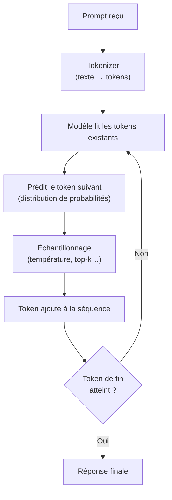

Un chatbot vous répond en quelques secondes, donc l'idée qui vient naturellement est simple : il a compris votre question, puis il a rédigé sa réponse. Si vous débutez avec les LLM, je vous conseille d'abandonner cette image assez vite, parce qu'elle crée l'essentiel de la confusion. Le modèle mental le plus sûr est plus simple : un LLM est une machine de prédiction qui devine sans cesse le morceau de texte suivant.

### Tout commence par un découpage du texte

Cela pose un premier problème. Un modèle ne travaille pas directement sur des phrases brutes, donc il transforme d'abord votre prompt en **tokens**, de petits morceaux de texte créés par un **tokenizer**, l'outil qui découpe le texte en éléments comme des mots entiers, des morceaux de mots ou de la ponctuation. Les [docs tokenizer](https://huggingface.co/docs/transformers/tokenizer_summary) expliquent pourquoi ce découpage en sous-morceaux est utile, et les [docs GPT-2](https://huggingface.co/docs/transformers/model_doc/gpt2) décrivent les modèles de type GPT comme des systèmes qui prédisent le mot suivant à partir des mots précédents.

### Puis il fait une supposition, pas un brouillon complet

Une fois que vous voyez ce découpage en tokens, la réponse qui arrive mot après mot paraît déjà moins magique. Un modèle de langage **causal**, c'est-à-dire un modèle qui ne peut regarder que les tokens précédents pendant la génération, lit les tokens déjà présents, estime quel token devrait venir ensuite, ajoute ce choix, puis recommence. Le [papier Transformer](https://arxiv.org/abs/1706.03762) d'origine décrit le mécanisme de masquage qui force chaque position à dépendre seulement des positions précédentes.

### Pourquoi il peut sembler sûr de lui et se tromper quand même

C'est le point que je ferais retenir en premier à un débutant : le modèle optimise une suite plausible, pas la vérité. C'est pour cela qu'une réponse très propre peut quand même être fausse, un échec qu'OpenAI détaille dans son [papier OpenAI](https://openai.com/index/why-language-models-hallucinate/). Si vous gardez en tête « token probable suivant » au lieu de « expert caché », beaucoup de comportements étranges deviennent soudain plus logiques.

### D'où vient la part de hasard

Vous pouvez encore vous demander pourquoi le même prompt peut produire des formulations différentes. Pendant la génération, le système peut prendre le token le plus probable ou échantillonner parmi plusieurs candidats, et le [guide de génération](https://huggingface.co/docs/transformers/main/en/generation_strategies) montre ces choix en pratique. Un réglage important est la **température**, c'est-à-dire le paramètre qui rend cet échantillonnage plus prudent ou plus audacieux : une température basse est plus stable, une température haute est plus risquée. Pour un usage débutant, je choisirais une température basse dès que l'exactitude compte plus que le style.

Le moyen le plus rapide que je connaisse pour rendre ces réglages concrets, c'est de comparer les grandes options de décodage côte à côte.

| Stratégie / réglage                      | Ce que ça fait                                            | Ce que vous gagnez                              | Ce que vous risquez                              | Quand je l'utiliserais                                                                   |
| ---------------------------------------- | --------------------------------------------------------- | ----------------------------------------------- | ------------------------------------------------ | ---------------------------------------------------------------------------------------- |
| Décodage glouton                         | Prend toujours le token suivant le plus probable          | Sortie stable et reproductible                  | Formulation plate et erreurs locales fréquentes  | Extraction, classification, ou tâches très cadrées                                       |
| Température basse                        | Accentue l'écart de probabilité entre les premiers tokens | Réponses plus cohérentes                        | Peut devenir rigide et répétitif                 | Prompts où la précision passe avant le style                                             |
| Température plus haute + échantillonnage | Pioche dans un ensemble plus large de tokens plausibles   | Plus de variété et de créativité                | Plus de dérive et plus de risque d'hallucination | Brainstorming ou exploration de style                                                    |
| Top-k / top-p                            | Réduit le groupe de candidats avant l'échantillonnage     | De la variété sans tomber dans le chaos complet | Plus de réglages à ajuster                       | Quand le glouton est trop raide mais que l'échantillonnage libre part dans tous les sens |

### La boucle de génération en un coup d'œil

Ma règle est simple : quand une question devrait avoir une seule bonne réponse, traitez le modèle comme une machine à brouillon et vérifiez l'affirmation vous-même.
