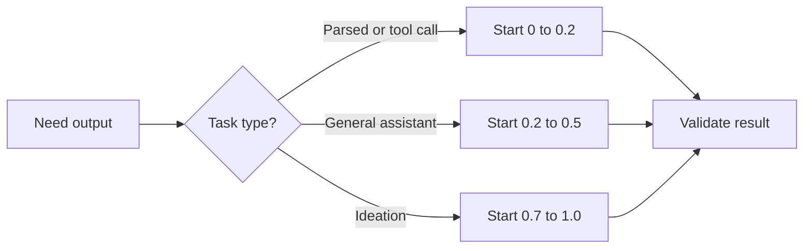

When the same extraction prompt gives you three different JSON shapes, your prompt is probably not the first suspect. I would check temperature before rewriting anything, because one leftover default can make a careful workflow look flaky.

## Treat temperature like a risk budget

[OpenAI docs](https://platform.openai.com/docs/api-reference/parameter-details) put `temperature` on a `0` to `2` scale and recommend changing either `temperature` or `top_p`, not both. [Anthropic docs](https://docs.anthropic.com/en/api/messages) use `0.0` to `1.0` and default to `1.0`. [Gemini docs](https://ai.google.dev/api/generate-content) also use `0.0` to `2.0`, but the default varies by model, so copying `1.0` across providers is a nice way to debug the wrong thing.

I start low whenever the answer will be parsed, routed, or used to call a tool. That is not glamorous, but validators and retries are more expensive than a model sounding slightly less creative.

Before I chase prompt tweaks, I like to anchor the decision with a simple map.



Before I touch the prompt, I usually sanity-check the provider rules against the job.

| Provider      | Documented range | Documented default | What I would do                                                                       |
| ------------- | ---------------- | ------------------ | ------------------------------------------------------------------------------------- |
| OpenAI        | `0` to `2`       | `1`                | I still start at `0.1` for extraction and only climb when I want variation on purpose |
| Anthropic     | `0.0` to `1.0`   | `1.0`              | Same habit, just remember the scale tops out earlier                                  |
| Google Gemini | `0.0` to `2.0`   | Model-dependent    | Check the model metadata first and do not assume `1.0`                                |

For structured output, I would start with a request that stays boring on purpose.

```ts
import OpenAI from 'openai';

const client = new OpenAI({ apiKey: process.env.OPENAI_API_KEY });

const response = await client.responses.create({
  model: 'gpt-4.1-mini',
  input: 'Extract the company name and country as JSON.',
  temperature: 0.1, // keep sampling tight for parser-friendly output
  top_p: 1, // leave the second sampling knob alone
  max_output_tokens: 80, // cap cost while leaving room for valid JSON
});

console.log(response.output_text);
```

## Compare one knob at a time

The mistake I still see is changing the prompt, `temperature`, and `top_p` in the same afternoon, then blaming the model with a straight face. I would change one sampling control at a time and keep the rest fixed so the comparison means something.

When I need more variation, I test it like an experiment instead of a vibe.

```ts
import OpenAI from 'openai';

const client = new OpenAI({ apiKey: process.env.OPENAI_API_KEY! });
const prompt = 'Give me 6 headline options for a note-taking app.';

for (const temperature of [0.2, 0.8]) {
  const response = await client.responses.create({
    model: 'gpt-4.1-mini',
    input: prompt,
    temperature, // change one variable per run
    top_p: 1, // keep nucleus sampling fixed for a fair comparison
    max_output_tokens: 120, // limit review cost while you compare samples
  });

  console.log(`temperature=${temperature}`);
  console.log(response.output_text);
}
```

## Low temperature is not a safety feature

[Azure docs](https://learn.microsoft.com/en-us/azure/ai-services/openai/how-to/reproducible-output) are blunt about reproducibility: even with a seed, determinism is not guaranteed, and longer outputs tend to drift more. That is why I still validate tool arguments and structured data on the server side. Low randomness helps, but it is not a security boundary.

If a wrong answer is expensive, stay between `0` and `0.2`. If you cannot name the benefit of extra variation before you raise it, keep your hand off the knob.
