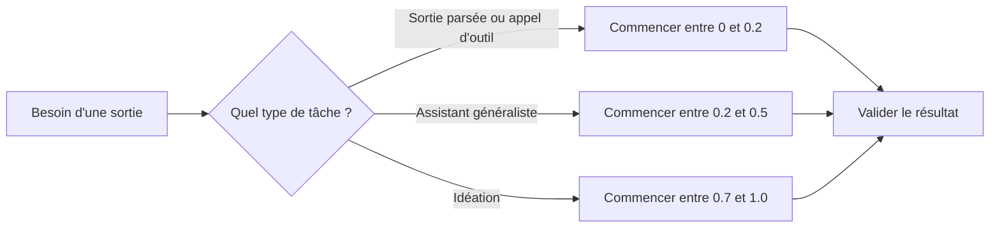

Quand le même prompt d’extraction vous donne trois formes de JSON différentes, le prompt n’est probablement pas le premier suspect. Moi, je vérifie la température avant de tout réécrire, parce qu’un défaut oublié suffit à faire passer un workflow soigneux pour quelque chose de bancal.

## Traiter la température comme un budget de risque

Les [docs OpenAI](https://platform.openai.com/docs/api-reference/parameter-details) placent `temperature` sur une échelle de `0` à `2` et recommandent de modifier soit `temperature`, soit `top_p`, pas les deux. Les [docs Anthropic](https://docs.anthropic.com/en/api/messages) utilisent `0.0` à `1.0` avec une valeur par défaut de `1.0`. Les [docs Gemini](https://ai.google.dev/api/generate-content) utilisent aussi `0.0` à `2.0`, mais la valeur par défaut dépend du modèle, donc recopier `1.0` d’un provider à l’autre, c’est une très bonne façon de déboguer le mauvais problème.

Je pars bas dès que la réponse sera parsée, routée ou utilisée pour appeler un outil. Ce n’est pas très glamour, mais les validateurs et les retries coûtent plus cher qu’un modèle un peu moins créatif.

Avant de bricoler le prompt, j’aime bien poser le choix sur une carte simple.



Avant de toucher au prompt, je vérifie en général que les règles du provider collent bien au travail demandé.

| Provider      | Plage documentée | Valeur par défaut documentée | Ce que je ferais                                                                                      |
| ------------- | ---------------- | ---------------------------- | ----------------------------------------------------------------------------------------------------- |
| OpenAI        | `0` à `2`        | `1`                          | Je démarre quand même à `0.1` pour l’extraction, et je ne monte que si je veux de la variation exprès |
| Anthropic     | `0.0` à `1.0`    | `1.0`                        | Même habitude, avec juste une échelle qui plafonne plus tôt                                           |
| Google Gemini | `0.0` à `2.0`    | Dépend du modèle             | Je regarde d’abord les métadonnées du modèle et je n’imagine pas que `1.0` est universel              |

Pour une sortie structurée, je commencerais par une requête volontairement un peu ennuyeuse.

```ts
import OpenAI from 'openai';

const client = new OpenAI({ apiKey: process.env.OPENAI_API_KEY });

const response = await client.responses.create({
  model: 'gpt-4.1-mini',
  input: 'Extract the company name and country as JSON.',
  temperature: 0.1, // garde un échantillonnage serré pour une sortie facile à parser
  top_p: 1, // laisse le second levier d’échantillonnage tranquille
  max_output_tokens: 80, // limite le coût tout en laissant la place pour un JSON valide
});

console.log(response.output_text);
```

## Comparer un seul levier à la fois

L’erreur que je vois encore, c’est changer le prompt, `temperature` et `top_p` dans la même après-midi, puis accuser le modèle avec beaucoup d’assurance. Je changerais un seul contrôle d’échantillonnage à la fois et je garderais le reste fixe pour que la comparaison veuille dire quelque chose.

Quand j’ai besoin de plus de variation, je le teste comme une expérience, pas comme une humeur du moment.

```ts
import OpenAI from 'openai';

const client = new OpenAI({ apiKey: process.env.OPENAI_API_KEY! });
const prompt = 'Give me 6 headline options for a note-taking app.';

for (const temperature of [0.2, 0.8]) {
  const response = await client.responses.create({
    model: 'gpt-4.1-mini',
    input: prompt,
    temperature, // change une seule variable par essai
    top_p: 1, // garde le nucleus sampling fixe pour comparer proprement
    max_output_tokens: 120, // borne le coût de relecture pendant le test
  });

  console.log(`temperature=${temperature}`);
  console.log(response.output_text);
}
```

## Une faible température n’est pas une sécurité

Les [docs Azure](https://learn.microsoft.com/en-us/azure/ai-services/openai/how-to/reproducible-output) sont assez claires sur la reproductibilité: même avec un seed, le déterminisme n’est pas garanti, et les sorties longues dérivent davantage. C’est pour ça que je valide encore les arguments d’outils et les données structurées côté serveur. Une faible part d’aléatoire aide, mais ce n’est pas une frontière de sécurité.

Si une mauvaise réponse coûte cher, restez entre `0` et `0.2`. Si vous êtes incapable de nommer le bénéfice de la variation avant de monter, laissez ce levier tranquille.
