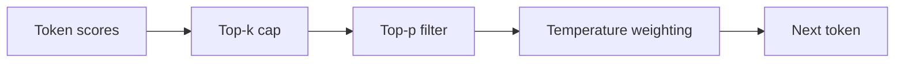

You lower temperature, the answer still grabs one ridiculous token, and suddenly the whole run feels cursed. When that happens, I do not want a softer creativity slider. I want a hard fence.

## Top-k is the hard fence

In [Vertex sampling](https://cloud.google.com/vertex-ai/generative-ai/docs/learn/prompts/adjust-parameter-values), top-k keeps only the `k` most likely next tokens, then `topP` can trim that shortlist again, and temperature decides how sharply the final pick favors the leaders. That order is why I treat top-k as a tail trimmer, not a nicer synonym for control.

[Transformers](https://huggingface.co/docs/transformers/en/main_classes/text_generation) makes the other crucial point explicit: `top_k` is a sampling control, so it matters when `do_sample=True`. If sampling is off, `top_k` is just decoration. That trips up almost everyone once, so if it already got you too, welcome to the club.

If you want the pipeline in one glance, this is the mental model I use.



Before comparing providers, I like to isolate the effect in the smallest script that can actually run.

```py
from transformers import AutoModelForCausalLM, AutoTokenizer

tokenizer = AutoTokenizer.from_pretrained("openai-community/gpt2")
model = AutoModelForCausalLM.from_pretrained("openai-community/gpt2")

inputs = tokenizer("Explain photosynthesis in one paragraph.", return_tensors="pt")
outputs = model.generate(
    **inputs,
    do_sample=True,      # sampling must be on or top_k is ignored
    temperature=0.7,     # keep some variation without opening the floodgates
    top_p=1.0,           # leave nucleus sampling neutral while testing top-k
    top_k=30,            # keep only the 30 most likely next tokens
    max_new_tokens=120,  # cap the run while you tune
)
print(tokenizer.decode(outputs[0], skip_special_tokens=True))
```

## The next trap is provider support

This is where I would be opinionated: I would not design around top-k unless the provider exposes it clearly for the model I am calling.

| Stack                                                                                         | Parameter | Support today                                               | What I'd choose                                    |
| --------------------------------------------------------------------------------------------- | --------- | ----------------------------------------------------------- | -------------------------------------------------- |
| Transformers                                                                                  | `top_k`   | Built in for sampled generation                             | My first stop on local models                      |
| Anthropic [Messages API](https://docs.anthropic.com/en/api/messages)                          | `top_k`   | Exposed, but documented for advanced use cases              | I would try temperature first                      |
| Google [GenerationConfig](https://ai.google.dev/api/generate-content#v1beta.GenerationConfig) | `topK`    | Model-dependent; some Gemini models do not allow setting it | Check the model capability before copying a preset |
| OpenAI [Responses API](https://platform.openai.com/docs/api-reference/responses/create)       | none      | Exposes `temperature` and `top_p`, not `top_k`              | Do not plan around top-k there                     |

That table is why I still think of top-k as mainly a self-hosted tool. In [vLLM params](https://docs.vllm.ai/en/latest/api/vllm/sampling_params.html), `top_k=0` or `-1` disables the cap entirely, which is wonderfully blunt: either you fence the candidate set or you do not.

When the model does support it, I would start narrower than most people expect.

| Situation                                             | `top_k` I'd try | Why                                                             |
| ----------------------------------------------------- | --------------- | --------------------------------------------------------------- |
| Strict extraction or routing                          | `1`             | Nearly greedy, with very little room for format drift           |
| Small local instruct model keeps grabbing junk tokens | `20` to `40`    | Usually enough room for wording without reopening the long tail |
| Larger local model sounds cramped                     | `40` to `80`    | Loosen it carefully instead of jumping straight to no cap       |

If you are tempted to sell top-k as a safety setting, I would not. [Responsible AI](https://cloud.google.com/vertex-ai/generative-ai/docs/learn/responsible-ai) is the better mental model: keep safety filters, evaluations, and monitoring separate from sampling tweaks.

My default is simple: on hosted APIs, start with temperature and leave top-k alone unless the docs for that exact model say it exists; on smaller self-hosted models, start around `20` to `40`. If you are changing `top_k` and `top_p` in the same experiment, stop and decide which tail problem you are actually fixing first.
