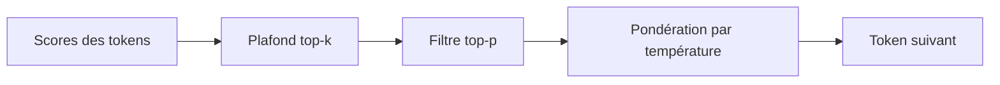

On baisse la température, la réponse attrape quand même un token absurde, et tout le run prend soudain un air maudit. Quand ça arrive, je ne veux pas d’un curseur de créativité un peu plus doux. Je veux une barrière nette.

## Le top-k sert justement de barrière nette

Dans [Vertex sampling](https://cloud.google.com/vertex-ai/generative-ai/docs/learn/prompts/adjust-parameter-values), le top-k ne garde que les `k` tokens suivants les plus probables, puis `topP` peut encore raccourcir cette shortlist, et la température décide à quel point le choix final favorise les premiers de la file. C’est pour ça que je traite le top-k comme un coupe-traîne, pas comme un synonyme plus chic de contrôle.

[Transformers](https://huggingface.co/docs/transformers/en/main_classes/text_generation) rappelle l’autre point crucial : `top_k` est un réglage de sampling, donc il compte quand `do_sample=True`. Si le sampling est coupé, `top_k` devient un simple décor. Presque tout le monde se fait avoir une fois, donc si c’est déjà votre cas, bienvenue au club.

Si vous voulez voir le pipeline en un coup d’œil, c’est le schéma mental que j’utilise.



Avant de comparer les fournisseurs, j’aime bien isoler l’effet dans le plus petit script qui tourne vraiment.

```py
from transformers import AutoModelForCausalLM, AutoTokenizer

tokenizer = AutoTokenizer.from_pretrained("openai-community/gpt2")
model = AutoModelForCausalLM.from_pretrained("openai-community/gpt2")

inputs = tokenizer("Explain photosynthesis in one paragraph.", return_tensors="pt")
outputs = model.generate(
    **inputs,
    do_sample=True,      # le sampling doit être actif sinon top_k est ignoré
    temperature=0.7,     # garde un peu de variété sans ouvrir les vannes
    top_p=1.0,           # laisse le nucleus sampling neutre pendant le test du top-k
    top_k=30,            # ne garde que les 30 tokens suivants les plus probables
    max_new_tokens=120,  # borne le run pendant le réglage
)
print(tokenizer.decode(outputs[0], skip_special_tokens=True))
```

## Le piège suivant, c’est le support côté fournisseur

Là, je prends clairement position : je ne construirais pas autour du top-k tant que le fournisseur ne l’expose pas explicitement pour le modèle que j’appelle.

| Environnement                                                                                 | Paramètre | Support aujourd’hui                                                    | Ce que je choisirais                                     |
| --------------------------------------------------------------------------------------------- | --------- | ---------------------------------------------------------------------- | -------------------------------------------------------- |
| Transformers                                                                                  | `top_k`   | Intégré pour la génération en sampling                                 | Mon premier arrêt sur des modèles locaux                 |
| Anthropic [Messages API](https://docs.anthropic.com/en/api/messages)                          | `top_k`   | Exposé, mais documenté pour des cas avancés                            | Je commencerais par la température                       |
| Google [GenerationConfig](https://ai.google.dev/api/generate-content#v1beta.GenerationConfig) | `topK`    | Dépend du modèle ; certains modèles Gemini n’autorisent pas ce réglage | Vérifier la capacité du modèle avant de copier un preset |
| OpenAI [Responses API](https://platform.openai.com/docs/api-reference/responses/create)       | aucun     | Expose `temperature` et `top_p`, pas `top_k`                           | Ne pas prévoir de top-k de ce côté-là                    |

Ce tableau explique aussi pourquoi je continue à voir le top-k surtout comme un outil d’auto-hébergement. Dans les [params vLLM](https://docs.vllm.ai/en/latest/api/vllm/sampling_params.html), `top_k=0` ou `-1` désactive complètement le plafond, et j’aime bien cette franchise : soit on clôture l’ensemble des candidats, soit on ne le fait pas.

Quand le modèle le supporte vraiment, je pars plus étroit que ce que la plupart des gens imaginent.

| Situation                                                   | `top_k` que je testerais | Pourquoi                                                                |
| ----------------------------------------------------------- | ------------------------ | ----------------------------------------------------------------------- |
| Extraction stricte ou routage                               | `1`                      | Presque glouton, avec très peu d’espace pour dériver sur le format      |
| Petit modèle instruct local qui attrape des tokens poubelle | `20` à `40`              | Souvent assez d’air pour la formulation sans rouvrir la longue traîne   |
| Modèle local plus gros qui sonne trop raide                 | `40` à `80`              | Le desserrer doucement au lieu de sauter directement vers aucun plafond |

Si vous êtes tenté de vendre le top-k comme un réglage de sécurité, je ne le ferais pas. [Responsible AI](https://cloud.google.com/vertex-ai/generative-ai/docs/learn/responsible-ai) donne le meilleur réflexe : garder les filtres de sécurité, l’évaluation et le monitoring séparés des réglages de sampling.

Ma règle par défaut est simple : sur une API hébergée, je commence par la température et je laisse le top-k tranquille tant que la doc de ce modèle précis ne dit pas qu’il existe ; sur un petit modèle auto-hébergé, je démarre autour de `20` à `40`. Si vous changez `top_k` et `top_p` dans la même expérience, arrêtez-vous là et choisissez d’abord quel problème de traîne vous essayez vraiment de corriger.
