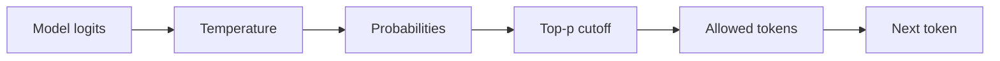

When a model is basically on target but one odd word keeps hijacking the sentence, lowering temperature can feel like turning down the whole personality just to fix one tail token. That is when I reach for top-p.

## Use top-p when the tail is the problem

[Holtzman et al.](https://arxiv.org/abs/1904.09751) introduced nucleus sampling to cut the unreliable tail of the next-token distribution. The provider docs line up on the part that matters in practice: [OpenAI docs](https://platform.openai.com/docs/api-reference/parameter-details) document `top_p` as a `0` to `1` control and recommend changing either `top_p` or `temperature`, not both; [Anthropic docs](https://docs.anthropic.com/en/api/messages) expose `top_p` as the nucleus-sampling control and give the same one-knob advice; [Vertex AI docs](https://cloud.google.com/vertex-ai/generative-ai/docs/multimodal/content-generation-parameters) describe `topP` the same way and document a `0.0` to `1.0` range. That is why I use top-p for weird tail tokens instead of flattening the whole answer with temperature first.

This is the mental model I keep in my head while tuning it.



The annoying part is that the docs are not equally explicit about every provider detail, so I keep the tactic boring on purpose: change one sampling knob, inspect the output, then stop if the issue is gone. That is slower for your ego and much faster for debugging.

When the tail is the real problem, I start with a request like this.

```ts
import OpenAI from 'openai';

const client = new OpenAI({ apiKey: process.env.OPENAI_API_KEY });

const response = await client.responses.create({
  model: 'gpt-4.1-mini',
  input: 'Write 5 taglines for a budgeting app.',
  temperature: 0.7, // keep overall creativity where it already works
  top_p: 0.9, // trim the low-probability tail without crushing the tone
  max_output_tokens: 80, // cap cost while you test and review outputs
});

console.log(response.output_text);
```

## How I actually tune it

If the whole answer is too wild or too dull, temperature is still the better first lever. If the answer is mostly good and only the occasional detour is weird, top-p is cleaner.

| `top_p`     | What changes      | What I expect in practice                          | What I would do                                        |
| ----------- | ----------------- | -------------------------------------------------- | ------------------------------------------------------ |
| `1.0`       | No nucleus cutoff | Full variety, including the occasional odd tail    | Keep this while judging the model's natural creativity |
| `0.9`       | Light tail trim   | Same voice, fewer weird word choices               | My default starting point on hosted APIs               |
| `0.8`       | Firmer cutoff     | Tighter phrasing, less wobble, slightly less spark | Try this before lowering temperature                   |
| Below `0.8` | Heavy cutoff      | Flatter output that can hide a prompt problem      | Only use it when you can name the exact tail issue     |

This also saves money and rate-limit headroom. Three retries with three sampling tweaks usually buy you extra tokens, extra review time, and not much clarity.

## Do not treat it like safety

I would not use `top_p` as a safety policy. [Moderation docs](https://platform.openai.com/docs/guides/moderation) exist because moderation and sampling solve different problems: sampling changes which token gets picked next, while safety controls decide whether the response is acceptable for your workflow.

My rule is simple: if the whole answer feels wrong, change temperature. If one low-probability detour keeps showing up, start at `top_p: 0.9`. If you want to go below `0.8`, you should be able to say exactly which failure you are trimming.
