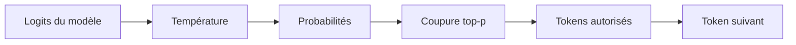

Quand un modèle est presque bon mais qu’un mot bizarre vient parfois détourner toute la phrase, baisser la température peut donner l’impression d’éteindre toute la personnalité juste pour corriger un token de queue. C’est exactement là que je prends le top-p.

## Utiliser le top-p quand le vrai souci est dans la queue

[Holtzman et al.](https://arxiv.org/abs/1904.09751) ont introduit le nucleus sampling pour couper la partie peu fiable de la distribution du token suivant. Les docs des principaux providers se rejoignent sur l’essentiel: les [docs OpenAI](https://platform.openai.com/docs/api-reference/parameter-details) documentent `top_p` comme un réglage entre `0` et `1` et recommandent de modifier soit `top_p`, soit `temperature`, pas les deux; les [docs Anthropic](https://docs.anthropic.com/en/api/messages) exposent `top_p` comme le contrôle de nucleus sampling et donnent le même conseil d’un seul levier; les [docs Vertex AI](https://cloud.google.com/vertex-ai/generative-ai/docs/multimodal/content-generation-parameters) décrivent `topP` de la même façon et documentent une plage de `0.0` à `1.0`. C’est pour ça que je m’en sers pour nettoyer les détours bizarres de queue au lieu d’aplatir toute la réponse avec la température.

C’est le petit schéma mental que je garde en tête quand je le règle.



Le point un peu agaçant, c’est que les docs ne sont pas symétriques sur tous les détails, donc je garde une méthode volontairement simple: je change un seul levier d’échantillonnage, j’observe la sortie, puis j’arrête dès que le problème a disparu. C’est moins flatteur pour l’ego, mais franchement meilleur pour déboguer.

Quand le vrai problème vient de la queue, je pars d’une requête comme celle-ci.

```ts
import OpenAI from 'openai';

const client = new OpenAI({ apiKey: process.env.OPENAI_API_KEY });

const response = await client.responses.create({
  model: 'gpt-4.1-mini',
  input: 'Écris 5 slogans pour une application de budget.',
  temperature: 0.7, // garde le niveau de créativité qui fonctionne déjà
  top_p: 0.9, // coupe la queue peu probable sans casser le ton
  max_output_tokens: 80, // limite le coût pendant les essais et la relecture
});

console.log(response.output_text);
```

## Comment je le règle en vrai

Si toute la réponse est trop folle ou trop plate, la température reste le meilleur premier levier. Si la réponse est globalement bonne et que seul le détour occasionnel est bizarre, le top-p est plus propre.

| `top_p`             | Ce qui change            | Ce que j’attends en pratique                                     | Ce que je ferais                                                 |
| ------------------- | ------------------------ | ---------------------------------------------------------------- | ---------------------------------------------------------------- |
| `1.0`               | Aucune coupure nucleus   | Variété complète, y compris le détour étrange                    | Je garde ça tant que j’évalue la créativité naturelle du modèle  |
| `0.9`               | Coupe légère de la queue | Même voix, avec moins de choix de mots bizarres                  | Mon point de départ par défaut sur les API hébergées             |
| `0.8`               | Coupure plus ferme       | Formulation plus tenue, moins de flottement, un peu moins d’élan | J’essaie ça avant de baisser la température                      |
| En dessous de `0.8` | Coupure lourde           | Sortie plus plate qui peut masquer un problème de prompt         | Je ne fais ça que si je peux nommer exactement le souci de queue |

Ça économise aussi du budget et de la marge côté rate limits. Trois retries avec trois réglages d’échantillonnage différents, ça achète surtout plus de tokens à relire et rarement beaucoup plus de clarté.

## Ne pas le traiter comme une sécurité

Je n’utiliserais pas `top_p` comme politique de sécurité. Les [docs Moderation](https://platform.openai.com/docs/guides/moderation) existent justement parce que la modération et l’échantillonnage ne règlent pas le même problème: l’échantillonnage change le prochain token choisi, alors que les contrôles de sécurité décident si la réponse est acceptable pour votre workflow.

Ma règle est simple: si toute la réponse semble mauvaise, je change la température. Si un détour peu probable revient encore, je commence à `top_p: 0.9`. Si vous voulez descendre sous `0.8`, vous devriez pouvoir nommer précisément l’échec que vous êtes en train de couper.
