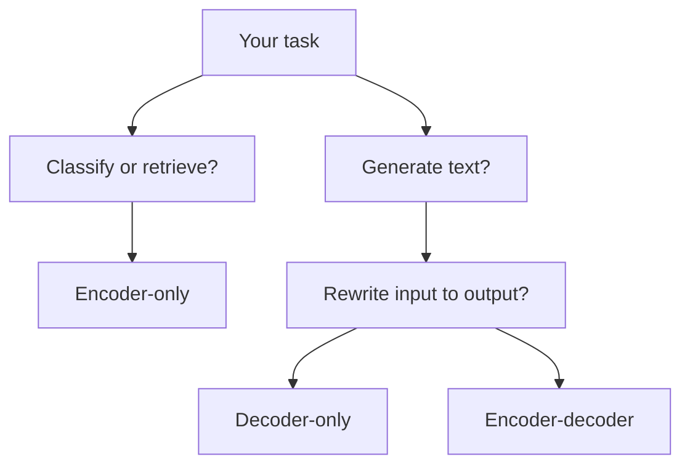

Throw a long brief at a sequence model and you can almost feel the bug report forming: it loses who did what, drops earlier constraints, and somehow sounds confident while drifting away from the task. The move that changed this was the one in [Attention Is All You Need](https://arxiv.org/abs/1706.03762): let every token attend to the others in the same layer instead of forcing the whole computation through a strictly sequential path.

## Why this changed day-to-day model work

That design choice fixed a very practical problem. Training became easier to parallelize, and the model no longer had to carry every long-range dependency through one long chain of recurrent steps. The trade-off is still real though: self-attention gets expensive as sequences grow, so transformers solve one bottleneck by making context length a budget you have to manage.

Once you accept that trade, the next useful question is not “what is a transformer?” but “which transformer shape fits this job?” In practice, the family split into three patterns that still matter: encoder-only models such as [BERT](https://arxiv.org/abs/1810.04805) for representation-heavy work, decoder-only models such as [GPT-3](https://arxiv.org/abs/2005.14165) for next-token generation, and encoder-decoder models such as [T5](https://arxiv.org/abs/1910.10683) when the output should stay tightly anchored to an input.

When I need a quick mental model, I think in task flow rather than architecture trivia:



This is the comparison I actually use when choosing a starting point:

| Need                  | Encoder-only                                                   | Decoder-only                                      | Encoder-decoder                                          |
| --------------------- | -------------------------------------------------------------- | ------------------------------------------------- | -------------------------------------------------------- |
| Best first choice for | Classification, ranking, retrieval                             | Chat, completion, code generation                 | Summarization, translation, controlled rewriting         |
| Why I would pick it   | Efficient scoring and strong representations                   | Mature serving path for autoregressive generation | Keeps the source and generated text explicitly connected |
| First thing to watch  | You still need a separate generation model if the task expands | Latency and token cost climb fast without caching | More moving parts to serve and tune                      |

## What I check before I trust a checkpoint

My default is simple: decoder-only for free-form generation, encoder-only for scoring or retrieval, and encoder-decoder only when the output really needs to track the input sentence by sentence. That rule saves a lot of wasted prompt engineering.

The next thing I inspect is generation speed. The [HF caching](https://huggingface.co/docs/transformers/main/en/cache_explanation) docs explain why KV caching matters: during autoregressive decoding, the model can reuse past keys and values instead of recomputing attention over the whole prefix at every step. If a serving stack turns that off or handles it badly, streaming feels sluggish long before model quality is the real issue.

After that, I look at cost and rate limits, because a good architecture choice can still become an expensive product mistake. [OpenAI rate limits](https://platform.openai.com/docs/guides/rate-limits) are a good reminder that hosted APIs can cap both requests and tokens, and some long-context requests sit behind separate limits. That is why I cap `max_new_tokens` early and test with prompts that look like production, not toy examples.

Then I draw the trust boundary. The [OWASP cheat sheet](https://cheatsheetseries.owasp.org/cheatsheets/LLM_Prompt_Injection_Prevention_Cheat_Sheet.html) is very clear on the tricky part: if you mix instructions with retrieved pages, emails, or PDFs, malicious text inside those documents can still steer the model. Confusion here is normal because the model sounds like it understands roles perfectly, but your application still has to separate trusted instructions from untrusted content and validate any tool-triggering output.

Before I argue about benchmarks, I like to run one tiny probe locally:

```python
from transformers import AutoConfig, AutoModelForCausalLM, AutoTokenizer
import torch

model_id = "gpt2"  # small decoder-only checkpoint for local checks
prompt = "Alice gave Bob the key because"

config = AutoConfig.from_pretrained(model_id)
print("model_type:", config.model_type)
print("is_encoder_decoder:", getattr(config, "is_encoder_decoder", "unknown"))
print("max_position_embeddings:", getattr(config, "max_position_embeddings", "unknown"))
print("use_cache:", getattr(config, "use_cache", "unknown"))

tokenizer = AutoTokenizer.from_pretrained(model_id)
model = AutoModelForCausalLM.from_pretrained(model_id)
inputs = tokenizer(prompt, return_tensors="pt")

with torch.inference_mode():
    output_ids = model.generate(
        **inputs,
        max_new_tokens=40,  # caps latency and token spend
        do_sample=False,    # keeps the run deterministic for debugging
        use_cache=True,     # reuses past keys and values while decoding
    )

print(tokenizer.decode(output_ids[0], skip_special_tokens=True))
```

If that quick check shows `use_cache` disabled, a context window smaller than your real documents, or a model family that does not match the task, I would stop there and switch approach. Once your production prompts live near the context ceiling, or your retrieved content is not fully trusted, that is the threshold where pipeline design matters more than another round of prompt tuning.
