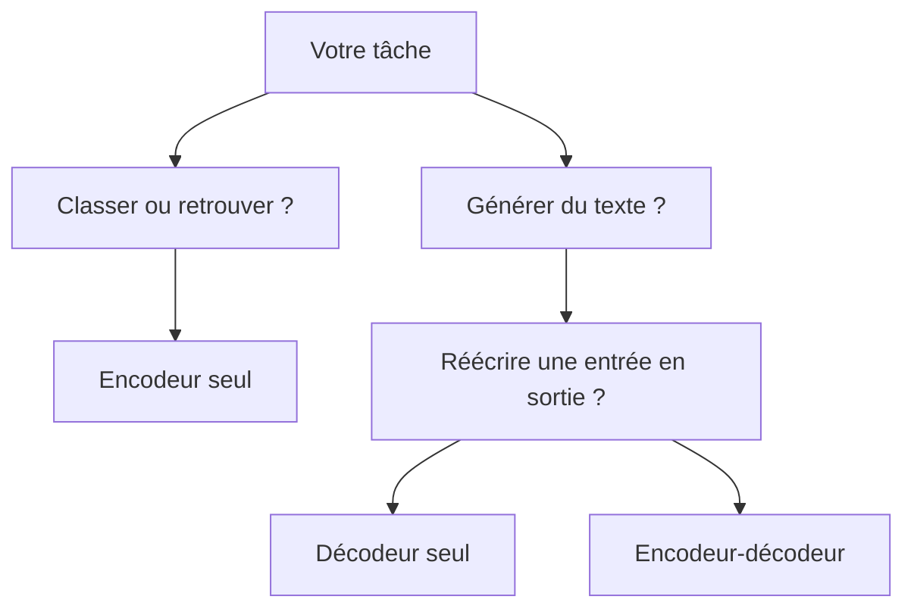

Balancez un long brief à un modèle séquentiel et vous sentez presque le ticket bug arriver: il oublie qui a fait quoi, laisse tomber des contraintes posées plus haut, puis continue avec un aplomb franchement suspect. Le changement qui a tout déplacé vient de [Attention Is All You Need](https://arxiv.org/abs/1706.03762): laisser chaque token regarder les autres dans la même couche au lieu de forcer tout le calcul dans un chemin strictement séquentiel.

## Pourquoi ça a changé le travail au quotidien

Ce choix a résolu un problème très concret. L’entraînement est devenu plus facile à paralléliser, et le modèle n’a plus eu besoin de porter chaque dépendance lointaine à travers une longue chaîne d’étapes récurrentes. Le compromis reste bien réel: l’auto-attention devient coûteuse quand les séquences grandissent, donc les transformers règlent un goulot d’étranglement en faisant de la longueur de contexte un budget à piloter.

Une fois ce compromis accepté, la bonne question n’est plus “qu’est-ce qu’un transformer ?” mais “quelle forme de transformer colle à ce travail ?” En pratique, la famille s’est découpée en trois schémas qui comptent encore: les modèles encodeur seul comme [BERT](https://arxiv.org/abs/1810.04805) pour le travail de représentation, les modèles décodeur seul comme [GPT-3](https://arxiv.org/abs/2005.14165) pour la génération du prochain token, et les modèles encodeur-décodeur comme [T5](https://arxiv.org/abs/1910.10683) quand la sortie doit rester étroitement accrochée à une entrée.

Quand j’ai besoin d’un modèle mental rapide, je pense en flux de tâche plutôt qu’en détails d’architecture:



C’est la comparaison que j’utilise vraiment pour choisir un point de départ:

| Besoin                      | Encodeur seul                                                            | Décodeur seul                                            | Encodeur-décodeur                                                |
| --------------------------- | ------------------------------------------------------------------------ | -------------------------------------------------------- | ---------------------------------------------------------------- |
| Meilleur premier choix pour | Classification, classement, recherche                                    | Chat, complétion, génération de code                     | Résumé, traduction, réécriture contrôlée                         |
| Pourquoi je le choisirais   | Scoring efficace et bonnes représentations                               | Chemin de serving mûr pour la génération auto-régressive | Garde un lien explicite entre le texte source et le texte généré |
| Premier point à surveiller  | Il faut quand même un autre modèle si la tâche dérive vers la génération | La latence et le coût en tokens montent vite sans cache  | Il y a plus de pièces à servir et à régler                       |

## Ce que je vérifie avant de faire confiance à un checkpoint

Ma règle par défaut est simple: décodeur seul pour la génération libre, encodeur seul pour le scoring ou la recherche, et encodeur-décodeur seulement quand la sortie doit vraiment suivre l’entrée phrase par phrase. Cette règle évite déjà beaucoup de pseudo-optimisation côté prompt.

Ensuite, je regarde la vitesse de génération. La doc [HF caching](https://huggingface.co/docs/transformers/main/en/cache_explanation) explique pourquoi le cache KV compte: pendant le décodage auto-régressif, le modèle peut réutiliser les clés et valeurs passées au lieu de recalculer l’attention sur tout le préfixe à chaque étape. Si une stack de serving coupe ça ou le gère mal, le streaming paraît lent bien avant que la qualité du modèle soit le vrai sujet.

Après ça, je vérifie le coût et les limites de débit, parce qu’un bon choix d’architecture peut quand même devenir une erreur produit coûteuse. [OpenAI rate limits](https://platform.openai.com/docs/guides/rate-limits) rappelle bien que les API hébergées peuvent plafonner à la fois les requêtes et les tokens, avec parfois des limites séparées pour le long contexte. C’est pour ça que je borne `max_new_tokens` tôt et que je teste avec des prompts qui ressemblent à la production, pas avec des jouets.

Puis je trace la frontière de confiance. La [OWASP cheat sheet](https://cheatsheetseries.owasp.org/cheatsheets/LLM_Prompt_Injection_Prevention_Cheat_Sheet.html) est très claire sur le point piégeux: si vous mélangez des instructions avec des pages récupérées, des e-mails ou des PDF, un texte malveillant dans ces documents peut quand même orienter le modèle. Cette confusion est normale, parce que le modèle donne l’impression de bien comprendre les rôles, mais votre application doit toujours séparer les instructions de confiance du contenu non fiable et valider toute sortie qui déclenche un outil.

Avant de discuter benchmarks, j’aime lancer une toute petite sonde en local:

```python
from transformers import AutoConfig, AutoModelForCausalLM, AutoTokenizer
import torch

model_id = "gpt2"  # petit checkpoint décodeur seul pour des vérifications locales
prompt = "Alice gave Bob the key because"

config = AutoConfig.from_pretrained(model_id)
print("model_type:", config.model_type)
print("is_encoder_decoder:", getattr(config, "is_encoder_decoder", "unknown"))
print("max_position_embeddings:", getattr(config, "max_position_embeddings", "unknown"))
print("use_cache:", getattr(config, "use_cache", "unknown"))

tokenizer = AutoTokenizer.from_pretrained(model_id)
model = AutoModelForCausalLM.from_pretrained(model_id)
inputs = tokenizer(prompt, return_tensors="pt")

with torch.inference_mode():
    output_ids = model.generate(
        **inputs,
        max_new_tokens=40,  # borne la latence et la dépense en tokens
        do_sample=False,    # garde un run déterministe pour déboguer
        use_cache=True,     # réutilise les clés et valeurs passées au décodage
    )

print(tokenizer.decode(output_ids[0], skip_special_tokens=True))
```

Si ce contrôle rapide montre un `use_cache` désactivé, une fenêtre de contexte plus petite que vos vrais documents, ou une famille de modèles mal choisie pour la tâche, je m’arrête là et je change d’approche. Dès que vos prompts de production vivent près de la limite de contexte, ou que votre contenu récupéré n’est pas totalement fiable, c’est le seuil où le design du pipeline compte plus qu’un tour de plus sur le prompt.
