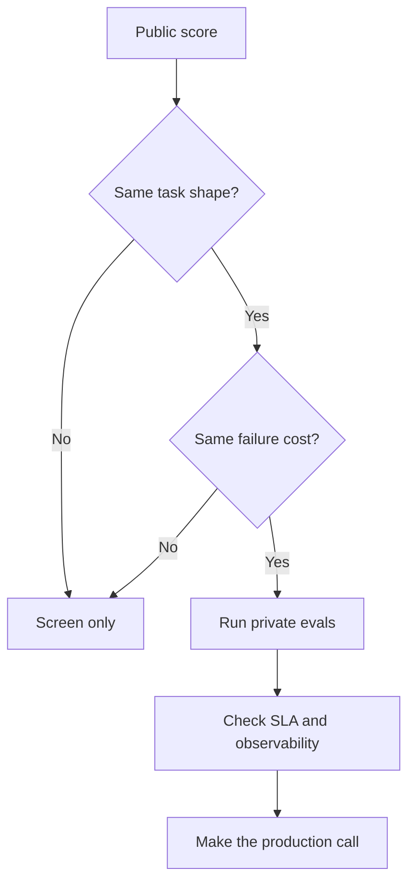

A vendor demo lands with a shiny benchmark chart, and suddenly the room acts like the decision is made. Then the pilot misses your schema, retries the wrong tool, or burns the latency budget. If that whiplash feels familiar, you are not behind. Benchmarks are useful. They just get dangerous the moment you treat them as a production verdict.

## The signal each classic benchmark still gives

| Benchmark                                     | Real signal                                                                          | Why I limit it                                                                                      | My 2026 use                                                                            |
| --------------------------------------------- | ------------------------------------------------------------------------------------ | --------------------------------------------------------------------------------------------------- | -------------------------------------------------------------------------------------- |
| [MMLU](https://arxiv.org/abs/2009.03300)      | Breadth across 57 multiple-choice subjects                                           | It gets overread as general intelligence, even though it is mostly a recall and test-taking signal  | Quick screen for broad knowledge, never my final tie-breaker                           |
| [HumanEval](https://arxiv.org/abs/2107.03374) | Narrow code synthesis scored with pass@k on hidden tests                             | It says far too little about editing a live codebase, using tools, or recovering from ambiguity     | Useful for code generation only when the workflow is still close to isolated functions |
| [MATH](https://arxiv.org/abs/2103.03874)      | Competition-style mathematical reasoning across 12,500 problems                      | It overweights olympiad-flavored reasoning compared with most business workflows                    | Worth keeping if math is central to the product, easy to overvalue otherwise           |
| [GPQA](https://arxiv.org/abs/2311.12022)      | Expert-written, Google-proof science questions that are still hard for strong models | It is strong for deep science, but it does not stand in for ordinary support, ops, or content tasks | The one I still watch closely when scientific depth really matters                     |
| [BIG-Bench](https://arxiv.org/abs/2206.04615) | A collaborative suite with more than 200 tasks                                       | It is too broad to collapse into one comforting number without losing the interesting failure modes | Good for finding odd capability gaps, bad for crowning a winner                        |

What usually trips teams up is not the benchmark itself. It is the hope that one public score can answer a product question it was never designed to answer.

## Why strong public scores still disappoint

The first issue is benchmark gaming and saturation. After years of model tuning, prompt tuning, and leaderboard attention, small deltas on famous suites can look more decisive than they really are. I do not use classic public benchmarks to separate frontier models when money, SLAs, or user trust are on the line.

The second issue is leakage risk. The [GPT-4 report](https://arxiv.org/abs/2303.08774) treats data overlap as a real evaluation concern, and that is enough for me to stay suspicious of any benchmark the whole industry has been optimizing against for years. If memorization can inflate the score, the score stops being a clean proxy for capability.

The third issue is observability. Public suites almost never tell you schema-valid rate, tool-call success, review burden, p95 latency, or cost per accepted answer. Those are the numbers that decide whether an on-call week stays calm or becomes memorable for bad reasons.

## What I would actually run

That leaves you with a better question: what evidence would make you trust the model inside your own workflow?

The [OpenAI evals guide](https://platform.openai.com/docs/guides/evals) makes the right recommendation here: evaluate the task you actually own. I would use public benchmarks to cut the market down to a shortlist, then build private evals around the real prompts, failure costs, and acceptance thresholds that matter to the team. If your agent needs structured outputs and reliable tool use, I would score those directly before I care about another leaderboard decimal.

I would also instrument task pass rate, schema-valid rate, tool-call success, review escapes, p95 latency, and cost per accepted output, in that order. That set is less glamorous than a leaderboard screenshot, but it is the one that keeps procurement, product, and on-call reality in the same room.

This is the filter I use before I let a public score influence a roadmap.

## Decision rule

My rule is blunt on purpose: if a benchmark is more than one abstraction layer away from your real task, it can shortlist models and nothing more. I only let it influence a buying call after private evals clear the task threshold and stay inside SLA on a boring, representative workload.
