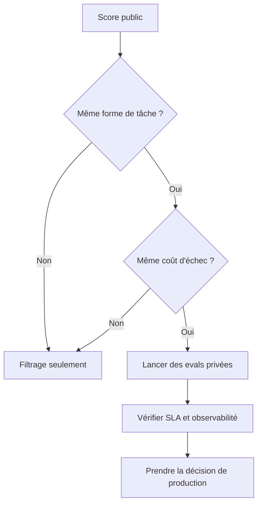

Une démo fournisseur arrive avec un beau graphique de benchmark, et soudain la salle agit comme si la décision était déjà prise. Puis le pilote rate ton schéma, relance le mauvais outil, ou explose le budget de latence. Si ce grand écart te paraît familier, tu n'as rien raté. Les benchmarks sont utiles. Ils deviennent juste dangereux au moment où on les traite comme un verdict de production.

## Le signal que chaque benchmark classique donne encore

| Benchmark                                     | Signal réel                                                                                     | Pourquoi je le limite                                                                                                            | Mon usage en 2026                                                                            |
| --------------------------------------------- | ----------------------------------------------------------------------------------------------- | -------------------------------------------------------------------------------------------------------------------------------- | -------------------------------------------------------------------------------------------- |
| [MMLU](https://arxiv.org/abs/2009.03300)      | Une largeur de connaissances sur 57 matières à choix multiple                                   | On le lit trop facilement comme de l'intelligence générale, alors qu'il signale surtout de la restitution et de la prise de test | Filtrage rapide de la culture générale, jamais mon arbitre final                             |
| [HumanEval](https://arxiv.org/abs/2107.03374) | Une synthèse de code étroite, notée avec pass@k sur des tests cachés                            | Il dit beaucoup trop peu sur l'édition d'une vraie base de code, l'usage d'outils, ou la récupération quand tout devient ambigu  | Utile pour la génération de code seulement si le workflow reste proche de fonctions isolées  |
| [MATH](https://arxiv.org/abs/2103.03874)      | Un raisonnement mathématique de concours sur 12 500 problèmes                                   | Il surpondère une logique de maths olympiques par rapport à la plupart des workflows métier                                      | À garder si les maths sont au cœur du produit, facile à surévaluer sinon                     |
| [GPQA](https://arxiv.org/abs/2311.12022)      | Des questions scientifiques écrites par des experts et pensées pour résister à la recherche web | Il est fort pour la science profonde, mais il ne remplace pas des tâches ordinaires de support, d'ops, ou de contenu             | C'est celui que je surveille encore de près quand la profondeur scientifique compte vraiment |
| [BIG-Bench](https://arxiv.org/abs/2206.04615) | Une suite collaborative de plus de 200 tâches                                                   | Il est trop large pour être réduit à un seul chiffre rassurant sans perdre les modes d'échec intéressants                        | Bon pour repérer des trous de capacité bizarres, mauvais pour désigner un gagnant            |

Ce qui piège les équipes, ce n'est généralement pas le benchmark lui-même. C'est l'espoir qu'un score public unique puisse répondre à une question produit pour laquelle il n'a jamais été conçu.

## Pourquoi de gros scores publics déçoivent encore

Le premier souci, c'est le benchmark gaming et la saturation. Après des années de tuning de modèles, de prompts et de leaderboards, de petits écarts sur des suites célèbres peuvent paraître bien plus décisifs qu'ils ne le sont vraiment. Je n'utilise pas les benchmarks publics classiques pour départager des modèles de pointe quand de l'argent, des SLA, ou la confiance des utilisateurs sont en jeu.

Le deuxième souci, c'est le risque de fuite. Le [rapport GPT-4](https://arxiv.org/abs/2303.08774) traite le recouvrement de données comme un vrai sujet d'évaluation, et ça me suffit pour rester méfiant face à n'importe quel benchmark que toute l'industrie optimise depuis des années. Si la mémorisation peut gonfler le score, alors le score cesse d'être un proxy propre de la capacité.

Le troisième souci, c'est l'observabilité. Les suites publiques ne te disent presque jamais le taux de schéma valide, la réussite des appels d'outils, la charge de revue, la latence p95, ou le coût par sortie acceptée. Pourtant, ce sont ces chiffres-là qui décident si une semaine d'astreinte reste calme ou devient mémorable pour de très mauvaises raisons.

## Ce que je lancerais vraiment

La meilleure question devient alors celle-ci : quelle preuve te ferait vraiment confiance à ce modèle dans ton propre workflow ?

Le [guide OpenAI Evals](https://platform.openai.com/docs/guides/evals) recommande la bonne chose : évaluer la tâche que tu possèdes réellement. J'utiliserais les benchmarks publics pour réduire le marché à une shortlist, puis je construirais des évaluations privées autour des vrais prompts, des vrais coûts d'échec et des vrais seuils d'acceptation de l'équipe. Si ton agent a besoin de sorties structurées et d'un usage d'outils fiable, je mesurerais ça directement avant de m'émouvoir d'une décimale de plus sur un leaderboard.

Je suivrais aussi le taux de réussite de tâche, le taux de schéma valide, la réussite des appels d'outils, les échappées de revue, la latence p95 et le coût par sortie acceptée, dans cet ordre. C'est moins glamour qu'une capture de leaderboard, je sais, mais c'est cette série-là qui garde les achats, le produit et l'astreinte dans la même pièce.

Voici le filtre que j'utilise avant de laisser un score public influencer une feuille de route.

## Règle de décision

Ma règle est volontairement brutale : si un benchmark est à plus d'une couche d'abstraction de ta vraie tâche, il peut présélectionner des modèles et rien de plus. Je ne le laisse influencer un achat qu'après des evals privées au-dessus du seuil de tâche et encore dans le SLA sur une charge banale et représentative.
