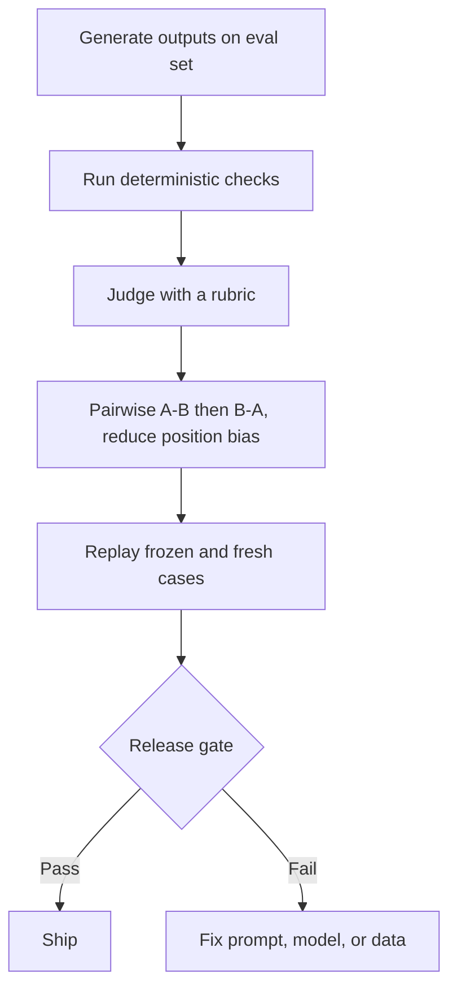

The release gate is green, the diff is small, and support tickets still spike after deploy. That usually means the eval stack measured something easy instead of something important. Automated eval earns its keep only when volume is high and the setup is honest about bias, drift, and cost. If this still feels annoyingly slippery, that is normal. Judge models are useful, but they are part of the system, not neutral referees.

When I need to explain the pipeline to a team, I draw the flow before I argue about metrics:

Each node answers a different failure mode, so the safest stack is layered on purpose.

## Old metrics break first

Before you add a judge, admit what failed before it. [G-Eval](https://arxiv.org/abs/2303.16634) opens by calling out how weakly BLEU and ROUGE track human judgment on open-ended generation, which is exactly why I would not use one lexical score as a release gate for modern assistants. The safer starting point is a replayable dataset plus deterministic checks. [OpenAI Evals](https://developers.openai.com/api/docs/guides/evals) models that explicitly with a `data_source_config` and `testing_criteria`, and [OpenAI graders](https://platform.openai.com/docs/guides/graders) split the hard checks into string checks, text similarity, score-model graders, and Python execution. My default is boring on purpose: schema, exact strings, and tool-call validation first, then subjective grading only for what rules cannot see.

## Judge models need rubrics, not vibes

Hard checks stop cheap failures, but they cannot tell you whether an answer was actually useful. That is where a rubric earns its keep. G-Eval is still the clearest reminder that chain-of-thought plus form-filling criteria beat judge intuition alone. Then comes the annoying part: [MT-Bench](https://arxiv.org/abs/2306.05685) found position bias, verbosity bias, and self-enhancement bias in LLM judges even when agreement with humans was reasonably strong. So I prefer pairwise A-B and B-A with a written reason over neat 1-to-5 scales almost every time. Pairwise costs more, yes, but fake precision costs more in production.

## RAG is where single scores hide the bug

Once a judge exists, teams get tempted to collapse everything into one number. That is where debugging gets expensive. [Ragas](https://docs.ragas.io/en/stable/concepts/metrics/available_metrics/) keeps retrieval and answer quality separate with metrics such as context precision, context recall, response relevancy, and faithfulness. I would keep retrieval metrics and answer metrics side by side in the same review, because a fluent answer with bad evidence and a clumsy answer with perfect evidence need very different fixes.

## Release gates need a baseline and an audit lane

Even a good suite rots. Prompts move, judge models change, datasets go stale, and teams quietly learn how to please the metric. [Braintrust compare](https://www.braintrust.dev/docs/evaluate/compare-experiments) is useful here because it treats experiments as baseline comparisons and highlights regressions per test case, which is the pattern I would copy in any stack. Then keep a second lane for people. [Braintrust review](https://www.braintrust.dev/docs/annotate/human-review) is explicit that human feedback builds ground truth, validates automated scorers, and surfaces edge cases the scorer missed. My production rule is simple: let automation score everything, let humans re-check a sample of wins, losses, and close calls, and watch judge latency and spend as first-class release metrics.

If I need to defend the setup in one screen, I use a table like this:

| Layer                     | What I trust it for                                           | Why I keep it                             | Where it fails                   |
| ------------------------- | ------------------------------------------------------------- | ----------------------------------------- | -------------------------------- |
| Deterministic checks      | Hard requirements such as schema, exact strings, and tool use | Cheap, replayable, and easy to gate in CI | Blind to usefulness and nuance   |
| Rubric-based judge        | Subjective quality with explicit criteria                     | Auditable if the rubric is clear          | A vague rubric gives fake rigor  |
| Pairwise judge            | Choosing between two candidate outputs                        | Less fake precision than scalar scoring   | More judge calls and more cost   |
| Split RAG metrics         | Separating retrieval bugs from answer bugs                    | Tells you which subsystem moved           | More dashboards to maintain      |
| Baseline regression suite | Catching what got worse before release                        | Makes regressions visible per case        | Stale datasets quietly weaken it |
| Human audit lane          | Calibrating the judge and finding blind spots                 | Keeps automation honest                   | Slow and expensive if overused   |

## Decision rule

Put only replayable, well-explained metrics on the SLA path. If humans keep disagreeing with the judge on your audit slice, or if one score cannot tell you which failure mode moved, that metric is not ready to guard a release.
