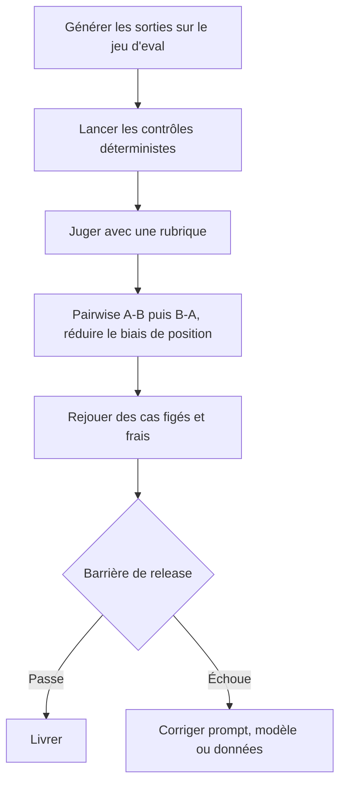

La barrière de release est verte, le diff est petit, et les tickets support montent quand même après le déploiement. Dans la vraie vie, cela veut souvent dire que la suite d'eval a mesuré quelque chose de facile au lieu de mesurer ce qui comptait. L'évaluation automatisée ne vaut vraiment son loyer que quand le volume grimpe et que le dispositif reste honnête sur ses biais, sa dérive et son coût. Si tout cela vous paraît encore péniblement glissant, c'est normal. Les modèles juges sont utiles, mais ils font partie du système, ce ne sont pas des arbitres neutres.

Quand je dois expliquer le pipeline à une équipe, je dessine d'abord le flux avant de débattre des métriques:

Chaque nœud répond à un mode d'échec différent, donc la pile la plus sûre est volontairement stratifiée.

## Les anciennes métriques cassent d'abord

Avant d'ajouter un juge, il faut reconnaître ce qui a déjà échoué. [G-Eval](https://arxiv.org/abs/2303.16634) commence par rappeler à quel point BLEU et ROUGE suivent mal le jugement humain sur de la génération ouverte, et c'est précisément pour cela que je ne mettrais pas un score lexical unique dans une release gate d'assistant moderne. Le point de départ le plus sûr reste un dataset rejouable avec des contrôles déterministes. [OpenAI Evals](https://developers.openai.com/api/docs/guides/evals) formalise aujourd'hui cela avec `data_source_config` et `testing_criteria`, et [OpenAI graders](https://platform.openai.com/docs/guides/graders) sépare les contrôles durs entre vérifications de chaînes, similarité textuelle, score-model graders et exécution Python. Mon réflexe par défaut est volontairement un peu ennuyeux: schéma, chaînes exactes et validation des appels d'outils d'abord, puis jugement subjectif seulement pour ce que les règles ne voient pas.

## Les modèles juges ont besoin d'une rubrique, pas d'intuition

Les contrôles durs stoppent les échecs bon marché, mais ils ne savent pas dire si une réponse était vraiment utile. C'est là qu'une bonne rubrique gagne sa place. G-Eval reste le rappel le plus net que le chain-of-thought combiné à des critères de form-filling bat l'intuition brute du juge. Puis arrive la partie pénible: [MT-Bench](https://arxiv.org/abs/2306.05685) a montré des biais de position, de verbosité et d'auto-préférence chez les juges LLM, même quand l'accord avec des humains restait correct. Donc je préfère presque toujours un pairwise A-B puis B-A avec une raison écrite à une jolie échelle de 1 à 5. Le pairwise coûte plus cher, oui, mais la fausse précision coûte plus cher encore en production.

## Le RAG est l'endroit où un score unique cache le bug

Dès qu'un juge existe, les équipes sont tentées d'écraser tout cela dans un seul chiffre. C'est là que le débogage devient cher. [Ragas](https://docs.ragas.io/en/stable/concepts/metrics/available_metrics/) garde séparées la qualité de retrieval et la qualité de réponse avec des métriques comme context precision, context recall, response relevancy et faithfulness. Je garderais les métriques de retrieval et les métriques de réponse côte à côte dans la même revue, parce qu'une réponse fluide avec de mauvaises preuves et une réponse maladroite avec de bonnes preuves ne se corrigent pas de la même façon.

## Les release gates ont besoin d'une baseline et d'une voie d'audit

Même une bonne suite se dégrade. Les prompts bougent, les modèles juges changent, les datasets vieillissent, et l'équipe apprend discrètement à plaire à la métrique. [Braintrust compare](https://www.braintrust.dev/docs/evaluate/compare-experiments) est utile ici parce qu'il traite les expériences comme des comparaisons contre une baseline et met les régressions en évidence cas par cas, et c'est exactement le pattern que je recopierais dans n'importe quelle stack. Puis il faut garder une seconde voie pour les humains. [Braintrust review](https://www.braintrust.dev/docs/annotate/human-review) dit explicitement que le feedback humain sert à construire le ground truth, valider les scorers automatisés et faire remonter les cas limites ratés par le scoreur. Ma règle de prod est simple: laisser l'automatisation tout scorer, laisser des humains recontrôler un échantillon de victoires, d'échecs et de cas serrés, puis suivre la latence et le coût des juges comme des métriques de release à part entière.

Quand je dois défendre le dispositif sur un seul écran, j'utilise un tableau comme celui-ci:

| Couche                            | Ce à quoi je lui fais confiance                                          | Pourquoi je la garde                                     | Là où elle casse                                   |
| --------------------------------- | ------------------------------------------------------------------------ | -------------------------------------------------------- | -------------------------------------------------- |
| Contrôles déterministes           | Exigences dures comme le schéma, les chaînes exactes et l'usage d'outils | Peu coûteux, rejouables et faciles à brancher dans la CI | Aveugles à l'utilité et à la nuance                |
| Juge à rubrique                   | Qualité subjective avec critères explicites                              | Auditable si la rubrique est claire                      | Une rubrique floue donne une fausse rigueur        |
| Juge pairwise                     | Choisir entre deux sorties candidates                                    | Moins de fausse précision qu'un score scalaire           | Plus d'appels au juge et plus de coût              |
| Métriques RAG séparées            | Séparer les bugs de retrieval des bugs de réponse                        | Indique quel sous-système a bougé                        | Plus de tableaux de bord à maintenir               |
| Suite de régression avec baseline | Voir ce qui a empiré avant release                                       | Rend les régressions visibles cas par cas                | Des datasets trop vieux l'affaiblissent en silence |
| Voie d'audit humain               | Calibrer le juge et repérer ses angles morts                             | Garde l'automatisation honnête                           | Lente et coûteuse si elle déborde                  |

## Règle de décision

Ne mettez sur le chemin du SLA que des métriques rejouables et clairement explicables. Si des humains continuent de contredire le juge sur votre tranche d'audit, ou si un score ne permet pas de dire quel mode d'échec a bougé, cette métrique n'est pas prête à protéger une release.
