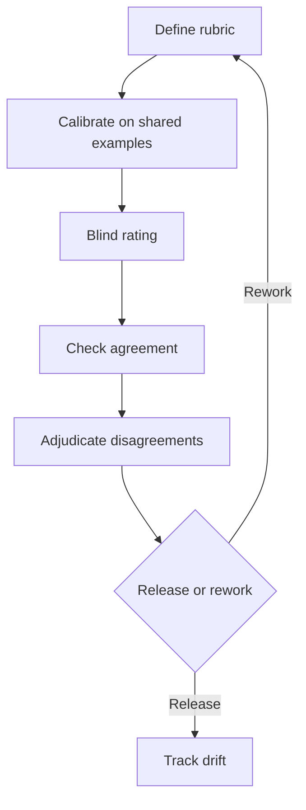

When a release looks fine in dashboards but support tickets keep saying "the answer was technically right and still useless," you have a human evaluation problem. Automated checks are great at catching broken schemas and missing tool calls. They are much worse at catching tone, comparative preference, and the subtle kind of bad answer that annoys a real user in thirty seconds.

If that feels frustrating, you are not missing a secret metric. You are hitting the part of quality that still needs people.

## Write the rubric before you scale the team

If the rubric is fuzzy, adding more raters just buys you louder confusion. The [HF guidebook](https://github.com/huggingface/evaluation-guidebook/blob/main/contents/human-evaluation/using-human-annotators.md) recommends spending real time on guideline design, iterative annotation, and quality estimation, and [Human Signal](https://docs.humansignal.com/guide/quality) makes the same operational point from the tooling side: review, adjudication, and agreement tracking are part of the job, not cleanup after the job. I would start narrower than most teams want. Split factuality, usefulness, safety, and tone into separate questions so disagreement tells you what broke.

When a team is getting lost, I sketch the loop before I touch the dashboard:

## Pick the format that matches the product decision

If you just need fast triage on one dimension, a [Likert item](https://www.qualtrics.com/experience-management/research/likert-scales/) is fine as long as each question measures one thing and the anchors are explicit. If the real release question is "which output would I actually show to a user," I would switch to [Bradley-Terry](https://www.jstor.org/stable/2334029) style pairwise comparison early. It costs more per example, but it usually produces cleaner signal than pretending raters can defend the difference between a 3 and a 4 all day without drifting.

When I have to choose quickly, this is the tradeoff table I use:

| Format       | Best for                    | What you gain                                      | What it costs                                                | What I would choose                       |
| ------------ | --------------------------- | -------------------------------------------------- | ------------------------------------------------------------ | ----------------------------------------- |
| Pass/fail    | Hard safety or policy gates | Fast decisions and clean escalation paths          | Hides near misses                                            | My default for non-negotiable constraints |
| Anchored 1-5 | Single-dimension triage     | Cheap trend tracking                               | Raters compress the middle and interpret anchors differently | Fine for queue triage, not for ship calls |
| Pairwise     | Ship or no-ship preference  | Cleaner preference signal with less fake precision | More comparisons and slower throughput                       | My pick when two outputs are close        |

## Treat agreement like a diagnostic

A big agreement number is not a medal. [Cohen's kappa](https://doi.org/10.1177/001316446002000104) is the classic choice for two raters on nominal labels. [Krippendorff's alpha](https://repository.upenn.edu/asc_papers/43/) is the one I would reach for when you have more than two raters, missing judgments, or different measurement levels. The point is not to impress anyone with a coefficient. The point is to find the part of the rubric that your team is still interpreting three different ways.

## Fatigue is the quiet way eval quality collapses

This is the part teams keep under-budgeting because it looks boring until it breaks. The recent [annotation quality survey](https://aclanthology.org/2024.cl-3.1/) is blunt about it: guideline quality, adjudication, reviewer setup, and annotator management all shape the final data quality. In practice, I would shorten sessions, rotate harder examples through calibration meetings, and watch disagreement rate over time, not just average score. If disagreement spikes late in a shift, that is an operations signal, not a character flaw.

## Use humans where automation cannot protect the SLA

I would not pay humans to label what a parser can reject in milliseconds. Keep automated checks for deterministic constraints, and spend human time on usefulness, safety judgment in ambiguous cases, tone, and close preferences between candidate answers. If a release can change revenue, safety, or support load, I want a blinded sample with at least two calibrated raters before I trust the number enough to ship.
