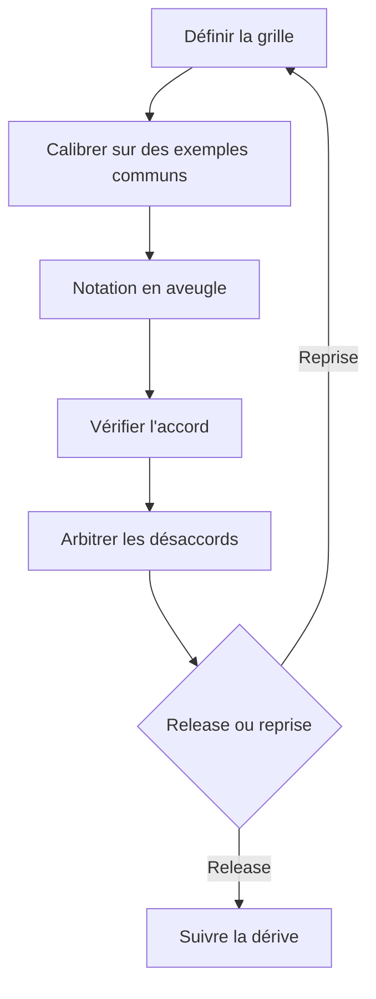

Quand un dashboard a l'air rassurant mais que les tickets support disent encore "la réponse était techniquement juste et pourtant inutile", tu as un problème d'évaluation humaine. Les contrôles automatisés excellent pour attraper un schéma cassé ou un appel d'outil manquant. Ils sont beaucoup moins bons pour attraper le ton, la préférence comparative et cette forme de mauvaise réponse qui agace un vrai utilisateur en trente secondes.

Si ça te frustre, c'est normal. Tu ne rates pas une métrique secrète. Tu arrives simplement à l'endroit de la qualité où il faut encore des humains.

## Écris la grille avant d'agrandir l'équipe

Si la grille est floue, ajouter plus d'annotateurs achète juste une confusion plus bruyante. Le [guidebook HF](https://github.com/huggingface/evaluation-guidebook/blob/main/contents/human-evaluation/using-human-annotators.md) recommande de consacrer un vrai temps à la conception des consignes, à l'annotation itérative et à l'estimation de qualité, et [Human Signal](https://docs.humansignal.com/guide/quality) martèle le même point côté opérationnel : revue, arbitrage et suivi de l'accord font partie du travail, pas du nettoyage après coup. Je partirais sur une grille plus étroite que ce que la plupart des équipes veulent. Sépare la factualité, l'utilité, la sécurité et le ton pour que le désaccord dise enfin ce qui casse.

Quand une équipe se perd, je dessine la boucle avant de toucher au dashboard :

## Choisis le format qui colle à la décision produit

Si tu veux juste un tri rapide sur une seule dimension, un [item Likert](https://www.qualtrics.com/experience-management/research/likert-scales/) convient tant que chaque question mesure une seule chose et que les ancres sont explicites. Si la vraie question de release est "quelle sortie est-ce que je montrerais vraiment à un utilisateur", je passerais tôt à une comparaison pairwise de style [Bradley-Terry](https://www.jstor.org/stable/2334029). Ça coûte plus cher par exemple, mais ça donne souvent un signal plus propre que de faire semblant que des annotateurs peuvent défendre la différence entre un 3 et un 4 toute la journée sans dériver.

Quand je dois trancher vite, c'est ce tableau de compromis que j'utilise :

| Format    | Idéal pour                                    | Ce que tu gagnes                                                | Ce que ça coûte                                                         | Ce que je choisirais                                         |
| --------- | --------------------------------------------- | --------------------------------------------------------------- | ----------------------------------------------------------------------- | ------------------------------------------------------------ |
| Pass/fail | Contraintes dures de sécurité ou de politique | Décisions rapides et escalade claire                            | Cache les presque ratés                                                 | Mon défaut pour les contraintes non négociables              |
| 1-5 ancré | Tri sur une seule dimension                   | Suivi de tendance peu coûteux                                   | Les annotateurs compressent le milieu et lisent les ancres différemment | Bien pour trier une file, pas pour décider une mise en ligne |
| Pairwise  | Préférence de type release ou non             | Signal de préférence plus propre avec moins de fausse précision | Plus de comparaisons et un débit plus lent                              | Mon choix quand deux sorties sont proches                    |

## Traite l'accord comme un diagnostic

Un gros chiffre d'accord n'est pas une médaille. Le [kappa de Cohen](https://doi.org/10.1177/001316446002000104) reste le choix classique pour deux annotateurs sur des labels nominaux. L'[alpha de Krippendorff](https://repository.upenn.edu/asc_papers/43/) est celui que je prendrais dès qu'il y a plus de deux annotateurs, des jugements manquants ou plusieurs niveaux de mesure. Le but n'est pas d'impressionner qui que ce soit avec un coefficient. Le but est de trouver la partie de la grille que ton équipe interprète encore de trois façons différentes.

## La fatigue est la façon discrète dont la qualité s'écroule

C'est la partie que les équipes sous-budgetent sans cesse parce qu'elle a l'air ennuyeuse jusqu'au moment où elle casse tout. La récente [synthèse qualité annotation](https://aclanthology.org/2024.cl-3.1/) est très claire : la qualité des consignes, l'arbitrage, l'organisation de la revue et la gestion des annotateurs façonnent directement la qualité finale des données. En pratique, je raccourcirais les sessions, je ferais tourner les exemples les plus durs dans des réunions de calibration, et je suivrais le taux de désaccord dans le temps, pas seulement la note moyenne. Si le désaccord grimpe en fin de session, c'est un signal d'exploitation, pas un défaut de caractère.

## Mets des humains là où l'automatisation ne protège pas le SLA

Je ne paierais pas des humains pour labelliser ce qu'un parseur peut rejeter en quelques millisecondes. Garde les contrôles automatisés pour les contraintes déterministes, et réserve le temps humain à l'utilité, au jugement de sécurité dans les cas ambigus, au ton et aux préférences serrées entre deux réponses candidates. Si une release peut toucher le revenu, la sécurité ou la charge support, je veux un échantillon en aveugle avec au moins deux annotateurs calibrés avant de faire assez confiance au chiffre pour livrer.
