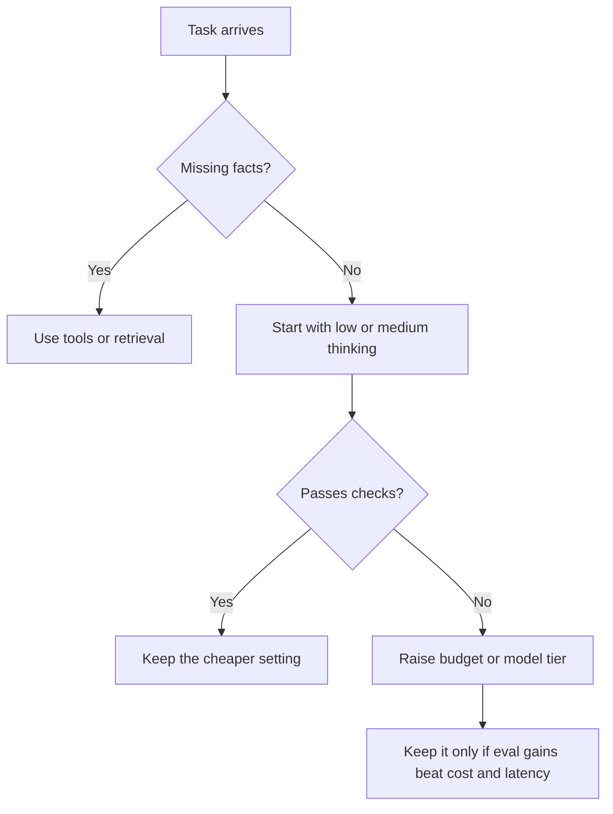

You know the feeling: the model sounds like the smartest person in the room, then misses one key step and quietly drags your code, spreadsheet, or decision off course. When that happens, I do not ask for “more intelligence” first. I ask whether I need more facts, more budget, or a different tool.

## Do not buy more thinking first

I would start by assuming the model is missing evidence, not depth. The [OpenAI guide](https://developers.openai.com/api/docs/guides/reasoning) says reasoning models spend extra reasoning tokens before answering, [Anthropic docs](https://platform.claude.com/docs/en/build-with-claude/extended-thinking) expose extended thinking with adaptive or budgeted modes, and [Gemini docs](https://ai.google.dev/gemini-api/docs/thinking) describe similar controls through thinking levels and thinking budgets. The shared lesson is useful precisely because it is unglamorous: more thinking costs more, takes longer, and only helps when the task is genuinely multi-step.

Older tutorials still talk about o1 and o3. Keep that in mind for maintenance work, but do not build a new default around them. The [o3 page](https://developers.openai.com/api/docs/models/o3) now labels o3 as a reasoning model succeeded by GPT-5, so I would follow current model guidance instead of copying old screenshots from the internet.

| Provider  | Current control                                               | What it changes                                                                                                                                | Thought visibility                                                                              | My pick                                                                                       |
| --------- | ------------------------------------------------------------- | ---------------------------------------------------------------------------------------------------------------------------------------------- | ----------------------------------------------------------------------------------------------- | --------------------------------------------------------------------------------------------- |
| OpenAI    | `reasoning.effort`                                            | How much deliberation the model spends before answering; available values depend on the model                                                  | Summaries are opt-in through `reasoning.summary`; raw reasoning is not exposed                  | Start at `low` or `medium`, then raise only after evals fail                                  |
| Anthropic | `thinking.type` plus `effort` on newer Claude models          | Adaptive thinking on newer models; manual `budget_tokens` is deprecated on Claude Opus 4.6 and Sonnet 4.6, and rejected on newer Opus releases | Claude returns `thinking` blocks or summarized thinking depending on model and display settings | Use adaptive thinking first; manual budgets are for legacy compatibility, not my first choice |
| Gemini    | `thinkingLevel` for Gemini 3, `thinkingBudget` for Gemini 2.5 | Depth or token budget for internal thinking                                                                                                    | `includeThoughts` returns thought summaries                                                     | Use Gemini 3 levels for latency tuning; use 2.5 budgets only when you need hard caps          |

That leads to the question that actually matters: when do you escalate, and when do you switch to tools instead? When I have to choose quickly, I use this path:



## A production default

If you want a baseline that is boring in a good way, I would ship something like this first:

```python
from openai import OpenAI

client = OpenAI()

response = client.responses.create(
    model="gpt-5.5",  # current default starting point for OpenAI reasoning work
    reasoning={
        "effort": "low",     # begin cheap; increase only after measured failures
        "summary": "auto",   # request a summary for debugging, not raw hidden reasoning
    },
    input="Compute VAT on €420 at 20%. Return JSON: {\"vat\": number}.",  # keep the task narrow
    max_output_tokens=120,  # cap answer size and reasoning spend
)

print(response.output_text)
```

I like this pattern because it gives you one cheap pass, one bounded output, and one debugging hook. Then I would add tools or retrieval before I jump to `high` or `xhigh`. Reasoning is great at planning around facts it has. It is lousy at inventing facts it never saw. That distinction saves money.

There is one more trap here: debug visibility can turn into data leakage. Anthropic can return thinking blocks, Gemini can return thought summaries, and OpenAI can return reasoning summaries, so I would treat any of that output like privileged telemetry. Keep it out of end-user UI, scrub it from logs when prompts contain sensitive text, and review access controls before your security team reviews them for you.

Costs bite twice. OpenAI’s [rate limits](https://developers.openai.com/api/docs/guides/rate-limits) apply to both requests and tokens, Gemini counts thinking tokens in usage metadata, and Anthropic bills the full thinking tokens even when you only receive a summary. I would not pay for higher reasoning unless the task is externally checkable and your evals show that the accuracy gain is worth the extra latency bill.
