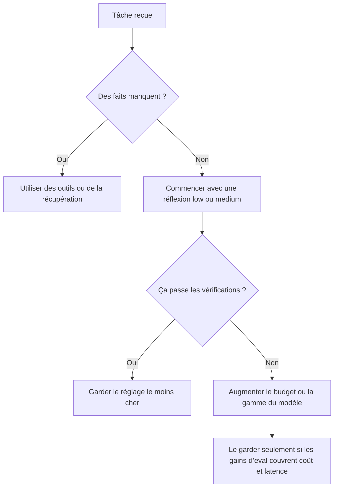

Vous voyez probablement le tableau: le modèle a l’air brillant, puis il rate une étape clé et entraîne discrètement votre code, votre tableur ou votre décision dans le décor. Quand ça arrive, je ne demande pas “plus d’intelligence” en premier. Je me demande si j’ai besoin de plus de faits, de plus de budget, ou d’un autre outil.

## N’achetez pas plus de réflexion trop tôt

Je partirais d’abord de l’idée que le modèle manque de preuves, pas de profondeur. Le [guide OpenAI](https://developers.openai.com/api/docs/guides/reasoning) explique que les modèles de raisonnement consomment des tokens de réflexion avant de répondre, les [docs Anthropic](https://platform.claude.com/docs/en/build-with-claude/extended-thinking) exposent une réflexion étendue avec mode adaptatif ou budgété, et les [docs Gemini](https://ai.google.dev/gemini-api/docs/thinking) décrivent des contrôles comparables via des niveaux et des budgets de réflexion. La leçon commune est utile justement parce qu’elle n’a rien de glamour: plus de réflexion coûte plus cher, prend plus de temps, et n’aide vraiment que si la tâche est réellement multi-étapes.

Les anciens tutoriels parlent encore de o1 et o3. Gardez-le en tête pour la maintenance, mais n’en faites pas votre nouveau réglage par défaut. La [page o3](https://developers.openai.com/api/docs/models/o3) présente maintenant o3 comme un modèle de raisonnement remplacé par GPT-5, donc je suivrais la doc actuelle plutôt que des captures d’écran vieillies trouvées au hasard en ligne.

| Fournisseur | Contrôle actuel                                                 | Ce que ça change                                                                                                                                                    | Visibilité de la réflexion                                                                             | Mon choix                                                                                                           |
| ----------- | --------------------------------------------------------------- | ------------------------------------------------------------------------------------------------------------------------------------------------------------------- | ------------------------------------------------------------------------------------------------------ | ------------------------------------------------------------------------------------------------------------------- |
| OpenAI      | `reasoning.effort`                                              | Le niveau de délibération avant la réponse; les valeurs disponibles dépendent du modèle                                                                             | Les résumés sont optionnels via `reasoning.summary`; le raisonnement brut n’est pas exposé             | Commencer en `low` ou `medium`, puis augmenter seulement si les evals échouent                                      |
| Anthropic   | `thinking.type` plus `effort` sur les modèles Claude récents    | Réflexion adaptative sur les modèles récents; `budget_tokens` manuel est déprécié sur Claude Opus 4.6 et Sonnet 4.6, puis refusé sur les sorties Opus plus récentes | Claude renvoie des blocs `thinking` ou une réflexion résumée selon le modèle et le réglage d’affichage | Utiliser d’abord le mode adaptatif; les budgets manuels servent surtout à la compatibilité avec l’existant          |
| Gemini      | `thinkingLevel` pour Gemini 3, `thinkingBudget` pour Gemini 2.5 | La profondeur ou le budget de tokens consacré à la réflexion interne                                                                                                | `includeThoughts` renvoie des résumés de réflexion                                                     | Utiliser les niveaux Gemini 3 pour régler la latence; réserver les budgets 2.5 aux cas où il faut un plafond strict |

La vraie question est donc la suivante: quand faut-il augmenter le niveau, et quand faut-il passer aux outils ? Quand je dois trancher vite, je prends ce chemin:



## Un réglage de production raisonnable

Si vous voulez un point de départ un peu ennuyeux mais très sain, je mettrais d’abord ceci en production:

```python
from openai import OpenAI

client = OpenAI()

response = client.responses.create(
    model="gpt-5.5",  # point de départ actuel côté OpenAI pour le raisonnement
    reasoning={
        "effort": "low",     # commencer peu cher; augmenter après des échecs mesurés
        "summary": "auto",   # demander un résumé pour déboguer, pas le raisonnement caché brut
    },
    input="Calcule la TVA sur 420 € à 20 %. Retourne JSON: {\"vat\": number}.",  # garder une tâche étroite
    max_output_tokens=120,  # plafonner la taille de réponse et la dépense
)

print(response.output_text)
```

J’aime ce schéma parce qu’il donne un premier passage peu coûteux, une sortie bornée, et un crochet de débogage. Ensuite, j’ajouterais des outils ou de la récupération avant de passer à `high` ou `xhigh`. Le raisonnement est très bon pour planifier à partir des faits déjà présents. Il est franchement mauvais pour inventer des faits qu’il n’a jamais vus. Cette différence fait économiser de l’argent.

Il y a un autre piège ici: la visibilité de la réflexion peut vite devenir une fuite de données. Anthropic peut renvoyer des blocs de réflexion, Gemini peut renvoyer des résumés, et OpenAI peut renvoyer des résumés de raisonnement, donc je traiterais tout cela comme une télémétrie sensible. Gardez ça hors de l’interface finale, nettoyez les logs quand les prompts contiennent du texte sensible, et vérifiez les contrôles d’accès avant que votre équipe sécurité ne le fasse à votre place.

Les coûts frappent deux fois. Les [rate limits](https://developers.openai.com/api/docs/guides/rate-limits) d’OpenAI s’appliquent aux requêtes et aux tokens, Gemini compte les tokens de réflexion dans ses métriques d’usage, et Anthropic facture l’ensemble des tokens de réflexion même quand vous ne recevez qu’un résumé. Je ne paierais pas pour plus de raisonnement tant que la tâche n’est pas vérifiable de l’extérieur et que vos evals ne montrent pas un gain de précision qui mérite vraiment la latence supplémentaire.
