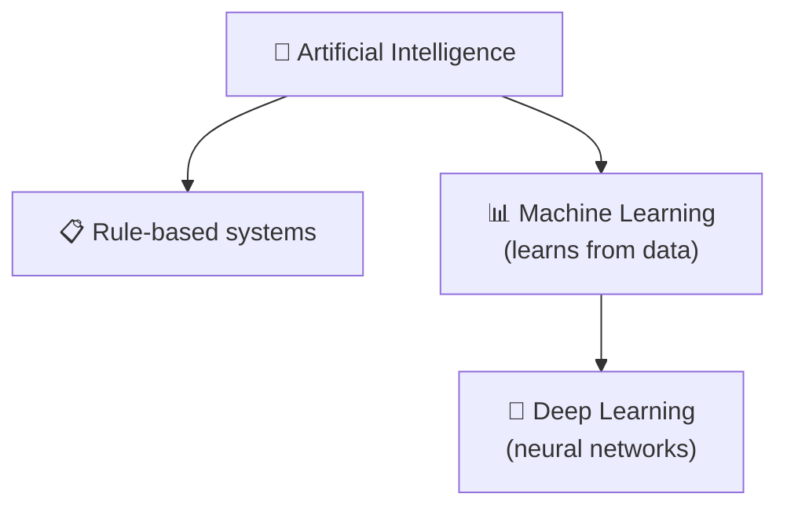

You hear "AI" in a sales demo, "machine learning" in a tutorial, and "deep learning" in anything that sounds expensive. If those words feel like three stickers slapped on the same box, the confusion is not your fault. I would fix it with one image: nested toolboxes.

### Start With The Biggest Box

Artificial intelligence, or **AI**, is the broad category. NIST describes AI as systems built to carry out tasks that usually call for human intelligence, which is intentionally wide because it covers many ways of building those systems, not one magic recipe ([NIST](https://www.nist.gov/artificial-intelligence)). So when someone says "this product uses AI," you still do not know how it works. You only know it is trying to perceive, predict, recommend, or decide.

That vagueness creates the next problem: if AI is the big box, which tool inside it are people usually talking about?

### Machine Learning Is The Workhorse

**Machine learning**, or **ML**, is the part of AI where a system improves from data instead of following only hand-written rules. Stanford HAI also places **deep learning** inside ML as the branch built from multi-layer neural networks, which is the nesting most beginners need to keep in mind ([Stanford HAI](https://hai.stanford.edu/policy/brief-definitions-of-key-terms-in-ai)). A **model** is the mathematical system doing the task, and **training** is the adjustment process that makes that model better.

The analogy I would keep is cooking. Classic software is a recipe you write line by line. ML is showing the machine many finished dishes with labels like "spam" and "not spam" until it starts recognizing the pattern for itself. That is powerful, but it also means the result is often harder to explain in plain human rules.

Here is the comparison I wish people gave earlier, because the nesting only really clicks once you compare what each layer is doing.

|               | AI (broad)                                                     | Machine Learning                                       | Deep Learning                                                |
| ------------- | -------------------------------------------------------------- | ------------------------------------------------------ | ------------------------------------------------------------ |
| Definition    | Umbrella for systems that simulate parts of human intelligence | Subset of AI that learns patterns from data            | Subset of ML that uses multi-layer neural networks           |
| How it learns | Rules, search, optimization, or learning from data             | Statistical patterns learned from examples             | Layered representations learned directly from large datasets |
| Data needed   | Varies from almost none to huge amounts                        | Usually moderate to large datasets                     | Usually large datasets                                       |
| Example       | Chess engine or route planner                                  | Spam filter or churn predictor                         | Image recognition or speech transcription                    |
| Limitation    | The label is too broad to explain the method                   | Often needs careful feature engineering and clean data | Compute-heavy and harder to interpret                        |

### Deep Learning Is What You Reach For When The Input Is Messy

**Deep learning**, or **DL**, is still machine learning, but it uses **neural networks**, meaning layers of connected math operations that pass signals forward. A **layer** is one stage of processing. Early layers may catch simple patterns, and later ones combine them into richer ones. That is why deep learning became such a strong fit for inputs like images, speech, and text, and why the field is closely tied to large datasets and heavy compute budgets ([Nature](https://www.nature.com/articles/nature14539)).

This is also where I take a clear stance: I would not start with deep learning unless the problem truly needs it. If a smaller dataset and a simpler model can do the job, I would choose that first every time.

### Why The Term Took Over

The phrase became impossible to ignore after AlexNet showed in 2012 that a deep convolutional neural network trained on GPUs could beat previous ImageNet results by a large margin ([AlexNet](https://papers.nips.cc/paper_files/paper/2012/file/c399862d3b9d6b76c8436e924a68c45b-Paper.pdf)). You do not need to memorize the paper. The useful takeaway is that better hardware, more data, and better training tricks finally lined up, so deep learning stopped being a niche research idea and became the default answer for many perception tasks.

If you want the next piece to click, read a guide on generative AI or LLMs, because that is where deep learning stops feeling abstract. My rule is simple: say **AI** for the big category, **machine learning** when the system learns from data, and **deep learning** only when neural networks are doing the heavy lifting.
