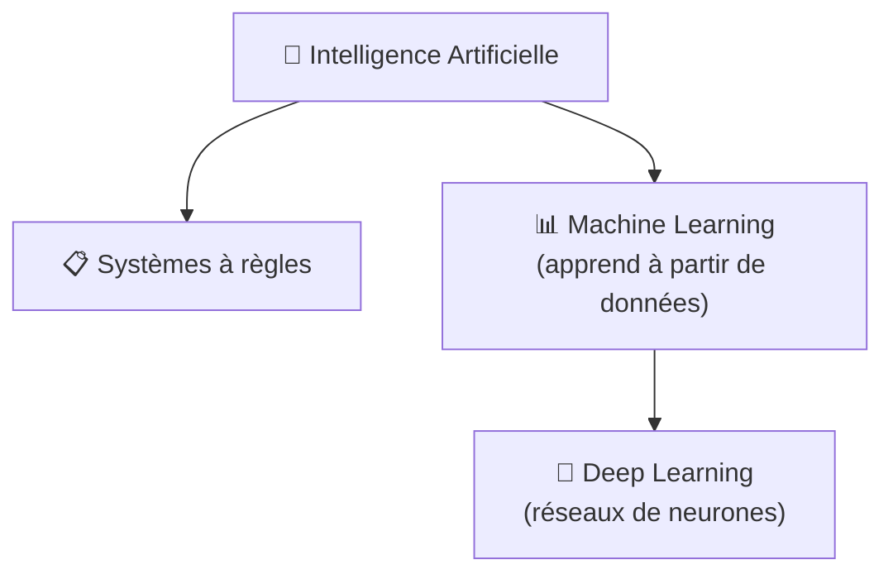

Vous entendez « IA » dans une démo commerciale, « machine learning » dans un tutoriel, et « deep learning » dès que le sujet a l'air coûteux. Si ces mots vous donnent l'impression de voir trois autocollants collés sur la même boîte, ce n'est pas vous le problème. L'image que je garderais, c'est celle de boîtes à outils imbriquées.

### Commencez par la plus grande boîte

L'**intelligence artificielle**, ou **IA**, est la catégorie la plus large. Le NIST décrit l'IA comme des systèmes conçus pour accomplir des tâches qui demandent d'habitude une forme d'intelligence humaine, et cette définition est volontairement large parce qu'elle couvre plusieurs façons de construire ces systèmes, pas une recette magique ([NIST](https://www.nist.gov/artificial-intelligence)). Donc quand quelqu'un dit « ce produit utilise de l'IA », vous ne savez toujours pas comment il fonctionne. Vous savez seulement qu'il essaie de percevoir, prédire, recommander ou décider.

C'est là que le vrai besoin apparaît : si l'IA est la grande boîte, de quel outil précis les gens parlent-ils la plupart du temps ?

### Le machine learning est l'outil de base

Le **machine learning**, ou **apprentissage automatique**, est la partie de l'IA où un système s'améliore à partir de données au lieu de suivre uniquement des règles écrites à la main. Stanford HAI place aussi le **deep learning** à l'intérieur du machine learning, comme la branche fondée sur des réseaux de neurones à plusieurs couches, et c'est exactement l'emboîtement qu'un débutant doit garder en tête ([Stanford HAI](https://hai.stanford.edu/policy/brief-definitions-of-key-terms-in-ai)). Un **modèle** est le système mathématique qui réalise la tâche, et l'**entraînement** est le processus d'ajustement qui le rend meilleur.

L'analogie que je garderais est celle de la cuisine. Un logiciel classique, c'est une recette écrite ligne par ligne. Le machine learning, c'est montrer à la machine beaucoup de plats déjà classés « spam » ou « pas spam » jusqu'à ce qu'elle repère elle-même le motif. C'est puissant, mais c'est aussi pour cela que le résultat est souvent plus difficile à expliquer avec des règles humaines simples.

Voici le tableau que j'aurais aimé avoir plus tôt, parce que l'idée de poupées russes devient vraiment claire quand on compare ce que chaque niveau fait concrètement.

|                     | IA (au sens large)                                                                      | Machine Learning                                                   | Deep Learning                                                               |
| ------------------- | --------------------------------------------------------------------------------------- | ------------------------------------------------------------------ | --------------------------------------------------------------------------- |
| Définition          | Catégorie générale des systèmes qui simulent certains aspects de l'intelligence humaine | Sous-ensemble de l'IA qui apprend des motifs à partir de données   | Sous-ensemble du ML qui utilise des réseaux de neurones à plusieurs couches |
| Manière d'apprendre | Règles, recherche, optimisation, ou apprentissage à partir de données                   | Motifs statistiques appris à partir d'exemples                     | Représentations apprises directement à partir de grands volumes de données  |
| Données nécessaires | Très variable, de presque aucune à des volumes énormes                                  | En général un volume modéré à important                            | En général de grands volumes de données                                     |
| Exemple             | Moteur d'échecs ou calculateur d'itinéraire                                             | Filtre anti-spam ou modèle de prédiction de churn                  | Reconnaissance d'images ou transcription vocale                             |
| Limite              | L'étiquette est trop large pour expliquer la méthode                                    | Demande souvent un vrai travail de features et des données propres | Coûteux en calcul et plus difficile à interpréter                           |

### Le deep learning sert surtout quand l'entrée est brouillonne

Le **deep learning**, ou **apprentissage profond**, reste du machine learning, mais il utilise des **réseaux de neurones**, c'est-à-dire des couches d'opérations mathématiques connectées qui se transmettent des signaux. Une **couche** est une étape de traitement. Les premières couches repèrent souvent des motifs simples, puis les suivantes les combinent en motifs plus riches. C'est pour cela que le deep learning s'est imposé sur des entrées comme les images, la parole et le texte, et pourquoi le domaine reste fortement lié à de grands volumes de données et à des budgets de calcul élevés ([Nature](https://www.nature.com/articles/nature14539)).

C'est aussi là que je prends une position claire : je ne commencerais pas par du deep learning si le problème n'en a pas vraiment besoin. Si un plus petit jeu de données et un modèle plus simple suffisent, je choisis cette option sans hésiter.

### Pourquoi ce mot a pris toute la place

L'expression est devenue impossible à ignorer après AlexNet, qui a montré en 2012 qu'un réseau de neurones convolutif profond entraîné sur GPU pouvait dépasser largement les résultats précédents sur ImageNet ([AlexNet](https://papers.nips.cc/paper_files/paper/2012/file/c399862d3b9d6b76c8436e924a68c45b-Paper.pdf)). Vous n'avez pas besoin de mémoriser le papier. Ce qu'il faut retenir, c'est que le matériel, les données et les techniques d'entraînement se sont enfin alignés, et le deep learning est passé d'idée de recherche un peu niche à réponse par défaut pour beaucoup de tâches de perception.

Si vous voulez que la suite devienne concrète, l'étape logique est un guide sur l'IA générative ou les LLM, parce que c'est là que le deep learning cesse d'être abstrait. Ma règle est simple : dites **IA** pour la grande catégorie, **machine learning** quand le système apprend à partir de données, et **deep learning** seulement quand les réseaux de neurones font l'essentiel du travail.
